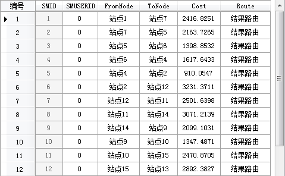

###  使用说明

旅行商分析是无序的路径分析。旅行商可以自己决定访问这些结点的起止顺序，目标是旅行路线阻抗总和最小（或接近最小）。有关旅行商分析的详细介绍，请参阅[旅行商分析概述](8-1TSP)。

###  操作步骤

1. 打开用于网络分析的网络数据集。
2. 在进行网络分析之前，先需要对网络分析环境进行设置。在“ **交通分析** ”选项卡的“ **路网分析** ”组中，勾选“ **环境设置** ”复选框，则弹出“ **环境设置** ”浮动窗口。在此窗口中对网络分析参数进行设置，如权值字段、结点/弧段标识字段等。关于环境设置窗口的介绍，请参见[网络分析环境设置窗口](NetAnalystEnvironmentWIN)页面。
3. 在“ **交通分析** ”选项卡的“ **路网分析** ”组中，单击Gallery下拉按钮，在弹出的下拉框中选择“ **旅行商分析** ”项，创建一个旅行商分析的实例。关于实例窗口的介绍，请参见[实例管理窗口](InstanceWIN)页面的介绍。
4. 在当前网络数据图层中单击鼠标选择要添加的站点位置。添加站点有两种方式，一种是在网络数据图层中单击鼠标完成站点的添加；一种是通过导入的方式，将点数据集的点对象导入作为站点。具体操作请参见[添加站点](ImportLocations)对话框。<br\>**注意**：网络分析管理窗口中，可以对站点的类型进行设置。选中某一个站点，在弹出的右键菜单中可以将该站点设置为起点、终点、中间点或者起止点。起点表示该点为旅行商分析的起始点；终点表示该点为旅行商分析的终止点，分析路径将最后经过该点；起止点表示该点既为起点又为终点，即旅行商分析的路径始于该点，又必须回到该点。默认第一个站点为起点，其他站点为中间点。
5. 同样的添加方式，可以为旅行商分析设置障碍点。关于障碍点管理的相关内容，请参见[障碍点管理](BarrierManagement)页面。
6. 在网络分析实例管理窗口中单击“参数设置”按钮，弹出“旅行商分析设置”对话框，对分析参数进行设置。 
    * **保存结点信息**：选择是否将分析结果经过的所有结点信息都保存下来。如果选中复选框，将结点信息保存为点数据集，并为其命名。该数据集将保存到网络数据集所在的数据源中。结点信息记录了结点的 ID（NodeID）和结点所在结果路由的 ID（RouteID）。
    * **保存弧段信息**：选择是否将路径分析经过的所有弧段的信息保存下来。如果选择复选框，将弧段信息保存为线数据集，并为其命名。该数据集将保存在网络数据集所在的数据源中。弧段信息记录了结果路由经过的弧段的 ID （EdgeID）。
    * **站点统计信息**：选择是否保存站点统计信息。如果选中复选框，将站点统计信息保存为属性表数据集，并为其命名。该数据集将保存分析站点的一些统计信息，包括起始站点、终止站点、耗费等。<br\>如下图所示，为一个站点统计信息属性表。表中记录了分析结果经过每个站点的顺序以及所用的耗费。字段 FromNode、ToNode 表示起始站点和终止站点，Cost 字段表示相邻站点之间的耗费，Route 字段表示分析生成的路由名称。<br\>  
    * **开启行驶导引**：选择分析时是否生成行驶导引。行驶导引记录了交通网络分析结果中的路径信息，一个行驶导引对象对应着一条从起点到终点的行驶路线。勾选“开启行驶导引”复选框，则表示在行驶导引窗口中输出分析结果的路径信息。关于行驶导引的介绍，请参见[行驶导引](PathGuide)页面。
7. 所有参数设置完毕后，单击“ **交通分析** ”选项卡中“ **路网分析** ”组的“ **执行** ”按钮或者单击“实例管理”窗口的“执行”按钮，即可按照设定的参数，执行旅行商分析操作。 

执行完成后，分析结果会自动添加到当前地图展示，同时输出窗口中会提示：“旅行商分析成功。”。

###  注意事项

  * 对于添加到站点目录树中的站点信息，可以将其导出为点数据集，方便以后进行类似网络分析时，直接导入即可使用。
  * 站点必须位于网络弧段和网络结点上，或者在设定的容限范围的区域。可以在“分析环境”窗口中，对结点捕捉容限进行设置，修改合适的容限大小。
  * 如需修改站点位置，可通过移动站点按钮，选中要移动的站点，拖动至合适的位置进行移动。
  * 如果在网络分析图层中设置了障碍点，则障碍点信息在网络分析管理窗口中显示，并可以在该窗口中对障碍点进行管理。关于如何添加障碍点请参阅[障碍点管理](BarrierManagement)。
  * 应用程序支持对多个网络分析实例同时进行管理。再次单击“网络分析”按钮，弹出的菜单中选择“旅行商分析”，可创建一个新的旅行商分析。在“实例管理”窗口中，通过下拉框的切换各个网络分析类型。如果不再需要某种分析实例，单击“删除实例”按钮，即可将当前实例删除，应用程序自动切换到下一个分析实例进行显示。

###  相关主题

[旅行商分析概述](8-1TSP)