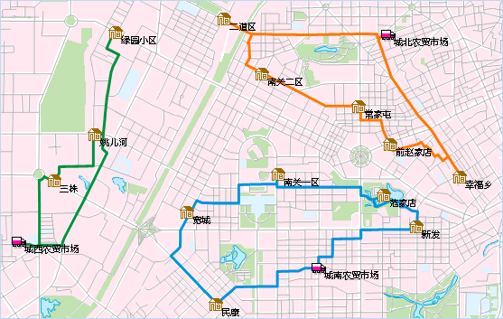

###  概述

物流配送分析，又叫多旅行商分析，是指网络数据集中，给定 M 个配送中心和 N 个配送目的地（M、N 为大于零的整数），查找最经济有效的配送路径，并给出相应的运输路线。SuperMap GIS 桌面提供的物流配送功能就是为了解决如何分配各个货车的配送次序和送货路线，使配送总花费达到最小或每个配送中心的花费达到最小。

应用程序提供了两种配送方案：总花费最小和全局平均最优。默认使用按照总花费最小的方案进行配送，可能会出现某些配送中心点配送的花费较多而其他的配送中心点的花费较小的情况，即不同配送中心之间的花费不均衡。全局平均最优方案会控制每个配送中心点的花费，使各个中心点花费相对平均，此时总花费不一定最小。

###  应用实例

某区域有3个大型农贸批发市场，为13个社区菜市场供应蔬菜水果。每天农贸市场派出3辆送货车从各自位置（配送中心点）出发，到13个社区菜市场（配送目的地）处送货。每辆货车都需要按照最优次序向各自的送货点送货，并且要保证配送路线的总花费最小。SuperMap 提供的物流配送分析可以帮助解决这类问题。

物流配送的分析结果会在地图窗口中直观地显示得到最优配送路径，并会生成一个属性表记录每条配送弧段的结点信息和花费情况。分析结果如下图所示，红色图标表示配送中心点，褐色图标表示配送目的地，不同颜色的路由表示不同的配送路线。

  
