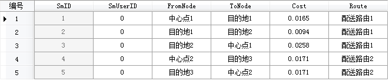

###  使用说明

现实生活中很多商铺都需要向其他商铺站点配送货物。例如快餐业务需要根据订餐顾客的位置，选择最快捷的送餐路线；大型超市的班车也需要规划多条路线，用最小的花费将购物的顾客送达至各个小区。SuperMap
提供的物流配送功能根据指定的配送中心点和配送目的地，查找最佳配送路线。

###  操作步骤

1. 打开需要进行分析的网络数据集。
2. 在“ **交通分析** ”选项卡的“ **路网分析** ”组中，选中“ **环境设置** ”复选框，弹出“ **环境设置** ”窗口。在此窗口中设置物流配送分析的基本参数（如权值字段、结点/弧段标识字段等）、分析结果参数以及追踪分析相关的参数（仅在进行追踪分析时需要设置）。关于环境设置窗口的介绍，请参见[网络分析环境设置窗口](NetAnalystEnvironmentWIN.html)。
3. 新建物流配送分析的实例。在“ **交通分析** ”选项卡的“ **路网分析** ”组中，单击Gallery下拉按钮，在弹出的下拉框中选择“ **物流配送** ”项。成功创建后，会自动弹出实例管理窗口。且地图窗口中的鼠标状态变为绘制状态，用来添加配送中心点和配送目的地。关于实例管理窗口的介绍，请参见[实例管理窗口](InstanceWIN.html)页面。
4. 在当前网络图层中添加配送中心点。添加配送中心点有两种方式，一种是在网络图层中通过鼠标绘制的方式完成配送中心点的添加；另外一种是通过导入的方式添加配送中心点。 
     * **鼠标添加配送中心点**   
在实例管理窗口的工具条中，单击“鼠标添加”按钮，此时地图窗口中鼠标变为刺点状态，可在地图窗口中合适的位置单击鼠标添加配送中心点。每添加一次中心点，该点会自动添加到实例管理窗口的“配送中心点”目录结点信息列表中。添加完成后，单击鼠标右键结束操作。   
**注意** ：需要设置合适的结点捕捉容限。如果鼠标点击位置超出结点捕捉容限，则可能导致站点添加失败。
     * **导入配送中心点**  
将当前工作空间中的点数据集导入作为配送中心点。在“实例管理”窗口中的目录树中，选择“配送中心点”结点，在右键菜单中选择“导入”项，打开“导入中心点”对话框。在此对话框中可以将点数据集中的点作为配送中心点导入，也可以使用过滤表达式对导入的点进行过滤。操作方式与添加站点的方式相同，具体请参见[导入站点](ImportLocations.html)页面。  
**注意**：若需要删除某个配送中心点，可选中该点，在弹出的右键菜单中选择“移除”或者选中要删除的配送中心点按住 Delete 键即可。
5. 同样的方式添加配送目的地和障碍点。关于障碍点管理的相关内容，请参见[障碍点管理](BarrierManagement.html)页面。
6. 在物流配送实例管理窗口中，单击“参数设置”按钮，弹出“物流配送设置”对话框（如下图所示）。在此对话框设置物流配的 参数以及配送结果信息。 
    * **配送方案选择** ：应用程序提供两种配送方案：总花费最小方案和全局平均最优方案。总花费最小方案是指所有配送路线的花费之和最小，但是可能会出现某些配送中心点配送的花费较多而其他的配送中心点的花费较小的情况；全局平均最优方案是指各个配送路线上的花费比较平均，但是总花费不一定最小。
    * **保存结点信息** ：选择是否将分析结果中配送路线经过的所有结点信息都保存下来。如果选中“保存结点信息”将结点保存为点数据集并为其命名。该数据集将保存至网络数据集所在的数据源下。其中字段 NodeID 表示配送路线经过的结点标识；RouteID 表示得到的配送路线的路由标识。
    * **保存弧段信息** ：选择是否将配送路线经过的所有弧段信息保存下来。如果选中“保存弧段信息”复选框，将保存为线数据集并为其命名，该数据集将保存到网络数据集所在的数据源。其中字段 EdgeID 表示生成配送路由线标识。
    * **站点统计信息** ：选择是否存储配送中心点和配送目的地的统计信息。选中复选框将统计信息保存为属性数据集，并为其命名。该属性表数据集将存储配送中心和配送目的地的统计信息，包括起始站点、终止站点、耗费等。   
如下图所示，为物流配送站点统计信息属性表，表中记录了每天配送路线经过每个站点的顺序及耗费。其中 FormNode/ToNode
表示起始站点/终止站点，Cost 表示站点之间的花费。ViaOrder 表示该炸点位于某个路由线的特定线段上，Route_ID 表示分析生成的路由线标识。  
  
    * **开启行驶导引** ：选择分析时是否生成行驶导引。行驶导引记录了交通网络分析结果中的路径信息，一个行驶导引对象对应着一条从起点到终点的行驶路线。勾选“开启行驶导引”复选框，则表示在行驶导引窗口中输出分析结果的路径信息。关于行驶导引的介绍，请参见[行驶导引](PathGuide.html)页面。
设置完毕后，单击“确定”按钮，退出该对话框。

7. 所有参数设置完毕后，在“ **路网分析** ”组中单击“ **执行** ”按钮或者在实例管理窗口中单击“ **执行** ”按钮，进行操作。分析结果会即时显示在地图窗口中。分析结果可以保存为数据集，以便在其他地方使用。

###  注意事项

  * 对于配送中心点和配送目的地信息，可以分别将其导出成点数据集，以便以后进行类似分析时，直接导入使用。 
  * 配送中心点和配送目的地点可以在网络弧段和网络结点上或在捕捉容限范围内的附近区域。
  * 对配送中心点和配送目的地位置需要进行更改时，可以通过单击“实例管理”窗口工具栏中的“鼠标移动”按钮 ，用鼠标选中需要移动的站点，拖拽至其合适的位置。
  * 如果在网络分析图层中设置了障碍点，则障碍点信息会添加到实例管理窗口“障碍点”目录结点中显示，并可以在该窗口中对障碍点进行管理。关于如何添加障碍点请参阅[障碍点管理](BarrierManagement.html)。

###  相关主题

<!--  -->
[物流配送概述](9-1MulTSP.html)
