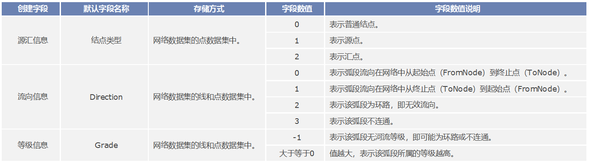
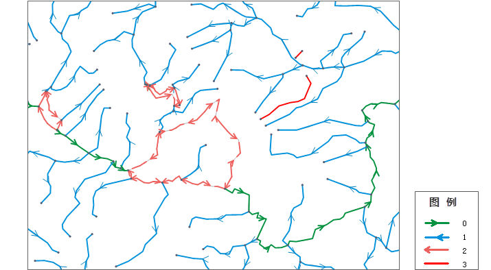

### 使用说明

在设施网络分析中，了解网络的流向十分重要。在进行设施网络分析前需要保证网络数据中存在流向字段，同时在环境设置窗口中指定该字段为流向字段。网络的流向取决于两个因素：网络的连通性；源点与汇点的位置。源点是交汇点要素，它通过网络的弧段使流动介质朝远离它自身的方向流动。例如，在灌溉系统中，可以将泵站抽象为源头。因为它们在管道中的水流方向总是远离泵站的方向流动。汇点也是交汇点要素，它通过网络的弧段使介质朝向它自身的方向流动。例如，在河网系统中，河口可以抽象为汇点，因为所有的水流都朝向河口流动汇聚。流从源点流出，并流向汇点。

由于流向既可以通过源点又可以通过汇点来构建，所以通常只用在网络中指定源点或者汇点即可。根据用户设置的源点和汇点位置，源汇字段信息会保存在网络数据集的点数据集的属性表中。源汇字段值有三种类型：0表示普通结点；1表示源点；2表示汇点。

SuperMap 应用程序在网络分析模块中提供了构建流向的功能。成功创建流向后，流向信息会保存在流向字段中。默认名称为 Direction。关于如何构建流向，请参见[追踪分析网络建模](TraceModeling)页面。

在创建流向时，需要首先给追踪网络设置源点或者汇点，并将源汇信息存储在一个源汇字段中，而流向信息根据源汇信息计算而来；同时也可以创建等级字段，存储不同网络的等级信息。具体如下表所示。
  
  
 
如下图所示，是对一个河流网络建立流向后的展示效果。不同的颜色和线性，代表了不同的流向。图例中数字的含义，请参见上表中的说明。

  