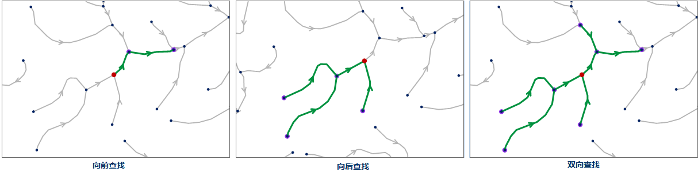

### 使用说明

根据通达性条件，查找网络中与指定的事件点相通达的结点或者弧段。

在进行通达要素分析时，设定的查找等级参数会直接影响到查找的通达要素数目。邻接要素分析是查找等级为1的通达要素分析。关于邻接要素分析的介绍，请参见[邻接要素分析](AdjoinAnalyst)页面。

### 操作说明

1. 在当前地图窗口中打开网络图层。
2. 在进行网络分析之前，需要先对网络分析环境进行设置。在 **空间分析** 选项卡的 **设施网络分析** 组中，勾选“环境设置”复选框，弹出“环境设置”浮动窗口。在该窗口中，设置网络分析的权值字段、结点/弧段标识字段、是否启用交通规则、转向表等。关于环境设置窗口的介绍，请参见[网络分析环境设置窗口](NetAnalystEnvironmentWIN)页面。
3. 在 **空间分析** 选项卡的 **设施网络分析** 组中，单击 **网络分析** 下拉按钮，在弹出的下拉菜单中选择 **通达要素分析** 项，创建一个通达要素分析的实例。关于实例窗口的介绍，请参见[实例管理窗口](InstanceWIN)页面的介绍。
4. 在当前网络图层中，单击鼠标选择要添加的一个事件点。添加事件点有两种方式，一种是在网络数据图层单击鼠标完成事件点的添加；一种是通过导入的方式，将点数据集中的点对象导入作为站点具体操作，请参见[添加站点](ImportLocations)页面描述。 邻近要素分析的事件点只能添加一次。添加完成后，该点会自动添加到实例管理窗口的事件点信息目录树中。添加完成后，单击鼠标右键结束操作。
5. 在网络分析实例管理窗口中单击“参数设置”按钮，弹出“通达要素分析”对话框，对分析参数进行设置。 
  - **结果类型**
    * **通达点** ：查找与事件点相通达的结点要素。
    * **通达边** ：查找与事件点相通达的弧段要素。
  - **查找方向** :提供三种查找方向供用户选择，向前查找、向后查找和双向查找。
    * **向前查找** ：沿着弧段向前的方向查找通达要素。
    * **向后查找** ：沿着弧段向后的方向查找通达要素。
    * **双向查找** ：沿着弧段的两个方向（向前或者向后）查找通达要素。
  - **查找等级**：查找通达要素的级数，即网络深度。与事件点直接相连通的弧段（或结点）为第一级通达边（通达点）。沿分析方向与第一级结点直接相连通的弧段（结点）为第二级通达边（通达点）。由此类推同样可以得到第三级、第四级......的所有通达边（通达点）。当与事件点连接的级数超过设置的参数将不再往下查找。通达要素查找分析的查找等级默认为2。
6. 所有参数设置完毕后，单击“ **空间分析** ”选项卡中“ **设施网络分析** ”组的“ **执行** ”按钮或者单击“实例管理”窗口的“执行”按钮，即可按照设定的参数，执行邻接要素分析操作。
7. 执行完成后，分析结果会自动添加到当前地图展示，同时输出窗口中会提示：“通达要素分析成功。”。如下图所示，对同一事件点按照通达等级为2分别进行向前查找、向后查找和双向查找的结果。箭头代表了网络的方向，红色点为事件点，紫色点为查找到的通达点，绿色线为查找到的通达边。

### 注意事项

* 对于添加到事件点目录树中的结点信息，可以将其导出为点数据集，方便以后进行类似网络分析时，直接导入即可使用。
* 通达要素分析的事件点可以在网络弧段和网络结点上或在捕捉容限范围内的附近区域。
* 事件点位置需要进行更改时，可以通过单击“实例管理”窗口工具栏中的“鼠标移动”按钮，用鼠标选中事件点，拖拽至其合适的位置。

### 相关主题

 [邻近要素分析](AdjoinAnalyst)

 [通达要素分析](AccessibilityAnalyst)