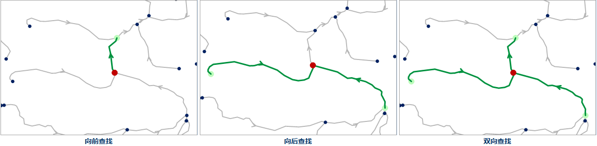
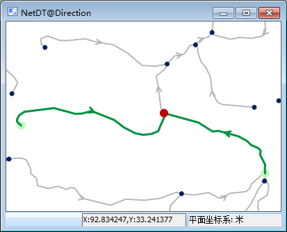
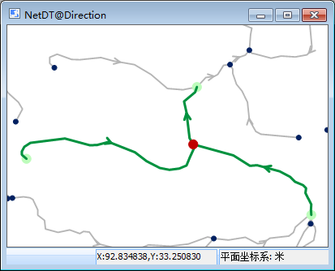

###  使用说明

在网络中，查找与指定的事件点相邻接的结点或者弧段。

邻接要素分析是通达要素分析的一种特殊情况。关于通达要素分析的介绍，请参见[通达要素分析](AccessibilityAnalyst.html)页面。

###  操作步骤

1. 在当前地图窗口中打开网络图层。
2. 在进行网络分析之前，需要先对网络分析环境进行设置。在“ **空间分析** ”选项卡的“ **设施网络分析** ”组中，勾选“环境设置”复选框，弹出“环境设置”浮动窗口。在该窗口中，设置网络分析的权值字段、结点/弧段标识字段、是否启用交通规则、转向表等。关于环境设置窗口的介绍，请参见[网络分析环境设置窗口](NetAnalystEnvironmentWIN.html)页面。
3. 在“ **空间分析** ”选项卡的“ **设施网络分析** ”组中，单击“ **网络分析** ”下拉按钮，在弹出的下拉菜单中选择“ **邻接要素分析** ”项，创建一个邻接要素分析的实例。关于实例窗口的介绍，请参见[实例管理窗口](InstanceWIN.html)页面的介绍。
4. 在当前网络图层中，单击鼠标选择要添加的一个事件点。添加事件点有两种方式，一种是在网络数据图层单击鼠标完成事件点的添加；一种是通过导入的方式，将点数据集中的点对象导入作为站点。
   - **鼠标添加事件点**  
在实例管理窗口的工具条中，单击“鼠标添加”按钮，则地图窗口中鼠标变为刺点状态，可在地图窗口中合适的位置单击鼠标左键添加事件点。邻接要素分析的事件点只能添加一次。添加完成后，该点会自动添加到实例管理窗口的事件点信息目录树中。添加完成后，单击鼠标右键结束操作。  
**注意** ：需要设置合适的结点捕捉容限。如果鼠标点击位置超出结点捕捉容限，则可能导致事件点添加失败。

   - **导入事件点**  
将当前工作空间中的点数据集导入作为事件点。在“实例管理”窗口中的树目录中，右击“事件点”结点，在弹出的右键菜单中选择“导入”命令，具体操作请参见[导入站点](ImportLocations.html)对话框。
5. 在网络分析实例管理窗口中单击“参数设置”按钮，弹出“邻接要素分析”对话框，对分析参数进行设置。  
   **结果类型**  
   - **邻接点** ：查找与事件点相邻接的结点要素。
   - **邻接边** ：查找与事件点相邻接的弧段要素。  
   **参数设置**  
   - **查找方向** :提供三种查找方向供用户选择，向前查找、向后查找和双向查找。
      * **向前查找** ：沿着弧段向前的方向查找邻接要素。
      * **向后查找** ：沿着弧段向后的方向查找邻接要素。
      * **双向查找** ：沿着弧段的两个方向（向前或者向后）查找邻接要素。
   - **查找等级**：查找邻接要素的级数，即网络深度。当与事件点连接的级数超过设置的参数将不再往下查找。邻接要素查找分析的查找等级默认为1，即仅查找与事件点相邻接的结点或者弧段。用户不可以修改。关于查找等级的详细介绍，请参见[通达性分析](AboutAccessbility.html)页面。
6. 所有参数设置完毕后，单击“ **空间分析** ”选项卡中“ **设施网络分析** ”组的“ **执行** ”按钮或者单击“实例管理”窗口的“执行”按钮，即可按照设定的参数，执行邻接要素分析操作。
7. 执行完成后，分析结果会自动添加到当前地图展示，同时输出窗口中会提示：“邻接要素分析成功。”。如下图所示，对同一事件点分别进行向前查找、向后查找和双向查找的结果。箭头代表了网络的方向，红色点为事件点，绿色的点和线为查找结果，即事件点的邻接点和邻接边。  

 

<!-- |  |  |  |
---|---|---  
 |  |  
图：向前查找 | 图：向后查找 | 图：双向查找   -->

###  注意事项

  * 对于添加到事件点目录树中的结点信息，可以将其导出为点数据集，方便以后进行类似网络分析时，直接导入即可使用。
  * 邻接要素分析的事件点可以在网络弧段和网络结点上或在捕捉容限范围内的附近区域。
  * 事件点位置需要进行更改时，可以通过单击“实例管理”窗口工具栏中的“鼠标移动”按钮，用鼠标选中事件点，拖拽至其合适的位置。