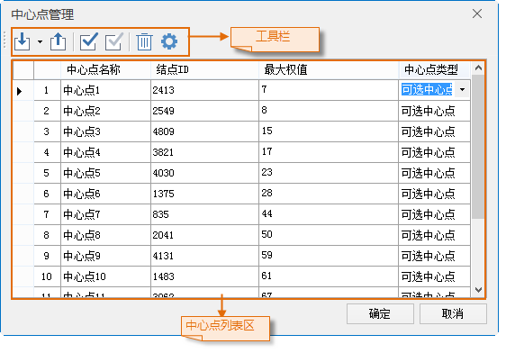

中心点是网络数据中具有接收或提供资源能力，且位于结点处的离散设施点。比如学校里具有教育资源，学生必须到学校进行学习。一个学校可以看作一个中心点；零售仓储点用来存储零售点所需的货物，每天需要向个零售点配送发货。类似于这样存储了一定资源，能够为人们提供服务的机构可以看作是中心点。中心点实际上也是网络图层中的一个结点，可以通过某个字段或者分析过程中把结点指定为中心点。

中心点管理窗口用来对选址分区的中心点统一进行管理，包括对中心点的相关信息（资源量、最大阻力值、中心点类型等）进行设置、导入/导出中心点等操作。

在进行选址分区分析时，需要对中心点进行设置。在选址分区实例管理窗口中，选中“中心点”目录结点，右击鼠标，在弹出的右键菜单中选择“中心点管理”项，会弹出“中心点管理”对话框。

  
  
###  操作步骤

1. **导入中心点**  
在“中心点管理”窗口中，在工具条中单击“导入”按钮，弹出“导入中心点”对话框，在该对话框中对导入的中心点参数进行设置。
   * 设置要导入的源数据参数。选择要导入的中心点数据所在的数据源和数据集。如果需要将满足一定条件的点数据导入，可以使用过滤条件，对导入的中心点进行过滤。
   * 设置中心点参数，选择中心点名称(文本型)、最大阻力字段（整型）和中心点类型（整型）字段。应用程序会从设置字段中读取中心点的各个属性。
2. **导出中心点** ：将中心点信息导出为点数据集。   
在“中心点管理”窗口中，单击“导出”按钮，在弹出的“导出结点”对话框中，设置中心点导出后要保存的数据源和数据集即可。
3. **修改中心点属性** ：对中心点属性（最大权值和中心点类型）进行修改。在中心点列表区中，选中要修改的属性单元格，直接输入最大权值或者选择中心点类型即可。
4. **统一赋值** ：统一修改选择的中心点的属性。具体操作如下：   
1）在中心点列表区中，选择需要修改属性的中心点所在的行；  
2）在工具条中，单击“统一赋值”按钮，弹出“统一赋值”对话框，选择要赋值的属性，并赋值。可以统一赋值的属性包括所有中心点的最大阻力半径和中心点类型。

###  注意事项

* 选址分区分析中，中心点类型可分为：固定中心点、可选中心点、非中心。 资源分配分析中，中心点类型只能设置为：固定中心点和非中心，不支持设置为可选中心点。