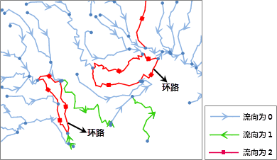

###  使用说明

检查网络数据集中是否存在环路。

设施网络中，环路是指两条或两条以上流向值为 2（即不确定流向）的弧段构成的闭合路径。这意味着环路必须同时满足以下两个条件：

1. 由至少两条弧段构成的闭合路径。
2. 构成环路的弧段的流向均为 2，即不确定流向。

下图是设施网络的一部分，使用不同的符号显示网络弧段的流向。对该网络进行环路检查，检查出两个环路，即图中的红色闭合路径。而右上方有一条流向为 2
的弧段，由于它未与其他流向同样为 2 的弧段构成闭合路径，因此不是环路。

   
  
###  操作步骤

1. 在“ **环境设置** ”窗口中，单击"检查环路"按钮，弹出“检查环路”对话框。
2. 在“检查环路”对话框中，勾选"保存分析结果"复选框，将分析结果保存为线数据集，为其命名并选择存放的数据源。否则结果不予保存。默认勾选该复选框。
3. 勾选“高亮显示分析结果”复选框，在当前进行分析的网络数据集中高亮显示分析结果。否则不显示。默认勾选该复选框。
4. 单击“确定”按钮，完成检查环路操作。单击“取消”按钮，退出当前操作。