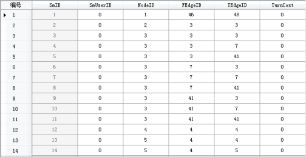

### 操作步骤

1. 在“ **空间分析** ”选项卡的“ **设施网络分析** ”组中，勾选“ **环境设置** ”复选框，则弹出“ **环境设置** ”浮动窗口，单击“环境设置”窗口工具条上的“转向表设置”按钮，在弹出的下拉菜单中选择“创建转向表”项，弹出“创建转向表”对话框如下图所示。

2. 设置源数据。选择需创建转向表的源数据集及其所在的数据源。
   * **数据源：** 在下拉框中列出了当前工作空间中的所有数据源，选择用于创建转向表的网络数据集所在的数据源。
   * **数据集：** 在下拉框中列出了当前数据源中的所有网络数据集，选择用于创建转向表的网络数据集。
   * **结点过滤条件：** 用户根据需要设定过滤条件，只有满足此条件的节点的转向信息才会被添加到生成的转向表数据集中。
3. 设置结果数据。选择生成的结果转向表数据集存放的位置及其名称。
  * **数据源：** 在下拉框中列出了当前工作空间中的所有数据源，选择结果转向表数据集存放的数据源。
  * **数据集：** 生成的结果数据集名称。
4. 单击"确定"按钮，进行创建转向表操作。单击"取消"按钮，退出当前对话框。 

成功创建转向表后，在指定数据源下生成结果转向表数据集，如下图所示。

  

  * **结果转向表数据集说明**
      * SmID、SmUserID 为系统字段，系统自动赋值，其中 SmID 字段不可编辑，SmUserID 可编辑。
      * NodeID 为结点标识字段，记录每个满足"结点过滤条件"的结点标识号（即“网络分析基本参数设置”对话框中设置的结点标识字段值）。
      * FEdgeID、TEdgeID 字段记录经过该结点的每个转向的起始弧段和终止弧段。
      * TurnCost 结点耗费字段，记录每个转向的消耗，默认值为0，表示无耗费，用户可根据实际操作需求，为该字段赋值。

### 相关主题

[转向表](TurnTable)

[设置转向表](SetTurnTable)