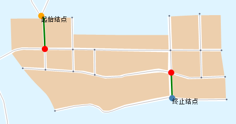

### 使用说明

当起点到终点有多条通达路线时，会查找所有路线都必须经过的点或弧段。

为了保证两点的连通性，可以通过关键要素查询得到必经点、线，如果能够保证查询出来的点、线通畅，则可以保证这两点是连通的。在管网中主要用以监测重点线路的泄漏点，保证管网安全和连通性；在路网中可以监测重点道路的畅通情况，保证了必经点、线的畅通则可以保证两点间的畅通。

### 操作步骤

1. 在当前地图窗口中打开网络图层。
2. 在进行网络分析之前，需要先对网络分析环境进行设置。在“ **空间分析** ”选项卡的“ **设施网络分析** ”组中，勾选“环境设置”复选框，弹出“环境设置”浮动窗口。在该窗口中，设置网络分析的权值字段、结点/弧段标识字段、是否启用交通规则、转向表等。关于环境设置窗口的介绍，请参见[网络分析环境设置窗口](NetAnalystEnvironmentWIN)页面。
3. 在“ **空间分析** ”选项卡的“ **设施网络分析** ”组中，单击“ **网络分析** ”下拉按钮，在弹出的下拉菜单中选择“ **关键要素分析** ”项，创建一个关键要素分析的实例。关于实例窗口的介绍，请参见[实例管理窗口](InstanceWIN)页面的介绍。
4. 在当前网络图层中，单击鼠标选择要添加的一个起始结点。添加起始结点有两种方式，一种是在网络数据图层单击鼠标完成起始结点的添加；一种是通过导入的方式，将点数据集中的点对象导入作为站点，具体操作请参见[添加站点](ImportLocations)对话框。
5. 终止结点的添加方式与起始结点一致，可参考起始结点的添加方式添加终止结点。
6. 在网络分析实例管理窗口中单击“参数设置”按钮，弹出“关键要素分析”对话框，对分析参数进行设置。 
7. 在”关键要素分析设置“对话框中可设置分析结果类型：
    * **关键结点** ：查找起始结点和终止结点之间的必经结点要素。
    * **关键弧段** ：查找起始结点和终止结点之间的必经的弧段要素。
8. 参数设置完毕后，单击“确定”按钮，退出“关键要素分析设置”对话框。
9. 所有参数设置完毕后，单击“ **空间分析** ”选项卡中“ **设施网络分析** ”组的“ **执行** ”按钮或者单击“实例管理”窗口的“执行”按钮，即可按照设定的参数，执行关键要素分析操作。
10. 执行完成后，分析结果会自动添加到当前地图展示，同时输出窗口中会提示：【关键要素分析】执行成功，耗时:***秒。分析结果如下图所示，红色点为查找到的关键结点，绿色线为查找到的关键弧段。   

###  相关主题

 [邻近要素分析](AdjoinAnalyst)

 [通达要素分析](AccessibilityAnalyst)