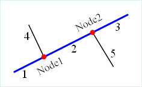

我们真实世界中的常见基础设施，如市政水网、输电线、天然气管道、电信网络和水流水系等。这些网络其本质都是资源有向流动的网络结构，都可以通过设施网络进行建模和分析。

设施网络分析是网络分析功能之一，主要用于进行各类连通性分析和追踪分析。

设施网络分析要按照一定的规则建立网络模型，并且设施网络必须要有流向。这是设施网络分析的特殊之处。所谓流向即物质流动的方向。网络中的流向取决于网络中的拓扑，源和汇的网络位置。

###  基本概念

一个设施网络的本质是一组边（edges）和交汇点（junctions）的组合，并通过一定的连通性规则来对真实世界的网络设施进行表达和建模，即用户通过指定构成设施网络的基本元素（点线对象）的含义和规则来指定所要建模的资源怎样在设置网络中进行流动。

  
如图1所示为一个简单的设施网络示意图。其中蓝色粗线为主管线，分别由1、2、3三段构成，黑色细线4和5为支线管道，红色交汇点 Node1 和 Node2 为主管线和支线的交汇连接点。

* **边（Edges）** ：构建的设施网络一般会包含线对象，在设施网络模型中用来表示资源流通管道。如水管、电线、天然气管线等都可以视为设施网络的边。
* **简单边（Simple Edges）** ：简单边即只能在首尾两头连接两个交汇点的边，如图 1中所示的支线水管（4和5），其一头和主管线相连接，另一头和其它次级管线相连接。或者说简单边不具有内部的连通性，如果需要在其中加入一个新的交汇点则必须在物理上将其打断为两个简单边。
* **复杂边（Complex Edges）** ：复杂边除了具有简单边首尾两端的交汇点外还可以在其中添加交汇点。如图 1中的蓝色水网主管线所示，虽然其通过交汇点 Node 1和 Node 2连接了两个支线管线但其并没有被真正打断，即其可以在中间添加任意多个交汇点而不被真正物理打断。**注意**：共相式 GIS 内核现有体系中暂时没有复杂边的概念，即所有复杂边出现时都被物理打断，作为简单边进行处理。
* **交汇点（Junctions）** ：构建的设施网络一般会包含点对象，在设施网络模型中用来表示两条以及多条资源流通管道的交汇位置，如水网的泵站和阀门、电网的电闸、天然气网的供气点等。
* **源（source）** ：指资源流出的交汇点，如真实网络中的电站和水站等。
* **汇（sink）** ：指资源流入的交汇点，如真实网络中的电网和水网用户接入点等。
* **网络权重（network weight）** ：每一个网络都可以与一组权重相关联，比如在水网中可以存在一个水压权重，其和每段边的长度关联，表达的含义是水流通过管道每运行一段则水压由于管道摩擦的存在会不断减少。一种网络权重可以与某一类对象的某一字段相关联也可以和多种对象进行关联，且权重可以为0，如孤立交汇点没有和任何字段关联的权重都为0。
* **要素有效和失效** ：设施网络中的边和交汇点都可以因为某种原因而失效（例如阀门关闭，导致某一段水管没法流通），失效的边或交汇点则变成了网络的障碍，有效和失效可以由一个字段来进行表示。

流向字段中的数值代表了特殊的含义，说明如下：

数值 | 含义  
---|---  
0 | 表示弧段流向在网络中从起始点（FromNode）到终止点（ToNode）。  
1 | 表示弧段流向在网络中从终止点（ToNode）到起始点（FromNode）。  
2 | 表示该弧段为环路，即无效流向。  
3 | 表示该弧段不连通。  
  
如下图所示，是对一个河流网络建立流向后的展示效果。不同的颜色和线性，代表了不同的流向。图例中数字的含义，请参见上表中的说明。

  