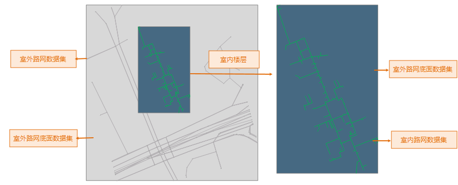

室内导航模型是指为了实现室内导航分析，需要对室内各种空间要素和信息进行有效组织和存储，从而为室内定位、信息查询和路径分析等室内导航功能提供数据和模型支持。

SuperMap iDesktop 为用户提供可视化构建室内导航模型的工具，支持将室内道路、楼梯点、出入口等要素信息组织构建网络数据集；支持同时构建多楼层、不同楼栋的多网络数据集；并支持添加室外道路数据，连通室内、室外，构建室内外一体的导航模型。

###  数据要求

构建导航模型所要求的数据包括室内路网数据，关键设施点（楼梯点、出入口）数据、其他 POI
点数据、以及室外道路数据。其中，前两种是构建导航模型的必需数据，其他 POI 数据和室外道路数据为可选数据，用户可根据实际情况进行设置。

* **室内路网数据** ：道路数据存储于线数据集或网络数据集中，是导航的基础数据，各楼层均有独立的道路数据。
* **关键设施点** ：包含楼梯点，出入口等数据，楼梯又可分为扶梯、直梯、步行楼梯等，用于跨楼层导航连接；出入口点数据是连通室内与室外、不同楼栋之间的关键数据，必须包含如下属性项：

参数 | 说明 | 数据类型  
---|---|---  
ID  | 每个楼梯及出入口均有唯一ID值，即使是相同的一部直梯，在不同的楼层，ID值也是不一样的。 | 宽字符  
类型 | 可以根据设施点不同的属性设置类型值，可分为直梯25136；步行楼梯 25134；扶梯25135；出入口25062等4类。可用于导航场景中楼梯点单值专题图显示。 | 宽字符  
名称 | 用于标识楼梯及出入口名称。用于导航场景中制作标签专题图，展示关键设施点名称。 | 宽字符  

* **其他POI** ：主要用于展示及搜索，以商场为例，卫生间、收银台、 ATM 等，都可以成为 POI，POI 数据能使导航信息更丰富，为可选数据。必须包含的属性项：

参数 | 说明 | 数据类型  
---|---|---  
ID  | 每个 POI 信息均有唯一ID值。 | 宽字符  
名称 | POI数据名称。 | 宽字符

* **室外道路数据** ：室外道路数据存储于网络数据集中，通过楼层的出入口数据与室内模型数据建立关系，用于实现室内外一体化导航，为可选数据。

###  操作说明

1. 单击 **交通分析** -> **室内导航** -> **构建室内导航模型** 按钮，弹出 **构建室内网络数据集** 对话框，对话框左侧为楼层列表区，右侧为参数设置区。
2. **楼层列表区** ：添加建筑物楼层，单击“ **添加** ”按钮，添加参与模型构建的建筑物楼层，支持添加多栋建筑物的多个楼层，参数描述如下： 
   * **建筑物名** ：当前建筑物名称，默认值为"Build1"，支持编辑修改；
   * **序号** ：当前楼层的ID序号，默认从"1"开始创建，支持编辑修改；
   * **名称** ：当前楼层的名称，默认值从“楼层_1"开始创建，支持编辑修改；
   * **底部高程** ：表示该楼层距离地平面的高度，支持直接输入数值修改。默认为20，单位为米。例如当楼层为1层时，与地平面的距离为0米，当楼层为2层时，与地平面的距离为20米。该数据将作为构建二三维一体化导航场景时，该楼层相较于地上的高程值。
3. **参数设置区** ：设置参与当前楼层的构网数据，每层楼将生成单独的网络数据集，因此每层楼需要单独设置，包含室内路网数据、关键设施点、其他POI及室外道路数据。有关参数的具体描述，请参看数据要求。以设置建筑物Build1中的楼层1为例： 
   * **路网** ：选择楼层1的路网数据集为 base_indoor_link_J1_F1，必填数据；
   * **关键设施点** ：设置楼层1的关键设施点数据集为 NewDataset_J1_F1，分别设置ID、名称、类型字段，必填数据；
   * **其他POI** ：若加入 POI 数据，设置 POI 点数据集，分别设置 POI 数据的ID、名称，可选数据；
   * **室外道路数据** ：若该楼层与室外相通，设置对应的室外道路数据集，可选数据；该楼层为1楼可与室外相通，室外路网数据集为：areaJ_poi_Network。
   * **结果设置** ：选择结果数据集所在的数据源，同时可修改结果数据集的名称。默认数据集名称为FloorRelationTable。结果数据集为楼层关系属性表，同一模型下的多个楼层，结果数据集设置为同一数据集。
4. 重复2-3操作，依次添加和设置其他楼层的构网数据参数。
5. **执行构建导航模型** ，室内导航模型结果包含楼层关系属性表、室内网络数据集、楼层底面数据集、室外底面数据集，例如当前模型构建时，添加了建筑物Build1的楼层1、楼层2、楼层3，则得到如下图所示的结果数据集：   
  
   * **楼层关系属性表**：记录了参与构建整个室内导航模型数据信息及各楼层数据集之间的关联关系，在导航的过程中发挥着至关重要的作用，包含每个楼层的室内路网数据集、室外路网数据集、底面数据集、层高、底面高程等属性信息。例如：示例中参与构建室内导航模型为建筑物 Build1 的三个楼层，楼梯关系属性表中详细记录了三个楼层的数据属性信息，如下图所示。    
 
   * **室内网络数据集** ：生成参与构建模型的建筑物楼层的网络数据集，每个网络数据集对应一个楼层的路网数据，若添加多栋建筑物的多个楼层，则生成多个网路数据集，例如添加了建筑物Build1的3个楼层，则生成3个网络数据集，分别是：楼层_1_Build1，楼层_2_Build1，楼层_3_Build1。   |   
---|---  
图：构网前路网线数据集  | 图：室内网络数据集  
    * **室内路网底面数据集** ：生成当前模型的室内路网底面数据集，取参与构建模型的所有楼层室内路网数据的并集范围，用于二三维室内导航场景中楼层底图显示，数据集中有且仅包含一个面对象，例如当前示例生成室内路网底面数据集为B_FloorRelationTable。
    * **室外路网底面数据集** ：根据楼层设置的室外道路数据，生成对应楼层的室外道路网络数据的外接矩形面数据集，用于二三维室内导航场景中从室外到室内的展示底图显示，例如当前示例生成室外路网底面数据集：OurRoadBaseFloor_楼层_1_Build1。

###  相关内容

  * [**室内导航概述**](IndoorNavigation.htm)
  * [**构建楼梯关系**](BuildStairRelation.htm)
  * [**室内导航分析**](IndoorNavigationAnalysis.htm)

  

* * *

  
  
---

