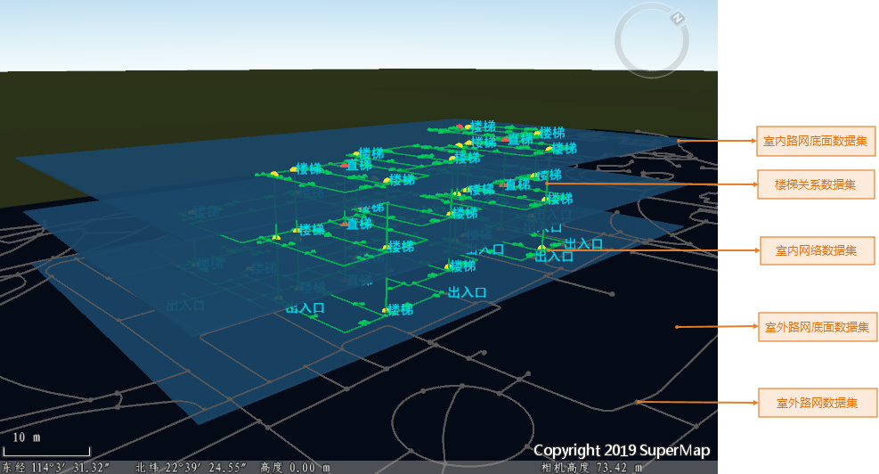
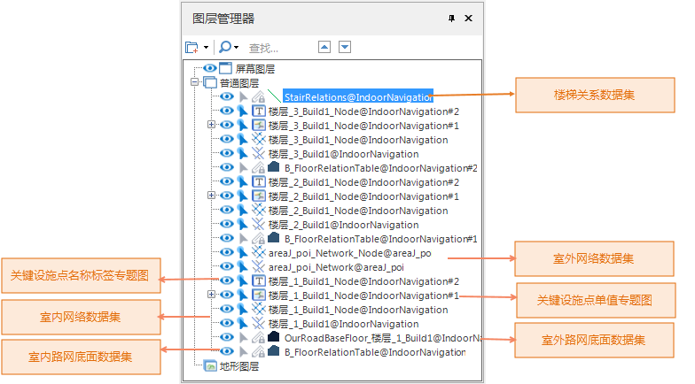
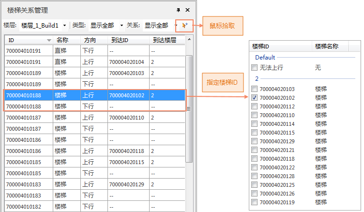
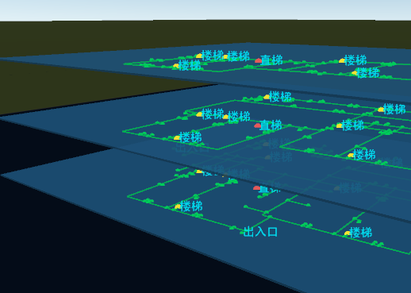
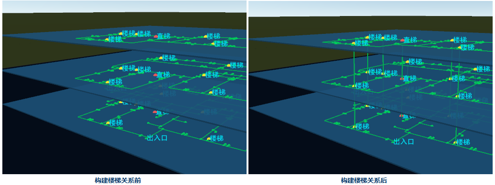

室内导航模型将不同楼栋、不同楼层的数据有效的组织在一起。而不同楼层之间，需要通过构建楼梯关系才能建立连接；SuperMap iDeskstop
提供可视化交互的构建楼梯关系工具，通过加载室内导航模型，生成二三维一体的导航场景，用户可通过场景方便、快捷、准确的指定楼梯上行、下行的方向，从而实现相邻楼层路径的互通。

###  加载室内导航模型

构建楼梯关系前需要先加载室内导航模型，程序将按照楼层关系属性表中的楼层属性信息，将各楼层的室内网络数据集、楼层底面数据集、室外底面数据集以及室外路网数据，自动加入场景并进行配图，生成二、三维一体的导航场景。

**操作说明** :

  1. 单击 **交通分析** -> **室内导航** -> **构建楼梯关系** 按钮，弹出 **加载室内导航模型** 对话框，在对话框中您将设置以下信息： 
    * **路网** ：设置已构建导航模型所在数据源及生成的楼层关系属性表数据集。
    * **楼梯关系数据集** ：为三维线数据集，作为不同楼层之间的连接桥梁。可加载已存在的楼梯关系数据集，进行修改、删除、添加等管理操作，同时也可新建数据集，从初始构建楼梯关系。
  2. 完成上述设置，单击“ **确定** ”按钮，程序将自动加载导航模型中的数据集，生成二三维一体化的导航场景模型，同时弹出楼梯关系管理对话框。 
  
---  
图：二三维一体化的导航场景  

###  二三维一体导航场景

二三维一体导航场景是程序加载室内导航模型数据，经过不同风格设置、专题图处理后自动生成，用于展示不同楼栋及楼层的分布情况，在场景中可直观查看楼梯点、出入口等关键设施点的分布。

图层管理器中以楼层为单位组织数据，每个楼层的数据包含：室内路网底面数据集；室内网络数据集；根据路网数据集名称字段制作的标签专题图，用于展示关键设施点名称；以及按照关键设施点的类型字段制作的单值专题图，根据类型显示为不同的颜色用于区分不同设施点；若构建模式时添加了室外路网数据，场景中同时加载室外路网底面数据集及室外网络数据集。

注：当加载导航模型数据量较大时，场景加载花费时间较长，请您耐心等待。

 | 图：场景图层管理器图层图层列表  
---  
  
###  楼梯关系管理

在楼层关系管理对话框中，可进行查看、修改、构建等楼梯点管理操作，楼梯类型可分为直梯、步行楼梯以及扶梯；其中直梯、步行楼梯存在上行和下行两种关系；扶梯，可上行或下行，由用户自己根据数据情况指定。详细参数描述如下：

  * 楼层：下拉菜单中显示当前导航模型中的参与楼层，您可指定楼层查看和管理楼梯关系。
  * 类型：下拉菜单中显示当前楼层的楼梯类型，可选择直梯、步行楼梯、扶梯中的某一类型进行查看，默认显示全部类型。
  * 关系：下拉菜单中分为已连接和未连接两种楼梯关系，可切换显示，默认显示全部。

  
---  
图：楼梯关系管理  
  
楼梯列表区：选定楼层后，在列表区中依此排列了当前楼层的所有楼梯点数据信息，包括楼层ID、楼梯名称（类型）、方向以及到达ID以及到达楼层。双击某一具体楼梯点，在场景窗口中将高亮显示该楼梯点。

每个楼梯点都有一个固定的ID值，楼梯点会根据楼层的不同，存在上行、下行两个方向，所以一个楼梯点将生成两条记录信息，例如：楼梯点ID为
70004010188，楼层为1层，同时存在方向为上行和下行两条记录：上行方向：到达楼层为2楼，需指定2楼到达ID；第二条下行记录，由于该楼栋无-1层，默认到达ID
将为无法下行，即不需要设置楼梯关系，“无法上行”或“无法下行”的楼梯关系，默认到达 ID 和到达楼层显示为“--”。

若相邻楼层之间的两个楼梯点（X,Y）坐标完全一致时，程序在加载室内导航模型时，会自动创建两个楼梯点的关系。

**构建楼梯关系**

提供“ **鼠标拾取** ”和“ **指定楼梯ID** ”两种方式构建楼梯关系：

  * **方式一：鼠标拾取** ：在楼梯点列表区中选择设置楼梯关系的的楼梯点记录，单击“鼠标拾取”按钮，将鼠标移至场景中，鼠标状态变为拾取状态，选择要到达的楼梯点，即可将两个楼梯点建立连接，生成一条三维线，同时程序自动将该楼梯点信息添加至到达ID和到达楼层。
  * **方式二：指定楼梯ID** ：在楼梯点列表区中选择设置楼梯关系的的楼梯点记录，双击当前楼梯点的到达ID内容框，弹出到达ID列表框，在列表框中勾选到达ID的单选框。 

可使用以上的的任意方式依次对楼梯点构建楼梯关系。

 |   
---|---  
图：构建楼梯关系前  | 图：构建楼梯关系后  
  
###  相关内容

    * [**室内导航概述**](IndoorNavigation.htm)
    * [**构建室内导航模型**](BuildIndoorNavigationModel.htm)
    * [**室内导航分析**](IndoorNavigationAnalysis.htm)
  

* * *

  
  
---

