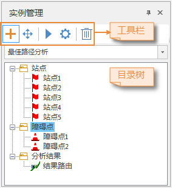

网络分析实例管理窗口用于管理分析实例就是在网络模型中通过分析解决实际问题的过程，如路径分析、服务区分析、最近设施查找等。目前，网络分析已经广泛应用于电子导航、交通旅游、城市规划、物流运输以及电力、通讯等不同行业中。

###  实例管理窗口介绍

在" **空间分析** "选项卡的" **设施网络分析** "组中，单击" **网络分析** "下拉按钮，在弹出的下拉菜单中选择要执行的网络分析项，则弹出"
**实例管理** "浮动窗口如下图所示。

  
  
**“实例管理”工具条说明**

* **鼠标添加点：** 单击**鼠标添加**按钮，地图窗口中鼠标变为刺点状态，可在地图窗口中合适的位置单击鼠标左键添加站点。每添加一次站点，该点会自动添加到实例管理窗口的站点信息中。添加完成后，单击鼠标右键结束操作。
* **鼠标移动点：** 单击**鼠标移到**按钮，地图窗口中鼠标变为刺点状态，可选中当前地图窗口中已存在的点，按住鼠标左键拖拽至结点捕捉容限内任意位置，松开鼠标左键完成移动。
* **执行：** 单击**执行**按钮，执行网络分析功能。
* **参数设置：** 单击**参数设置**按钮，弹出参数设置窗口，设置当前网络分析的详细分析参数。
* **删除实例：** 单击**删除实例**按钮，弹出“删除实例”对话框，单击“确定”，删除当前实例，单击“取消”，退出当前操作。

**目录树结点右键菜单说明**
- **站点**
   * **移除** ：选择“ **站点** ”右键菜单中“ **移除** ”项，移除站点中所有的子站点。若选择其子结点右键菜单中的" **移除** "项，则仅移除该子项。
   * **导入** ：以导入的方式添加站点，详细请参见[导入站点](ImportLocations.html)页面。
   * **导出** ：将该分析实例中所有站点导出保存为点数据集。

- **障碍点**
   * **移除** ：选择" **障碍点** "右键菜单中" **移除** "项，移除障碍点中所有的子障碍点。若选择其 子结点右键菜单中的" **移除** "项，则仅移除该子项。
   * **导入** ：以导入的方式添加障碍点，类似于导入站点的方式。
   * **导出** ：将该分析实例中所有障碍点导出保存为点数据集。

- **分析结果**
   * **保存为数据集** ：将分析结果中生成的所有子项保存为数据集，若选择其子结点右键菜单中的" **保存为数据集** "项，则仅将该结果子项保存为数据集。在生成结果数据集时，可以选择某一字段做为统计字段，字段值为路径所经过的所有弧段的对应字段值的累加。
   * **移除** ：清空分析结果中所有子项。