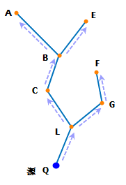

###  使用说明

多要素追踪分析支持五种分析类型：共同上游、共同下游、连通分量、不连通分量和多点连通环路。

**结点/弧段共同上游**

根据给定的结点或弧段，查询这些要素的共同上游结点或弧段。

下图以追踪多个结点的共同上游为例：假设以水流代表设施网络中流动的物质，Q 点是一个汇点，那么 Q 点将接收水流的输入，流向如图中的箭头所示的方向，那么，图中的 A、B、C、L、E、F、G 结点都是 Q 点的上游结点，也称为 Q 点的上游，因为从这些结点流出的水最后都流入了 Q 点；而弧段 AB、BC、CL、LQ、EB、FG、GL 是 Q 点的上游弧段，也称为 Q 点的上游。

   
  
如下图所示，流向如图中的箭头所示的方向，如果查找 Q 和 P 点的共同上游弧段，则分析结果会找到弧段 AB、BC、CL、EB、GL 和 FG。

  
  
**结点/弧段共同下游**

根据给定的结点/弧段要素，查询这些要素的共同下游结点/弧段。

如下图所示，以追踪弧段的下游为例：假设以水流代表设施网络中流动的物质，Q 点是一个源点，水流将从 Q 点流出，流向如图中的箭头所示的方向，那么，图中的 A、B、C、L、E、F、G 结点都是 Q 点的下游结点，也称为 Q 点的下游，因为从这些结点接收了 Q 点流出的水；而弧段 BA、CB、LC、QL、BE、GF、LG 是 Q 点的下游弧段，也称为 Q 点的下游。

    
  
如下图所示，流向如图中的箭头所示的方向，如果查找弧段 QL 和 PM 的共同下游弧段，则分析结果会找到弧段 BA、CB、LC、BE、LG 和 GF。

  
  
**连通分量**

根据给定的网络要素（结点或者弧段），查找与这些要素相连通的其他要素。一般情况下，网络数据集都是连通的，因此与当前要素相互连通的要素会比较多。

**不连通分量**

根据给定的网络要素（结点或者弧段），查找与这些要素相连通的其他要素。一般情况下，网络大部分处于连通状态，如果需要确定所有网络要素都是连通的，通过“不连通分量”可以检查是否有不连通要素。比执行“连通分量”检查网络连通性更加直观些。

**多要素连通环路**

根据给定的要素查找与这些要素连接成一个闭合的环路。根据要素类型的不同，可以分为多点连通环路和多弧段连通环路。