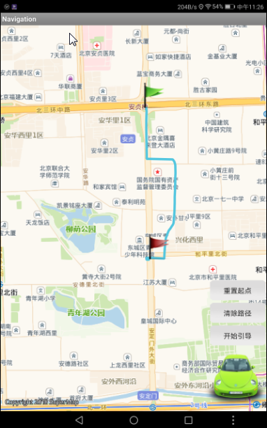

###  使用说明

桌面产品支持路网编译功能，该功能为移动导航加工基础数据，将编译所得的数据结果应用于 iMobile 开发的移动端系统中。

  * 路网数据编译功能依赖相关路网数据，包括：基础道路线数据集、道路名称表、道路线与道路名称关系表、路网结点数据集、转向结点数据集和行政区划表数据，通过以上数据编译得到 **基础道路数据** 、 **拓扑数据** 和 **引导数据** ，最后将这些数据打包为一份路网数据。
  * 该功能同时支持将不同数据源下的多个不同区域的数据一起编译打包为一份数据。方便用户整合不同区域的数据。例如：各省份的路网编译数据均存储在不同的数据源中，用户需要将各省份数据编译为一份数据供导航应用，用户可在编译数据中加载多份数据，一起打包编译，得到用户需要的最终结果。

  * 该功能基于四维图新的数据进行路网数据编译，四维图新的源数据格式为 *.mif 文件，需将其导入至数据源中使用。

###  工作原理

路网数据编译的实现包括基础道路编译、拓扑数据编译、引导数据编译三个部分，各阶段的具体实现说明如下所述：

  * **基础道路编译** ：首先根据道路名称关联关系表中的 RouteID 和 ID 字段的对应关系，将道路名称属性表中的 PathName 字段中的道路名称更新到基础道路线数据中。然后根据已经更新了道路名称的基础道路线数据、路网结点数据、转向结点数据、行政区划表编译得到基础道路数据，编译好的基础道路数据会新增道路等级、网格标识、对应的一层网格号等信息。
  * **拓扑数据编译** ：根据已经正确编译了基础道路数据、路网结点、转向结点、图幅 ID等数据，编译节点拓扑关系、弧段拓扑关系、打包0、1、2、3层拓扑包。
  * **引导数据编译** ：根据已经正确编译了基础道路数据和指定的图幅ID编译路网引导数据。

###  功能入口

  * **交通分析** -> **路径规划** 组-> **路网编译** 。

###  参数说明

  * 单击工具栏中的“添加”按钮，在弹出的“选择”对话框中添加路网基础道路的线数据集。

**注** ：若需要将多个编译区域打包为一份数据，可重复步骤 2
，依次添加多份数据至列表框。例如：用户需要将四川省、重庆市、云南省三个省份的数据打包为一份数据，则依次加入三个省份的基础线数据集。

  * 在“路网数据编译”对话框中，需进行路网基础数据设置： 
    * **编译类型** ：可选择路网数据编译类型，包括“基础道路编译”、“拓扑数据编译”、“引导数据编译”三种类型，其中“基础道路编译”是路网编译结果的必选项，“拓扑数据编译”、“引导数据编译”是可选项，用户可根据数据需求进行选择。
    * **路网结点** ：设置路网结点数据，其中存储了拓扑关系、结点类型等信息，用于编译引导数据和拓扑数据。
    * **转向结点** ：设置转向结点数据，其中存储了转向关系、拓扑关系等信息，用于编译引导数据和拓扑数据。
    * **道路名称** ：设置存储了路网数据道路名称的属性表数据，根据 RouteID 字段将 PathName 字段中的道路名称更新到基础道路线数据中。
    * **道路名称关联** ：设置路网数据基础道路线与道路名称关系属性表数据，将道路线数据中的 ID 与道路名称属性表中的 RouteID 相关联。
    * **行政区划** ：设置路网数据行政区划属性表数据集，可用于标识道路数据左右两侧的行政区域。如若数据源中无该数据，可单击右侧“ **构建** ”按钮，在弹出的对话框中，程序将从导航数据的 Admin 表和 FName 表中提取行政区划信息，并将行政区划信息存储在指定的结果的数据集中。Admin 表和 FName 表都可以通过 SuperMap 提供的数据转换模块导入到 SuperMap 的数据源中。
    * **编译范围** ：设置路网数据编译的范围，单击右侧下拉按钮选择编译范围，可根据需要编译所有图幅或指定图幅范围或ID，进行路网数据编译。具体操作说明如下： 
      * **所有图幅** ：即编译所有图幅范围的路网数据。
      * **指定图幅ID** ：若某图幅路网数据编译失败，可重新单独编译该图幅ID的路网数据，只更新该部分的路网数据即可。在下拉选项中选择“指定图幅ID”后，在弹出的“图幅ID选择”对话框左侧选中一个或多个需进行路网数据编译的图幅ID，将其添加到右侧文本框中即可，则表示只编译指定图幅范围内的路网数据。 
      * **指定图幅范围** ：在下拉选项中选择“指定图幅范围”后，在弹出的“指定图幅范围”对话框中，选择图幅范围所在的面数据集即可。 
    * **输出路径** ：用于设置打包的路网数据保存的路径，可直接在文本框中输入路径，或单击右侧按钮进行设置。
  * 单击“ **确定** ”按钮，即可进行路网数据编译操作。打包后的结果数据保存在上一步设置的“CompileNavigation”文件夹中，结果如下图所示。其中，SiChuan,BeiJing 和 ChongQing 三个文件夹中的数据都为编译的中间数据，可将其删除；Data 文件夹中存储着打包后的基础道路数据、导引数据及拓扑数据。  
  
    

  * 将编译所得的 Data 数据结果打包应用于 iMobile 开发的移动端系统中，运用导航模块实现路径导航。应用结果如下图所示，通过设定起点、终点，点击路径规划，得出当前位置到终点的最佳路径，并根据行进位置进行引导。iMobile 路径导航示意图如下：

  