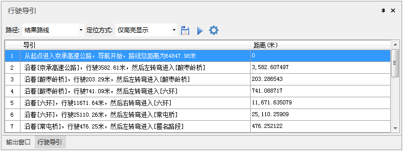
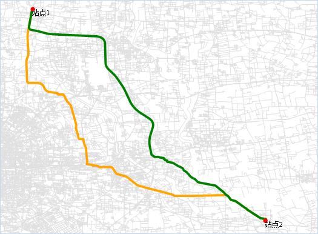

###  使用说明

根据构建的导航模型数据，可对网络数据集进行导航分析，可验证导航模型数据的正确性。

###  功能入口

  * 在当前工作空间中，打开网络数据集所在的数据源。
  * **交通分析** -> **导航分析** 组-> **导航** 。

###  操作说明

1. **模型文件** ：选择已构建的导航模型文件，为导航提供相关的分析环境和道路信息。
2. **导航分析模式** ：选择导航模型的网络数据集。 
    * 推荐模式：该模式会优先考虑高速路等高级道路，选择最优路线进行导航。
    * 距离最短：该模式表示导航结果为距离最短的路线。
    * 不走高速：表示导航结果路线都没有高速路段。
3. **开启行驶导航** ：勾选该复选框之后，导航结果会显示每条路线的详细信息，包括道路名称、距离、转弯方向等信息，如下图所示：     
  
4. **生成备选路线** ：若选择的导航分析模式为推荐模式或不走高速模式，可以勾选该复选框，在有其他方案的前提下，生成一条备选的路线方案。分析结果中会有结果路线和备选路线两个结果。 **备注** ：距离最短模式只有一个结果，不能生成备选路线。  需同时满足以下三个条件才有备选路线生成，否则不会生成备选路线:

    * 备选路线总耗费小于1.15倍的最短路径总耗费。
    * 共享耗费（结果路线与备选路线共有路径）小于等于最短路径总耗费的的0.75倍。
    * 备选路线总耗费与共享耗费（结果路线与备选路线共有路径）差值小于1.1倍的最短路径总耗费与共享耗费的差值。
5. 设置好导航参数之后，单击“确定”按钮，将鼠标移至当前地图中，在合适的位置单击鼠标左键即可添加站点，也可通过“鼠标移动”的方式调整站点的位置，选中待调整的站点，按住鼠标左键移动站点位置即可。
6. “实例管理”窗口中的站点顺序为导航依次经过的顺序，站点顺序可以通过有点菜单中的“上移”、“下移”进行调整。
7. 添加完站点之后，单击“实例管理”窗口中的“执行”按钮，即可执行导航分析，导航结果路线会展示在当前地图中，输出窗口也会提示导航的总距离和时间耗费信息。导航结果展示如下图所示，其中，绿色路线为导航结果，黄色路线为备选路线。 导航分析结果如下：   

