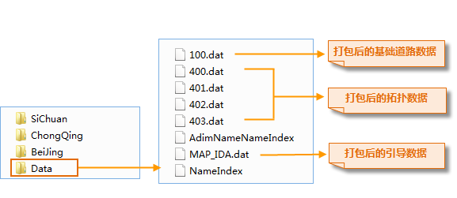
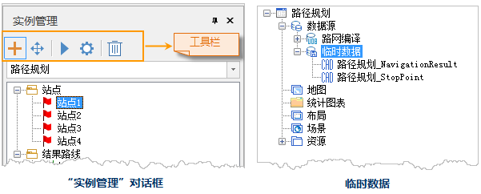

### 使用说明

支持基于标准化地理空间数据编译成果的路径规划分析功能，路网编译成果为路径规划提供相关的基础道路数据、拓扑数据和引导数据。同时也是对路网编译数据进行验证和分析，有关数据制作请参看[路网数据编译](CompileNavigationData)。

### 功能入口

  * 路径规划依赖路网线数据，在地图窗口中打开对应的路网数据集。
  * **交通分析** -> **路径规划** 组-> **路径规划** 。

### 操作说明

1. 在 **路径规划设置** 对话框中设置如下参数： 
    * **路径模型文件** ：点击文本框右侧文件夹按钮，选择已编译好的路网数据文件，路网数据文件可通过[路网数据编译](CompileNavigationData)功能生成此文件，例如编译所得文件结果如下图所示，此处路径模型文件选择 **Data** 文件夹，其中存储着打包后的基础道路数据、导引数据及拓扑数据； SiChuan,BeiJing 和 ChongQing 三个文件夹中的数据都为编译的中间数据，不可作为路径模型文件。     
    * **路径规划模式** ：程序提供三种路径规划模式，分别是： 
      * **推荐模式** ：该模式会优先考虑高速路等高级道路，选择最优路线进行导航。
      * **距离最短** ：该模式表示导航结果为距离最短的路线。
      * **不走高速** ：表示导航结果路线都没有高速路段。
    * **开启行驶导引** ：勾选该复选框之后，路径规划结果会显示每条路线的详细信息，包括道路名称、距离、转弯方向等信息。
2. 设置好以上参数后，单击“ **应用** ”按钮，在当前地图中鼠标指针变为十字框标，在合适的位置单击鼠标左键即可添加站点。并在地图窗口右侧弹出“实例管理”对话框。在工作空间管理器中的路网数据源下生成临时数据源，该数据源下包含两个数据集，分别是路径规划数据集（NavigationResult）和站点数据集（StopPoint）。如下图所示： 
     
3. **站点管理** ：单击站点通过鼠标右键菜单进行站点管理，也可通过实例管理器工具栏操作按钮进行管理。 
    * 实例管理窗口中的站点顺序为路径规划依次经过的顺序，站点顺序可以通过右键菜单中的“设为起点”、“上移”、“下移”、“设为终点 ”进行顺序调整。
    * 可通过实例管理器工具栏中“鼠标移动”的方式调整站点的位置，选中待调整的站点，按住鼠标左键移动站点位置即可 。
    * 可通过右键菜单进行“移除”、“重命名”等操作。
    * 支持单个站点导出的操作。  
4. 添加完站点之后，单击“ **实例管理** ”窗口工具栏中的“ **执行** ”按钮，即可执行路径规划。 
    * 路径规划结果路线会展示在当前地图中，路径规划结果展示如下图所示，其中，绿色路线为路径规划结果。
    * **行驶引导** ：路径规划结果会在行驶引导窗口显示每条路线的详细信息，包括道路名称、距离、转弯方向等信息。
    * 在“实例窗口”内的“结果路线”下，会生成一个结果路线，该结果路线支持鼠标右键导出为结果路线数据集。

  
