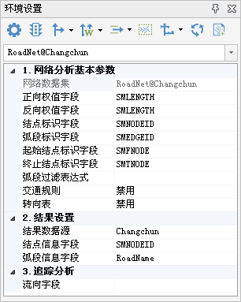

网络分析环境设置窗口，用来对网络分析全局的一些参数进行设置。“ **路网分析** ”组的“ **环境设置** ”复选框，用来控制环境设置窗口的显示和隐藏。

“**环境设置**”窗口与网络数据集绑定，只有当前地图窗口存在打开的网络数据集，窗口中的参数才可以设置。

  

* **工具条介绍**
   * **风格设置**：对交通网络分析和设施网络分析过程中的各种站点、障碍点等点风格，结果路由等线风格，服务区等面风格和文字提示的风格分别进行设置。详细介绍请参见[风格设置](StyleSetting.html)页面
   * **交通规则设置** ：为网络分析设置交通规则，即设置网络弧段是否单行（包括正向单行和反向单行）或者禁止通行等属性。详细介绍请参见[**交通规则设置**](TrafficRules.html)对话框的介绍。
   * **转向表设置**：对网络分析中的转向表进行设置，包括[创建转向表](CreatTurnTable.html)和[设置转向表](SetTurnTable.html)。详细介绍请参见[转向表](TurnTable.html)页面。
   * **权值设置**：用来在内存中更新弧段权值和结点权值。[更新弧段权值](UpdateArcWeight.html)用来对弧段的正向/方向权值进行更改以及该弧段是否为障碍边进行设置等。[更新结点权值](UpdateNodeWeight.html)用来对结点处的转向权值以及结点是否为障碍点进行设置。
   * **追踪分析网络建模**：用来对追踪分析的分析参数统一进行设置，包括设施网络的结点标识字段和弧段标识字段、是否创建流向、是否创建等级等。详细介绍请参见[追踪分析网络建模](TraceModeling.html)。
   * **创建三维网络数据集流向**：根据指定的源点和汇点的位置，为三维网络数据集创建流向。详细说明请参见[三维网络创建流向](../SceneOperation/RealspaceNetworkAnalyst/BuildDirections3D.html)页面。
   * **分析区域设置**：用于设置网络分析的分析区域，在进行网络分析时只加载分析区域范围内的网络数据集，提高了网络分析的性能。详细介绍请参见[分析区域设置](AnalysisArea.html)。
   * **管线模型设置**：在进行爆管分析前，可通过构建管线模型和设置管线图层功能构建管线模型数据，详细介绍请参见[构建管线模型](../SceneOperation/RealspaceNetworkAnalyst/BuildPipelineModel.html)和[管线图层设置](../SceneOperation/RealspaceNetworkAnalyst/PipelineModelSetting.html)页面。
   * **检查环路** ：检查网络数据集中是否存在环路。详细介绍请参见[检查环路](CheckLoop.html)页面。
   * **创建网络模型文件** ：可基于二维网络数据集，生成 *.snm 格式的网络模型文件。详细介绍请参见[创建网络模型文件](CreatNetworkFile.html)页面。

* **网络图层下拉框** ：当当前地图窗口中存在多个网络数据集时，可通过网络图层下拉框，选择需要进行环境设置的网络数据集。
* **网络分析基本参数**
   * **网络数据集** ：显示了当前选择的网络数据集名称。用户不可以设置。
   * **正向/反向权重字段** ：从右侧下拉框中选择一个字段作为网络数据集弧段的正向/反向权值字段。可以选择当前网络图层的任意字段作为权重字段。  
权重字段表示了网络结点从一点到另外一点的耗费值。在实际应用中我们可以将距离、时间、花费等字段作为权重字段。例如要计算 A 点到 B 点，可以使用时间字段作为权重字段，然后使用网络分析中的路径分析功能计算 A 点到  B 点之间的最佳路径。正向权重是指从弧段的起点到达终点的耗费，反向权重是指从弧段的终点到达起点的耗费。这两个字段的设置可以相同（如设置长度作为权重字段时），也可以不同（如设置时间作为权重字段，因为相同时间内从一条弧段的起点到达终点和从终点到达起点所用的时间可能不同）。  
权重字段支持直接输入表达式，也可以选择“表达式…”，使用“SQL表达式”对话框来定义表达式。关于如何使用SQL表达式，请参阅[SQL表达式对话框](../Query/SQLDia.html)页面。
   * **结点标识字段** ：从右侧下拉框中选择一个唯一标识网络数据集中每个结点的字段，可以选择网络数据集中的点数据集的字段作为标识字段。应用程序默认采用 SMNODEID 字段为结点标识字段。
   * **弧段标识字段** ：从右侧下拉框中选择一个唯一标识网络数据集中每个弧段的字段，可以选择网络数据集中的线数据集的字段作为标识字段。应用程序默认采用 SMEDGEID 作为弧段标识字段。
   * **起始/终止结点标识字段**：从右侧下拉框中选择一个标识网络数据集中起始/终止结点的字段，可以选择网络数据集中的线数据集的字段作为标识字段。应用程序默认采用 SMTNODE 作为起始/终止结点标识字段。
   * **弧段过滤表达式**：设置分析时要过滤掉的弧段，在进行网络分析时只考虑满足此表达式的弧段对象。可以直接输入表达式，也可以选择“表达式…”，使用“SQL表达式”对话框来定义表达式。关于如何使用SQL表达式，请参阅[SQL表达式对话框](../Query/SQLDia.html)页面。
   * **交通规则**：设置分析时是否启用交通规则，可根据实际需要进行交通规则设置。应用程序默认禁用。关于如何设置交通规则，请参阅[设置交通规则](TrafficRules.html)页面。
   * **转向表**：设置分析时是否启用转向表，可根据实际需要进行转向表设置。应用程序默认禁用。关于如何创建及设置转向表，请参阅[转向表](TurnTable.html)页面。

* **结果设置**
   * **结果数据源** ：网络分析结果默认保存在的数据源。后续的网络分析结果都将默认保存在该数据源下。默认为当前网络数据集所在的数据源。
   * **弧段信息字段** ：提供弧段信息的字段，如道路的名称字段等。可用于生成行驶导引。
   * **结点信息字段** ：提供结点信息的字段，如公交站名称字段等。可用于生成行驶导引。

* **追踪分析**
   * **流向字段** ：追踪分析的前提条件，需要指定一个流向字段，用于指定弧段的流向。