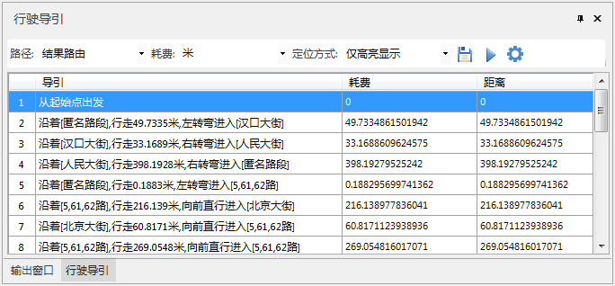

行驶导引记录了最佳路径分析、最近设施查找、旅行商分析和物流配送等常用交通网络分析结果中的路径信息。一个行驶导引对象对应着一条从起点到终点的行驶路线。

###  行驶导引窗口介绍

在“ **交通分析** ”选项卡的“ **路网分析** ”组中，勾选“ **行驶导引** ”复选框，则弹出“ **行驶导引** ”浮动窗口。

在执行网络分析功能前，单击“实例管理”窗口中的“参数设置”按钮，在弹出的设置窗口中勾选“开启行驶引导”复选框，在执行网络分析功能完毕后，行驶导引窗口将显示行驶导引报告。

   
  
**"行驶导引"工具条说明**

**路径** ：选择当前分析结果中的分析路径。

* 对于最佳路径分析，当最佳路径有两条或多条时（在耗费相同的情况会出现这种情况），用来选择路径，一般情况下只有一条最佳路径。
* 对于旅行商分析，当路径有两条或多条时（在耗费相同的情况会出现这种情况），用来选择路径，一般情况下只有一条路径。
* 对于查找最近设施点，路径数量由"查找最近设施点"对话框中的 "查找参数"决定，一般路径数量时小于或等于"查找设施点的个数"值。选择不同的路径，列表框中将显示不同路径的行驶情况。

**耗费**：从下拉框中选择耗费单位，应用程序提供的时间单位：秒、分、小时；长度单位：英里、英尺、英寸、码、度、毫米、厘米、分米、米、千米。注意：应用程序支持自定义耗费单位。直接在文本框中输入要使用的单位，如 Min，Sec 等。耗费单位设置成功后，导引文字中的耗费单位会自动更新为设置后的耗费单位。

**定位方式**：在单击框中的"查看"时在地图上定位浏览结点和弧段的方式，包括：仅高亮显示、居中显示对象、整窗显示对象。当定位方式由整窗显示对象切换至其他两种定位方式查看时，地图显示比例尺默认不变。
* 仅高亮显示，在当前地图窗口中高亮标识所查看的结点和弧段，地图比例尺不变。
* 居中显示对象，在当前地图窗口中高亮标识并居中显示所查看的结点和弧段，地图比例尺不变。
* 整窗显示对象，在当前地图窗口中高亮标识并整窗显示所查看的结点和弧段，地图比例尺变大。

**保存** ：单击保存按钮，弹出"导出行驶导引文件"对话框，选择保存路径、保存类型、输入文件名称，单击"确定"按钮即可将"行驶导引报告"内容导出。保存为（*.html）格式的行驶导引文件。

**播放/暂停** ：单击**播放**按钮，应用程序将以动画形式从起点开始到终点结束显示行驶路径；单击**暂停**按钮，模拟动画符号将在路径上暂停行驶。

**设置** ：单击**设置**按钮，弹出"播放参数设置"对话框，用以设置行驶动画的各项参数（见下图）。

<!--     -->
* 总耗费：表示从起点至终点行驶的耗费值总和，单位为耗费单位。
* 总时间：表示从起点行驶至终点所耗费的时间。
* 行驶速度：每帧的速度，默认为**（耗费单位/每秒）。
* 播放符号：单击该按钮弹出"点符号选择器"对话框，可对动画符号风格进行详细设置。

**"行驶导引"列表框说明**

* **序号** ：表示起始站点经过每一个站点后到达终止站点的所有拐点的顺序。
* **导引** ：对行驶情况的简单说明，以"从起始点出发"开始，以"到达终点"结束。
* **耗费** ：记录了两个拐点间的行驶耗费，与正向/反向阻力字段相关，单位为耗费单位。
* **距离** ：记录了两个拐点之间的距离。  