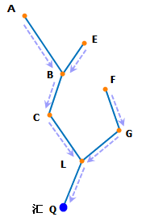
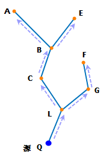

### 使用说明

最短路径追踪分析支持三种分析类型：任意两要素间最短路径、上游最短路径追踪和下游最短路径追踪。

**任意两点/弧段间最短路径**

根据添加的两个结点或者弧段，计算它们之间的最短路径。

**上游最短路径追踪**

用于设施网络上游路径分析，根据给定的结点/弧段，查询其上游耗费最少的路径。

如下图所示，假设以水流代表设施网络中流动的物质。Q 点是一个汇点，那么 Q 点将接收水流的输入。流向如图中的箭头所示。那么，图中的 A、B、C、L、E、F、G 结点是都是 Q 点的上游结点，也可以成为 Q 点的上游，因为从这些结点流出的水最后都流入了 Q 点；而弧段 AB、BC、CL、LQ、EB、FG、GL 是 Q 点的上游弧段，也称为 Q 点的上游。

另外，相对于弧段 LQ 来说，A、B、C、L、E、F、G 结点也是弧段 LQ 的上游结点，也称为弧段 LQ 的上游；而弧段 AB、BC、CL、EB、FG、GL 是弧段 LQ 的上游弧段，也称为弧段 LQ 的上游。

  
  
**下游最短路径追踪**

用于设施网络下游路由路径分析，根据给定的结点/弧段，查询其下游耗费最少的路径。

如下图所示：假设以水流代表设施网络中流动的物质，Q 点是一个源点，水流将从 Q 点流出，流向如图中的箭头所示的方向，那么，图中的 A、B、C、L、E、F、G 结点都是 Q 点的下游结点，也称为 Q 点的下游，因为从这些结点接收了 Q 点流出的水；而弧段 BA、CB、LC、QL、BE、GF、LG 是 Q 点的下游弧段，也称为 Q 点的下游。

另外，相对于弧段 QL 来说，A、B、C、L、E、F、G 结点也是弧段 QL 的下游结点，也称为弧段 QL 的下游；而弧段 BA、CB、LC、BE、GF、LG 是弧段 QL 的下游弧段，也称为弧段 QL 的下游。

  
