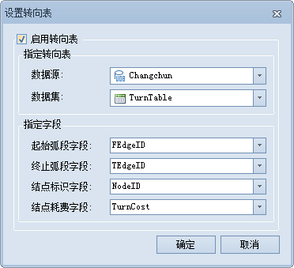

### 操作步骤

1. 在" **空间分析** "选项卡的" **设施网络分析** "组中，勾选" **环境设置** "复选框，则弹出" **环境设置** "浮动窗口，单击"环境设置"窗口工具条上的**转向表设置**按钮，在弹出的下拉菜单中选择"设置转向表"项，弹出"设置转向表"对话框。设置转向表是指将指定的转向表数据集设置为转向表。  
<!--    -->
2. 指定转向表。选择目标转向表数据集及其所在的数据源。
   * **数据源：** 在下拉框中列出了当前工作空间中的所有数据源，选择目标数据集所在的数据源。
   * **数据集：** 在下拉框中列出了当前数据源中的所有转向表数据集，选择一个作为网络分析的转向表。
3. 指定字段。
   - **起始弧段字段：**在节点处的转弯总会涉及到两个弧段，即一个起始弧段和一个终止弧段。在选择的转向表中，选取一个字段作为起始弧字段，以表示转弯是从哪个弧段开始的。
   - **终止弧段字段：** 在选择的转向表中，选取一个字段作为终止弧字段，以表示转弯是到达哪个弧段的。
   - **结点标识字段：** 用来唯一标识转向点的一个字段。
   - **结点花费字段：** 用来记录特定转弯处，在对应节点上的花费。

4. 单击"确定"按钮，完成设置转向表操作。单击"取消"按钮，退出当前对话框。 

### 相关主题

<!--  -->
[转向表](TurnTable.html)

<!--  -->
[创建转向表](CreatTurnTable.html)
