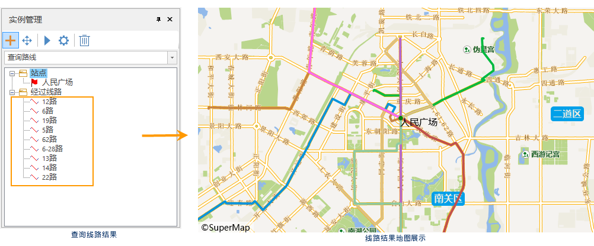

### 使用说明

查询路线是查询经过指定站点的线路。

### 操作步骤

1. **加载公交数据** ：单击“ **交通分析** ”选项卡->“ **公交分析** ”组->“ **查询路线** ”按钮，弹出“公交分析参数设置”对话框，在该窗口中，设置公交站点、线路数据，站点与线路的关系数据，是公交分析的必需数据。
2. 完成上述参数设置，单击“确定”按钮。在地图窗口右侧弹出“ **环境设置** ”窗口和“ **实例管理** ”窗口，同时在工作空间管理器中的公交分析数据源下生成 **临时数据源** 。 
3. **环境设置** ：在“环境设置”窗口，用户可在该窗口设置出入口参数、步行参数、融限设置的相关信息，同时也可对已设置的公交站点、线路，站点与线路的关系等数据进行修改。关于参数的具体描述，请参见[公交分析环境设置](TrafficEnvirSet)页面。
4. **临时数据源** ：在工作空间管理器中的公交分析数据源下生成 **临时数据源** ，该数据源下包含两个数据集，用于存储实例管理窗口中的两类数据。分别是站点数据集（查询线路_Stop)、经过线路（查询路线_Result)。
5. **实例管理** ：在实例管理窗口，用户根据分析需求,在地图窗口指定具体站点。添加站点有两种方式，一种是地图图层单击鼠标完成站点的添加；一种是通过导入的方式，将点数据集中的点对象导入作为站点。查询路线只能指定一个站点。
    * **添加站点** ：在当前地图窗口中，鼠标指针为十字框标，在合适的位置单击鼠标左键即可添加站点。并单击鼠标选择指定的一个站点。
    * **导入站点** :当前工作空间中的点数据集导入作为站点。在“实例管理”窗口中的树目录中，右击“站点”结点，在弹出的右键菜单中选择“导入”命令，具体操作请参见[导入站点](../ImportLocations)对话框。
6. 添加完成后，该点会自动添加到实例管理窗口的站点信息目录树中。
7. 单击“ **交通分析** ”选项卡中“ **路网分析** ”组的“ **执行** ”按钮或者单击“实例管理”窗口的“执行”按钮，即可按照设定的参数，执行查询路线操作。
8. 执行完成后，分析结果会自动添加到当前地图展示，多条线路将以不同的颜色展示区分；在实例管理窗口中“经过线路”目录树下依次排列在途径该站点的线路。单击某条线路，地图中将自动定位至该线路并高亮显示。  

  
  
###  相关主题

 [获取公交数据](TrafficDataPrepare)

 [设置公交分析环境](TrafficEnvirSet)

 [加载公交数据](LoadTranfficData)

 [公交换乘分析](TransferAnalysis)

 [查询站点分析](FindStopsByLineStop)
