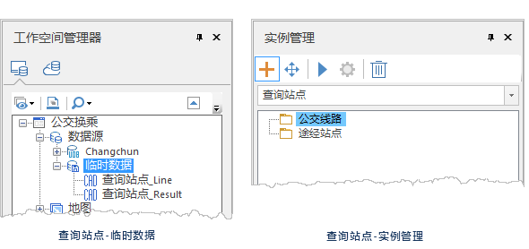
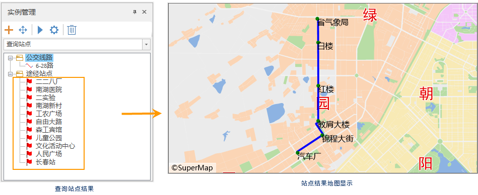

###  使用说明

查询站点是通过指定具体线路查询该条线路上有哪些站点。可以获得这些站点的详细信息。

###  操作步骤

1. **加载公交数据** ：在“ **交通分析** ”选项卡的“ **公交分析** ”组中，单击“ **查询路线** ”按钮，弹出“公交分析参数设置”对话框，在该窗口中，设置公交站点、线路数据，站点与线路的关系数据，是公交分析的必需数据。
2. 完成上述参数设置，单击“确定”按钮。在地图窗口右侧弹出“ **环境设置** ”窗口和“ **实例管理** ”窗口，同时在工作空间管理器中的公交分析数据源下生成 **临时数据源** 。 
3. **环境设置** ：在“环境设置”窗口，用户可在该窗口设置出入口参数、步行参数、融限设置的相关信息，同时也可对已设置的公交站点、线路，站点与线路的关系等数据进行修改。关于参数的具体描述，请参见[公交分析环境设置](TrafficEnvirSet.html)页面。
4. **临时数据源** ：在工作空间管理器中的公交分析数据源下生成 **临时数据源** ，该数据源下包含两个数据集，用于存储实例管理窗口中的两类数据。分别是公交线路数据集（查询站点\_Line)、途径站点（查询站点\_Result)。   
  
5. **实例管理** ：在实例管理窗口，用户根据分析需求,在地图窗口指定具体线路。在当前地图窗口中，鼠标指针为十字框标，单击指定公交线路上任一点，即可选定该条线路作为指定查询线路。选定的线路在地图窗口高亮显示。
6. 添加完成后，该条线路会自动添加到实例管理窗口的公交线路信息目录树中。
7. 单击“ **交通分析** ”选项卡中“ **路网分析** ”组的“ **执行** ”按钮或者单击“实例管理”窗口的“执行”按钮，即可按照设定的参数，执行查询站点操作。
8. 执行完成后，分析得到的站点名称会自动显示到当前地图展示；在实例管理窗口中生成途径站点结果依次排列在途径站点的信息目录树中，单击某一具体站点，地图中将自动定位至该站点并高亮显示。  
   

###  相关主题

<!--   -->
[获取公交数据](TrafficDataPrepare.html)

<!--   -->
[设置公交分析环境](TrafficEnvirSet.html)

<!--   -->
[加载公交数据](LoadTranfficData.html)

<!--   -->
[公交换乘分析](TransferAnalysis.html)

<!--   -->
[查询路线分析](FindLinesByStop.html)