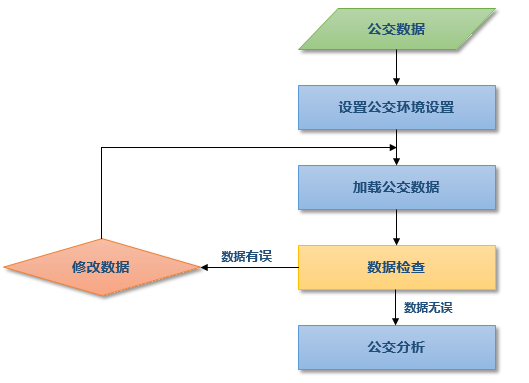

### 使用说明

公交，这里指公共交通，包括道路运输、轨道运输及航空运输等，一直是人们出行最常使用的方式。公交分析的主要任务即输出从起点到终点的最符合人们出行需求（如少步行、少换乘）和偏好（如不乘地铁）的换乘方法。随着城市建设的快速步伐，公交基础设施的建设也得到了长足发展，为人们生活带来了极大便利。面对日趋复杂和多样化的公共交通网络，准确、人性化的公交换乘方案显得尤为重要，对人们的日常出行起到不可小觑的指引作用。

SuperMap 公交分析是针对如公交车、地铁、长途客车、高铁等城市公共交通方式，以公交换乘分析、线路或站点查询为主要功能的分析模块。通过高效、准确和灵活的查找算法，为使用者提供最优的公交换乘方案。
* 丰富的站点、线路信息设置：如公交票价信息、发车时间和间隔、站点与线路的关系、站点与（轨道交通）出入口的关系设置等。
* 灵活的分析参数设置：站点归并、站点捕捉、最大步行距离、换乘策略、避开/优先站点、线路。
* 准确的线路导引：通过网络数据集给出准确步行路线。

**公交分析的主要流程** ：SuperMap 公交分析的流程可以大致分为 5 部分,请结合下面的文字加以理解：

1. 首先获取或者从其他格式导入公交数据；
2. 设置公交分析环境，包括站点环境设置、线路环境设置、公交关系设置，以及站点归并容限、站点捕捉容限、步行阈值等参数设置；
3. 加载公交数据；
4. 通过数据检查功能查找公交数据中的错误，根据错误信息对数据进行编辑修改，重复该步骤直至检查无误；
5. 进行公交分析，包括公交换乘分析和公交查询。

  
### 内容提要：

 [获取公交数据](TrafficDataPrepare)

 [设置公交分析环境](TrafficEnvirSet)

 [加载公交数据](LoadTranfficData)

 [公交换乘分析](TransferAnalysis)

 [查询路线分析](FindLinesByStop)

 [查询站点分析](FindStopsByLineStop)