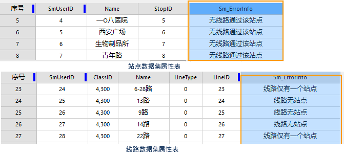

### 使用说明

公交数据是公交分析的核心和基础。SuperMap
公交分析所要求的数据包括公交站点、线路数据，站点与线路的关系数据、站点与出入口的关系数据以及网络数据集。这五种数据都需要用户提供，其中，前三种是公交分析的必需数据，站点与出入口关系数据集和网络数据集为可选数据。

用于公交分析的数据在分析前需要对数据进行检查，修改不满足要求的数据，以保证使用的公交数据符合分析要求，然后通过设置公交分析环境并加载公交数据，就可以进行公交分析。

### 公交数据组成

* **公交站点数据集** :即公交站点数据集,将采集获得的公交站点数据存储到一个点数据集中。该数据集中每一个点对象代表现实世界中的一个公交站点。不同类型的站点共同存储，如公交车站点、地铁站点等。要求属性表中必须包含两个字段：站点ID（字段类型为32位整型或64位整型）和站点名称字段，这两个字段为公交分析的必需字段。如下表为长春公交站点数据集属性表所示：StopID 即为站点ID，Name 即为公交车站点。

SmUserID | Name | StopID | ...  
---|---|---|---  
1  | **机场前站** | 1 | ...  
2 | **李家沱** | 2 | ...  
3 | **和平大街** | 3 | ...  
... | ... | ... | ...  

* **公交线路数据集**：即公交线数据集,将采集获得的公交线路以线对象的方式存储于一个线数据集中。该数据集中每一个线对象代表一条完整的有向公交线路，不论公交线路为何种类型（单向、双向、环线）。例如，123路公交车的始发站和终点站分别为A和B，那么从A到B与从B到A为两个线对象，并且这两条线路必须存储在同一数据集中。公交线路的方向与矢量化时的绘制方向一致。  
公交线路数据集的属性表中必须包含两个字段：线路ID（字段类型为32位整型或64位整型）和线路名称字段，这两个字段为公交分析的必需字段。除此之外，还可以包含其他一些属性字段，如始发时间、末班车时间、发车间隔、票价计费信息，这些信息可以为公交分析尤其是公交换乘分析的换乘方案的优先选择、出行花费等提供依据。如下表为长春公交线路数据集属性表所示：

SmUserID | Name | LineID | ...  
---|---|---|---  
1  | **11路** | 1 | ...  
2 | **8路** | 2 | ...  
3 | **长春轻轨** | 29 | ...  
... | ... | ... | ...  

* **站点与线路关系数据集**：站点与线路关系数据集为一个纯属性表类型的数据集，用于确定站点与线路的关系。现实中的公共交通，尤其是公交车线路，存在大量经过某站点而不停车的情况。单纯依靠将站点数据（二维点）捕捉到线路数据（二维线）上，不仅可能与实际情况不符，甚至可能导致分析结果错误，给使用者和出行者带来不必要的损失。因此，通过一个准确的站点与线路关系表来避免这种问题出现。  
该数据集中每一条记录表示一个公交站点与一条线路具有对应关系，即该站点经过该条有向公交线路。要求该数据集必须包含线路ID和站点ID两个字段，字段类型支持32位整型和64位整型。还可以包含站点在线路中的顺序号的信息。

SmUserID | LineID | StopID | ...  
---|---|---|---  
1  | **18** | 1 | ...  
2 | 27 | 8 | ...  
3 | 15 | 13 | ...  
... | ... | ... | ...  
  
* **站点与出入口关系数据集（可选）**:有些站点，如轨道交通的站点，往往一个停车站有多个出入口，如果希望公交换乘的结果详细到出入口站点，以及从该出入口到附近站点的步行线路，则需要准备站点与出入口关系数据集。如图1所示，乘坐地铁一号线到木樨地站，步行到木樨地A1口后换乘，这段步行路线就可以根据站点与出入口关系数据集来给出。  
该数据集为一个二维线数据集，用于标识普通站点与出入口站点之间的关系和行进路线，通过实际测量或数字化获得。其中每一个线对象代表从某站点（或出入口）到某出入口（或站点）的路径，即其两个端点为站点或出入口的位置。该数据用于在换乘分析时，提供与实际一致的站点与出入口间的路线。要求该数据集中必须包含两个字段：站点 ID 字段和出入口ID字段，此外还可以指定出入口的名称、拼音字段。  
**注意** :该数据不是公交分析的必需数据，如果没有该数据，则公交换乘分析结果中，站点与站点间换乘以直线连接或者按照网络底图数据换乘。  
  

* **网络数据集（可选）** :网络数据集（Network）由网络弧段和结点对象构成，并存储了弧段和结点间的空间拓扑关系。网络数据集可作为公交分析的参考数据。在进行换乘分析时，从某个位置或站点需要步行到达另一位置或站点时，系统会根据网络数据集给出与实际一致的行走路线。相反，如果没有设置网络数据集，则一段步行的起点和终点间是以直线连接的。因此，使用网络数据集辅助公交换乘分析，能够获得更加准确和人性化的换乘导引。
* **其他格式数据的导入** :除上面介绍的 SuperMap 数据模型的公交数据外，SuperMap 还支持将其他格式的数据导入，如 MapInfo的mif和tab格式、ArcGIS的shape格式等。只要是能够通过SuperMap的“数据导入”功能导入为对应的SuperMap点、线和属性表数据集的格式，并且满足公交分析对数据的要求，就可以进行公交分析。

### 数据检查

* 采集获得的公交数据可能由于测量误差、数据制作人员失误等原因出现错误，从而可能导致分析结果不正确。因此，SuperMap 在执行公交分析之前提供了对公交数据正确性检查的功能。
* 检查成功后，系统将自动在站点、线路数据集的属性表、站点与线路关系数据集和站点与出入口关系数据集的属性表中添加一个文本型字段，名称为“Sm_ErrorInfo”，写入对应的错误信息。各个数据集对应的错误信息内容及说明如下表所示。  

<table width="90%">
	<tr>
		<th width="20%">检查的数据集</th>
		<th width="25%">错误信息</th>
		<th width="55%">说明</th>
	</tr>
	<tr>
		<th rowspan="2">站点数据集</th>
		<td>无线路通过该站点</td>
		<td>在站点与线路关系数据集中不存在与该站点有关的记录。</td>
	</tr>
	<tr>
		<td>重复ID</td>
		<td>按照站点ID 顺序排序，第二次及以后出现的同一站点 ID 被认为是非法值。</td>
	</tr>
		<tr>
		<th rowspan="3">线路数据集</th>
		<td>线路为站点</td>
		<td>在站点与线路关系数据集中不存在与该线路有关的记录。</td>
	</tr>
	<tr>
		<td>线路仅有一个站点</td>
		<td> </td>
	</tr>
	<tr>
		<td>重复ID</td>
		<td>按照站点ID 顺序排序，第二次及以后出现的同一站点 ID 被认为是非法值。</td>
	</tr>
		<tr>
		<th rowspan="3">站点与线路关系数据集</th>
		<td>站点不在数据集中</td>
		<td>站点数据集中不存在该站点</td>
	</tr>
	<tr>
		<td>线路不在数据集中</td>
		<td>线路数据集中不存在该线路</td>
	</tr>
	<tr>
		<td>没有在融限范围内</td>
		<td>在站点与线路关系数据集中，存在某站点与某线路的关系记录，但在站点、线路数据集中，该站点到线路的距离大于站点捕捉融限，即该站点不能被捕捉到该线路上。</td>
	</tr>	
			<tr>
		<th rowspan="2">站点与轨道交通出入口关系数据集</th>
		<td>站点不在数据集中</td>
		<td>站点数据集不存在该站点</td>
	</tr>
	<tr>
		<td>空间位置不匹配</td>
		<td>连接站点与出入口的线对象的两端点，必须与站点数据集中对应的站点的位置一致，否则认为是数据错误。注意：轨道交通（如地铁）的每一个出入口是作为一个站点在站点数据集中存储的。</td>
	</tr>
</table>
  
**注意**:检查的前提是已经设置好分析环境设置，系统需要根据公交分析环境的设置进行检查，例如，站点捕捉容限用于对站点与线路关系进行检查，检查站点是否能被捕捉到对应的线路上。

   
  
### 公交数据修改

如果检查出数据有错误，或者实际的公交网络有变化，就需要对公交数据进行修改。使用者可针对错误信息进行修改，严格意义上来讲，应反复检查反复修改直至没有错误被检查出来，之后才能执行公交分析功能。否则在执行公交分析时，程序会提示“公交换乘模型加载失败！
”，提示执行分析失败。修改完成后，重新设置公交分析环境和加载数据，就可以对更新后的公交数据进行公交分析。

###  相关主题

<!--   -->
[设置公交分析环境](TrafficEnvirSet.html)

<!--   -->
[加载公交数据](LoadTranfficData.html)

<!--   -->
[公交换乘分析](TransferAnalysis.html)

<!--   -->
[查询路线分析](FindLinesByStop.html)

<!--   -->
[查询站点分析](FindStopsByLineStop.html)