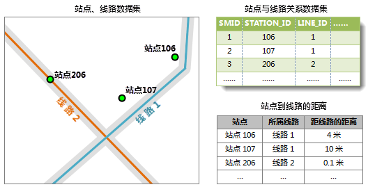

###  使用说明

公交分析环境设置窗口，用来对公交分析全局的一些参数进行设置。“路网分析”组的“环境设置”复选框，用来控制环境设置窗口的显示和隐藏。

公交分析环境设置是公交数据检查和公交数据分析的前提。可设置站点环境、线路环境、公交关系和其他一些参数，如站点捕捉容限、归并容限等。

###  公交线路环境设置

公交线路环境设置

设置公交线路数据的有关信息，包括公交线路所属的数据集、公交线路ID字段、名称字段以及线路的其他一些辅助信息的字段。带*号字段为必填字段，其他字段为选填字段。

**序号** | **字段名称** | **描述** | **类型**  
---|---|---|---  
1  | **线路名称字段** | 设置公交线路名称字段。该字段为必设字段。如果线路数据集中不存在该字段，将抛出异常。 | 必填字段  
2 | **线路 ID 字段** |
设置公交线路ID字段。该字段为必设字段，要求字段类型为32位整型或64位整型。如果线路数据集中不存在该字段或字段类型不匹配，将抛出异常。 | 必填字段  
3  | **线路别名字段** | 设置公交线路别名字段。 | 选填字段  
4  | **线路类型字段** | 设置标识公交线路类型的字段。要求该字段类型为整型。规定字段值为0代表公交汽车，1代表地铁，2代表无轨电车。 | 选填字段  
5  | **行驶速度字段** | 设置公交行车速度字段。 | 选填字段  
6  | **线路长度字段** | 设置公交线路的长度字段。 | 选填字段  
7  | **首班发车时间字段** | 设置公交线路首班车发车时间字段。 | 选填字段  
8  | **末班发车时间字段** | 设置公交线路末班车发车时间字段。 | 选填字段  
9  | **发车时间间隔字段** | 设置公交线路发车时间间隔字段。 | 选填字段  
  
###  公交线路环境设置

设置公交站点数据的相关信息，包括公交站点所属的数据集（即公交站点数据集）、站点ID字段、站点名称字段以及公交站点别名字段。在公交分析环境设置中必须指定一个StopSetting对象，且该对象必须设置了正确的参数，否则可能影响数据检查和数据加载的正确性。

**序号** | **字段名称** | **描述** | **类型**  
---|---|---|---  
1  | **站点数据集** | 设置公交站点所属数据集。要求数据集类型为点数据集。如果未设置或指定的数据集类型为其他类型，将抛出异常。 | 必填字段  
2 | **站点名称字段** | 设置公交站点名称字段。该字段为必设字段。如果站点数据集中不存在该字段，将抛出异常。 | 必填字段  
3  | **站点别名字段** | 设置公交站点别名字段。 | 选填字段  
4  | **站点 ID 字段** | 设置公交站点数据集中的公交站点 ID
字段。该字段为必设字段，要求字段类型为32位整型或64位整型。如果站点数据集中不存在该字段或字段类型不匹配，将抛出异常。 | 必填字段  
  
###  公交关系设置

设置站点与线路关系数据集、站点与出入口关系数据集以及网路数据集的相关信息。在公交分析环境设置中必须制定关系数据集，该数据集须指定了正确的公交站点与线路关系数据集、站点ID字段和线路ID字段，否则可能影响数据检查和数据加载的正确性。

**序号** | **字段名称** | **描述** | **类型**  
---|---|---|---  
1  | **关系数据源** | 设置存放关系数据集的数据源。 | 必填字段  
2 | **关系数据集** | 设置公交站点与线路关系数据集。要求数据集类型为纯属性表类型。如果未设置或指定的数据集类型为其他类型，将抛出异常。 |
必填字段  
3  | **线路 ID字段** |
设置站点与线路关系数据集中的线路ID字段。该字段为必设字段，要求字段类型为32位整型或64位整型。如果站点与线路关系数据集中不存在该字段或字段类型不匹配，将抛出异常。
| 必填字段  
4  | **站点 ID 字段** | 设置站点与线路关系数据集中的站点 ID
字段。该字段为必设字段，要求字段类型为32位整型或64位整型。如果站点与线路关系数据集中不存在该字段或字段类型不匹配，将抛出异常。 | 必填字段  
5  | **站点顺序字段** | 设置站点与线路关系数据集中存储了站点在线路中的顺序号（即该站点为线路中的第几站）的字段。 | 选填字段  
  
###  出入口参数设置

设置站点与主入口的关系参数，出入口数据集为可选数据，可根据研究的实际情况进行设置。

**序号** | **字段名称** | **描述** | **类型**  
---|---|---|---  
1  | **出入口数据集** | 设置站点与出入口关系数据集。要求数据集类型为线数据集。如果指定的数据集类型为其他类型，将抛出异常。 | 选填字段  
2 | **出入口中文名称字段** | 获取或设置站点与出入口关系数据集中的出入口中文名称字段。 | 选填字段  
3  | **出入口名称拼音字段** | 获取或设置站点与出入口关系数据集中的出入口名称拼音字段。 | 选填字段  
4  | **出入口 ID 字段** | 获取或设置站点与出入口关系数据集中的出入口 ID 字段。该字段为必设字段，要求字段类型为32位整型或64位整型。如果站点与线路关系数据集中不存在该字段或字段类型不匹配，将抛出异常。 | 选填字段  
5  | **站点 ID 字段** | 获取或设置站点与出入口关系数据集中的站点 ID 字段。该字段为必设字段，要求字段类型为32位整型或64位整型。如果站点与线路关系数据集中不存在该字段或字段类型不匹配，将抛出异常。 | 选填字段  
  
###  步行参数设置

**序号** | **字段名称** | **描述** | **类型**  
---|---|---|---  
1  | **步行数据集** | 设置步行数据集，该数据集为网络数据集。根据网络数据集的弧段和结点信息来获取换乘时的实际步行路线。 | 选填字段  
2 | **起始结点标识字段** | 设置网络数据集中的弧段起始结点ID的字段。 | 选填字段  
3  | **终点结点标识字段** | 设置网络数据集中的弧段终止结点ID的字段。 | 选填字段  
4  | **结点标识字段** | 设置网路数据集中的结点ID的字段。 | 选填字段  
5  | **弧段 ID** | 设置网络数据集中的弧段ID字段。 | 选填字段  
  
###  容限设置

* **站点捕捉容限** ：站点捕捉容限用于判断站点是否位于线路上。在确定站点与线路的关系时，系统首先根据公交站点与关系数据集来判断公交站点与线路的对应关系，然后根据站点捕捉容限进行进一步排除，如果站点到线路的距离大于捕捉容限，则认为其不是该线路上的站点。 

如下图所示：由公交站点与线路关系数据集得知，站点107和106位于线路1上，假设站点捕捉容限为5米，但在站点数据集和线路数据集中，站点107距离线路1的距离为10米，大于站点捕捉容限，那么站点107被认为不在线路1上。出现这种情况的原因可能是数据测量不精确，如果误差较大，不排除该点可能比排除该点造成的错误更大；也有可能是站点与线路关系数据集中该条记录有误。

  

* **最大步行距离** ：公交换乘的换车需要在公交站点处进行，换车情况有两种，第一种是两辆公交车的站点重合在一点，乘客从第一辆公交车下车不需要移动即可换乘第二辆公交车，第二种情况是乘客需要从一个站点走到另一个站点进行换乘，而最大步行距离就是出行者换乘时可以接受的行走的最大距离。如果换乘分析的方案中步行的距离超过了这个阈值，则该方案会被放弃。
* **单位** ：点击设置框右侧的下拉菜单设置站点捕捉容限和步行距离的单位。

### 相关主题

 [获取公交数据](TrafficDataPrepare)

 [加载公交数据](LoadTranfficData)

 [公交换乘分析](TransferAnalysis)

 [查询路线分析](FindLinesByStop)

 [查询站点分析](FindStopsByLineStop)