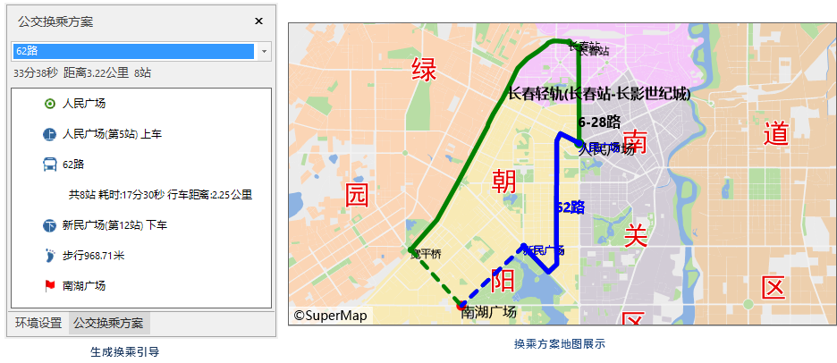

### 使用说明

公交分析的主要功能包括：公交换乘分析和公交查询（查询经过站点的线路和查询线路上的站点）。其中，公交换乘分析是针对给定的起点和终点分析满足用户需求的公交换乘方案的过程。

### 操作步骤

1. **加载公交数据** ：在“ **交通分析** ”选项卡的“ **公交分析** ”组中，单击“ **公交换乘** ”按钮，弹出“公交分析参数设置”对话框，在该窗口中，设置公交站点、线路数据，站点与线路的关系数据，是公交分析的必需数据。
2. 完成上述参数设置，单击“确定”按钮。在地图窗口右侧弹出“ **环境设置** ”窗口和“ **实例管理** ”窗口，同时在工作空间管理器中的公交分析数据源下生成 **临时数据源** 。 
3. **环境设置** ：在“环境设置”窗口，用户可在该窗口设置出入口参数、步行参数、融限设置的相关信息，同时也可对已设置的公交站点、线路，站点与线路的关系等数据进行修改。关于参数的具体描述，请参见[公交分析环境设置](TrafficEnvirSet)页面。
4. **临时数据源** ：该数据源下包含七个数据集，用于存储实例管理窗口中需要指定的七个数据。分别是起点数据集（公交换乘分析_Begion)、终点（公交换乘分析_End)、优先站点（公交换乘分析_PriorStop)、优先线路（公交换乘分析_PriorLine)、避让站点（公交换乘分析_EvadeStop)、避让线路（公交换乘分析_EvadeLine)、换乘方案（公交换乘分析_Result)。
5. **实例管理** ：在“实例管理”窗口，用户根据分析需求,在地图窗口指定公交换乘分析的起点、终点、优先站点、优先线路、避让站点、避让线路。前两个是公交换乘分析的必需数据，后四个数据为非必需数据，可根据用户需求设置。
    * **添加起点** ：在当前地图窗口中，鼠标指针为十字框标，在合适的位置单击鼠标左键即可添加起点。并单击鼠标选择要添加的一个起点。添加起点有两种方式，一种是地图图层单击鼠标完成起点的添加；一种是通过导入的方式，将点数据集中的点对象导入作为起点。添加完成后，该点会自动添加到实例管理窗口的起始结点信息目录树中。
    * **导入起点** :当前工作空间中的点数据集导入作为起点。在“实例管理”窗口中的树目录中，右击“起点”结点，在弹出的右键菜单中选择“导入”命令，具体操作请参见[导入站点](../ImportLocations)对话框。

    * **添加终点** ：添加完成后，鼠标状态会自动切换为添加终点的状态。终点添加方式与起点一致，可参考起点的添加方式添加终点。
    * **优先站点** ：即指定某一个或多个站点作为换乘路线中优先经过的站点，支持添加多个优先站点，在实例管理窗口的工具条中，单击“鼠标添加”按钮 ，即可添加多个站点。同时支持导入优先站点，导入方式与导入起点一致，可参考导入起点的操作方式。
    * **优先线路** ：即指定某一条或多条线路作为换乘路线中优先选择的线路，支持添加多条优先线路。在当前地图窗口中，鼠标指针为十字框标，在指定线路上捕捉任一点单击鼠标左键即可将该条线路作为优先线路。
    * **避让站点** ：即指定某一点或多个站点作为避让站点，换乘分析方案中将不包含该站点。支持添加多个避让站点。导入方式与导入起点一致，可参考导入起点的操作方式。同时支持导入避让站点，导入方式与导入起点一致，可参考导入起点的操作方式。
    * **避让线路** ：即指定某一点或多条线路作为避让线路，换乘分析方案中将不包含该线路。支持添加多条避让线路。添加方式与优先线路一致，可参考优先线路的添加方式。<br\>**注**：公交换乘分析的起点、终点只能添加一个。添加完成起点和终点即可进行换乘分析，优先站点、优先线路、避让站点、避让线路为非必要条件，用户可根据自身换乘需求进行设置。

6. 在公交换乘分析实例管理窗口中单击“参数设置”按钮 ，弹出“公交换乘分析设置”对话框，可对出发时间、乘车偏好、换乘策略、步行与乘车权重以及换乘方式最大数等参数进行设置。
    * **出行时间** ：设置出行时间，公交换乘结果会依据不同线路的不同运行时间进行过滤，出行时间前后半小时内停运的公交线路将不会出现在结果中。
    * **乘车偏好** ：乘车偏好设置支持对公共交通工具进行选择，如不乘地铁、优先公交汽车等，可以和换乘策略、优先和避让配合使用，使公交换乘分析的结果更加灵活和满足出行者的多样需求。程序提供了乘车偏好的类型，包括无偏好、优先乘坐公交汽车、优先乘坐地铁和不乘地铁。需要特别注意，目前，乘车偏好主要是根据线路的类型来划分的。因此，乘车偏好是否有效还要取决于公交线路数据中是否包含线路类型的属性信息，并且该属性字段的值必须与要求一致。
    * **换乘策略** ：在公交换乘时，出行者往往有不同的需求和偏好，如尽量少步行、少换乘、尽快到达目的地等。进行公交换乘分析时，会为分析者优先提供满足策略要求的换乘方案。程序提供了四种换乘策略，包括：少换乘、少步行、距离最短和较快捷。
  　　公交换乘方案的排序涉及到多个参数，如公交分析环境设置中的步行阈值、站点归并容限等，公交换乘分析参数设置中的乘车策略、乘车偏好、步行与乘车权重比等。因此，无论选择何种换乘策略，都需要结合其他参数进行加权计算，得出最优换乘方案。例如，距离最短换乘策略，是指根据所有相关参数的设置进行加权计算，最后按照加权总距离由短到长的顺序对换乘方案排序，而非单纯按照乘车和步行的总距离作为判断标准。
      * **少换乘** ：优先从起点到终点需要换乘的次数较少的换乘方案。如果换乘次数相同，则优先加权总距离小的方案。
      * **少步行** ：优先从起点到终点需要步行的距离较短且加权总距离较短的换乘方案。
      * **距离最短** ：优先从起点到终点加权总距离最短的换乘方案。
      * **较快捷** ：优先从起点到终点耗费最少的换乘方案。
    * **步行与乘车权重** :该权重比可理解为步行1公里相当于乘车几公里，用于评价公交换乘的各种方案。因为有方案数量的限制，所以就需要在所有方案中进行优选 。通过下面的例子来理解步行与乘车权重比的作用。例如现在有两种换乘方案： 

方案1：坐车10公里，走路1公里；

方案2：坐车15公里，走路0.5公里；

假设权重比为15：

方案1的总消耗为：10 + 1*15 = 25

方案2的总消耗为：15 + 0.5*15 = 22.5

此时方案2较好；

假设权重比为2：

方案1的总消耗为：10 + 1*2 = 12

方案2的总消耗为：15 + 0.5*2 = 17

此时方案1较好。

  * **换乘方案最大数** :根据实际参数的设置不同，公交换乘分析得出的换乘方案的实际数量可能小于或等于该值。
  * **显示引导信息** ：勾选该复选框，执行分析后将弹出“公交换乘方案”窗口，该窗口提供了具体的完整的公交换乘路线的详细信息。
1. 所有参数设置完毕后，单击“ **交通分析** ”选项卡中“ **路网分析** ”组的“ **执行** ”按钮或者单击“实例管理”窗口的“执行”按钮，即可按照设定的参数，执行公交分析操作。
2. 执行完成后，分析结果会自动添加到当前地图展示；在实例管理窗口的换乘方案中生成换乘路线结果，换乘方案是概括方案只包含乘车路线，同时在公交换乘方案窗口中，生成每个换乘方案的具体的公交换乘路线的详细信息。  

  

###  相关主题

 [获取公交数据](TrafficDataPrepare)

 [设置公交分析环境](TrafficEnvirSet)

 [加载公交数据](LoadTranfficData)

 [查询路线分析](FindLinesByStop)

 [查询站点分析](FindStopsByLineStop)
