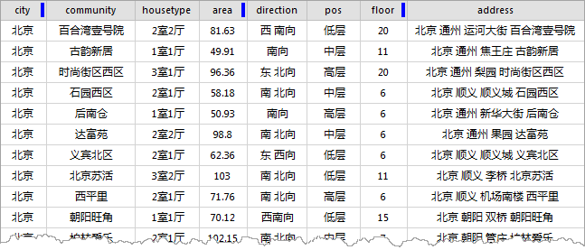
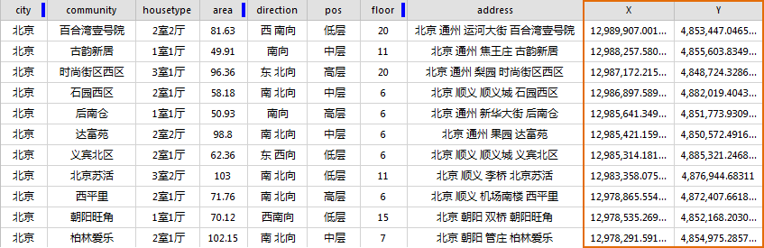
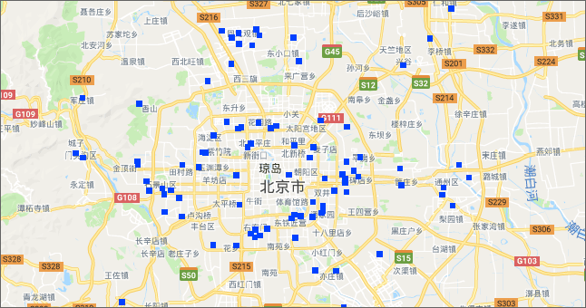

---
id: AddressResolution
title: 地址解析
---  

### 使用说明

人们在存储详细地址信息时，通常会将地址信息以纯文本的形式保存，SuperMap iDesktop 在线服务的 **地址解析**
功能提供了将在Excel、csv等纯文本文件中存储的地址描述信息与在线资源的已有位置进行匹配，从而为地址解析一个具体的空间位置（采用坐标值 **X、Y**
的形式）。

用户可通过该坐标值，将文本文件转化为具有空间位置的点数据，以便更好的利用数据，提高现有数据的利用率。

**注意** ：该功能属于SuperMap iDesktop 在线服务，需要保证网络可用。

现有一份北京市链家房产数据的Excel文件，在该文件中详细记录了房源的详细地址，以下将以该份数据为例进行地址解析，以使其获得具体的空间位置，让用户更直观的查看房源的位置信息。

### 操作说明

1. 通过 **"数据导入"** 功能将 Excel 等文本文件导入到目标数据数据源中，导入后文件以属性表数据集存在。有关数据导入的功能，详细请参看[导入数据](../../Features/DataProcessing/DataConversion/ImportData.htm)。  

  

2. 在“ **在线** ”选项卡“ **服务** ”组中，单击“ **地址解析** ”按钮，弹出“ **地址解析** ”对话框，在“ **地址解析** ”对话框中，设置解析地址需要的相关参数： 
* **数据源** ：选择地址解析数据文件所在的数据源。 
* **数据集** ：选择待解析的属性表数据集，数据集只支持属性表数据集。 
* **字段** ：选择属性表数据集中存储详细地址信息的字段。
* **仅对空坐标进行检查更新** ：该复选框针对已解析过的数据且解析结果中存在空坐标值，需要只对空坐标记录进行再次解析时勾选；若是第一次执行地址解析，不用勾选此项。
3. 设置完上述参数，点击“ **确定** ”按钮，即可执行地址解析的操作，在执行过程中输出窗口会输出解析成功的记录。
* 执行完成后，在属性表中自动生成了“X”与“Y”两个属性字段，分别记录了解析后地址的详细坐标值，如下图所示。
* 若解析后的X、Y值存在空坐标，则为程序没有解析成功的记录，用户可通过再一次执行“地址解析”的操作，在“ **地址解析** ”对话框中勾选“ **仅对空坐标进行检查更新** ”复选框，对空坐标记录再次解析。  

  
 
4. 用户可通过“ **[属性数据转为点数据](../DataProcessing/ConvertDataType/AttributeToPoint.htm)** ”功能将属性表中的 X、Y 坐标值创建相对应的点对象，从而生成一个点数据集。将转换完成的点数据叠加在在线地图中，即可查看每套房源在地图上的空间位置。如下图所示：
  

