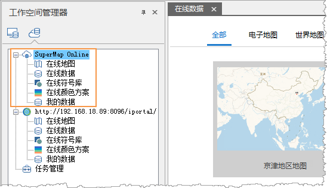
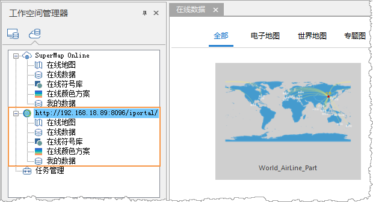

在线服务既支持访问 SuperMap Online 公有云的数据，又支持访问 iPortal 私有云数据。在应用程序中配置了 SuperMap Online
和 iPortal 的地址，即可直接访问到云服务中的数据，并可将本地数据分享上传。

### SuperMap Online

SuperMap Online 的地址为：<http://www.supermapol.com>，在“ **文件** ”的“ **服务**
”选项中已预定义。若计算机可访问 SuperMap Online 的地址，则在线数据面板中访问 Online 的资源，如下图所示：

  
 
  
**登录** ：“ **在线** ”选项卡的“ **账户** ”分组中，单击“登录”按钮，在弹出的账号登录面板中已注册的 SuperMap
账号、密码，即可登录。登录后可进行数据分享，并下载未公开分享的数据。

  
**注册** ：若用户未注册 SuperMap
账号，则可单击对话框中的“注册账号”，在弹出的浏览器页面中，通过邮箱或手机号注册账号。通过邮箱注册一小时内，登录您的注册邮箱，打开来自超图云门户的一封主题为“账户激活”的邮件，点击邮件正文的“激活账户”按钮，或点击验证链接，即可完成激活。

### iPortal

在“ **文件** ”选项卡的“ **服务** ”面板中，可以添加和管理用户的 iPortal 地址。 可以添加多个 iPortal
的地址，但是当前桌面只能显示一个 iPortal 地址的数据。iPortal 服务地址的管理方式如下：

  1. 单击“文件”菜单按钮，在面板中选择“服务”选项，打开云服务设置面板。
  2. 在 SuperMap iPortal 的工具栏中，单击“添加服务”按钮，在弹出的“添加 iPortal”对话框中，输入已配置好的 iPortal 服务地址。
  3. **添加** ：输入 iPortal 地址后，可选择添加方式，一种为“仅添加”，即将当前地址添加到 iPortal 地址列表中；另一种是“登录并添加”是指将地址添加到列表中，并登录 iPortal 账号。
  4. **设置为当前iPortal** ：在 iPortal 地址列表中选中一条地址，单击工具栏中的  按钮，或者单击鼠标右键，选择“设置为当前iPortal”选项，此时，在线工作空间中可以查看当前 iPortal 服务地址中的数据和资源。  

  

  5. **登录** ：单击工具栏中的“登录”按钮，或在添加 iPortal 地址的时候选择“登录并添加”，在弹出的登录面板中输入 iPortal 的账号和密码，即可下载 iPortal 中的私有数据，并将本地数据进行分享。
  6. **注册** ：若用户没有申请过 iPortal 的账号，可单击上图中的“注册”按钮，在弹出的页面输入注册信息，单击页面下方的“注册”即可提交注册信息，待管理员审核成功后，表示注册成功，用注册账号登录即可。
  7. 修改链接信息：若 iPortal 地址有变更，可单击工具栏的“修改链接信息”按钮，在弹出的 “修改iPortal” 对话框中，重新输入 iPortal 地址即可。

### 相关内容：

 [在线地图](OnlineMap)

 [在线数据](OnlineData)

 [在线颜色方案](OnlineColorSchemes)

 [在线符号库](OnlineSymbol)

 [我的数据](OnlineMyData)
