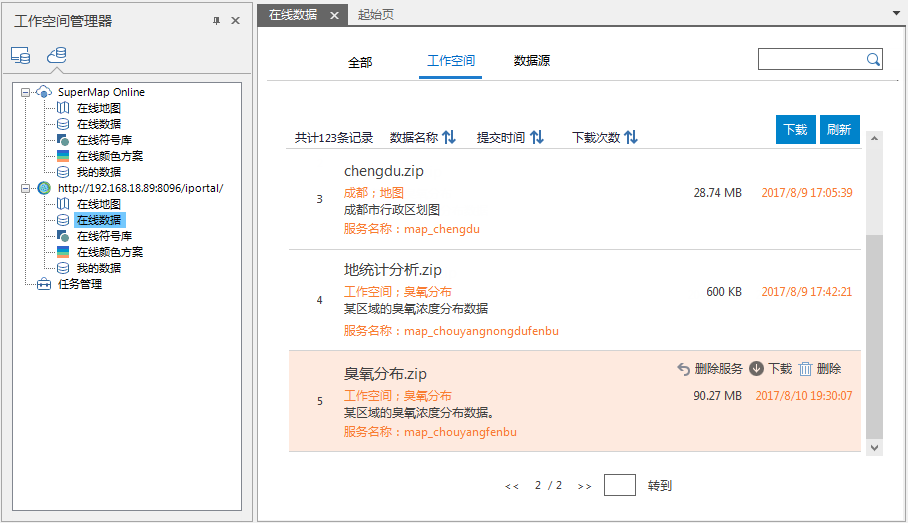
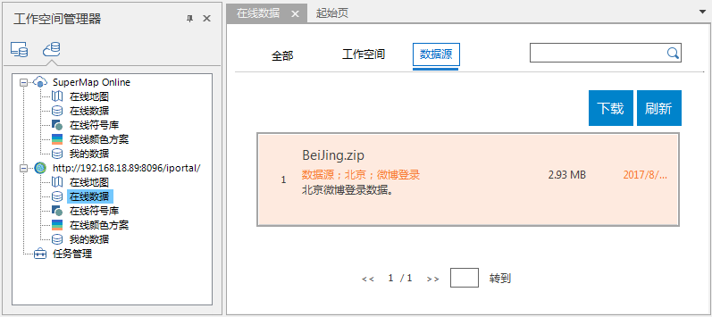

SuperMap 在线数据包括工作空间和数据源两种数据，可将本地数据上传至 SuperMap Online 或
iPortal，供其他用户下载使用。在“工作空间管理器”的“云数据”面板中单击“在线数据”节点，即可查看当前服务器中的在线数据。

### 在线工作空间

在“云数据”面板中单击“在线数据
”树节点，在右侧面板中单击“工作空间”标签，即可查看服务地址中的在线工作空间。在线工作空间来源于地图分享时一并上传的数据，及用户分享的工作空间数据。用户登录账号后，可下载工作空间到本地使用。

**上传工作空间**

**功能入口**

在“工作空间管理器”的工作空间节点->鼠标右键-> **上传工作空间...** ；

**参数说明**

在弹出的“上传工作空间”面板中设置以下参数：

  * **选择数据** ：显示了当前打开工作空间的名称。
  * **名称** ：设置工作空间上传后的显示名称。
  * **图标** ：单击图标，在弹出的“打开”对话框中选择图片文件作为该工作空间的图标，在浏览器中访问[SuperMap Online](https://www.supermapol.com/) 或 Iportal 服务地址时，会在该数据的详细信息页面显示。图片支持的格式有：*.png、*.jpg.*jpeg、*.bmp。
  * **关键字** ：输入工作空间的关键字，便于数据搜索，多个关键字需以分号隔开。
  * **简介** ：可在该文本框中输入该工作空间的描述信息，便于其他用户快速了解工作空间中的主要内容。
  * **上传地址** ：设置地图托管的服务地址，下拉列表中显示了 SuperMap Online 和当前 iPortal 的地址，单击下拉按钮选择即可。
  * **上传目录** ：单击右侧按钮，在弹出的“选择目录”对话框中，选择或新建上传后工作空间的存放目录。“选择目录”对话框支持目录的返回上一级、重命名、新建目录、删除等目录管理的操作。
  * **公开对象** ：支持设置该地图分享的对象，若上传地址为Online，则可设置地图是否对任何人可见；若上传地址为 iPortal，则可设置地图是否对任何人或群组内可见，并支持指定可见群组。

上传工作空间时，可选择是否分享工作空间中的地图，若想分享工作空间中的地图，可将“上传工作空间”面板切换为“地图”选项界面，勾选分享的地图，设置以下参数即可随工作空间分享其中的指定地图：

  * **选择地图** ：显示了当前工作空间中的所有地图，勾选待分享的地图即可。
  * **图标** ：单击图标框中的图片，在弹出的对话框中选择一张图片，用于展示还地图的主要内容，图片支持的格式有：*.png、*.jpg.*jpeg、*.bmp。
  * **关键字** ：地图关键字可用于地图分组与搜索，在文本框中直接输入即可，多个关键字需以分号隔开。
  * **简介** ：可在该文本框中输入地图内容的描述信息，便于其他用户快速的了解地图内容。

设置好以上参数后，单击“上传工作空间”面板中的“分享”按钮，即可将工作空间及其中的地图上传至 SuperMap Online 或 iPortal
中，上传过程中可在“任务管理”面板查看上传进度。

上传成功后，可在“在线数据”中查看并下载该数据，如下图所示。   
  
  

  
### 在线数据源

在“云数据”面板中单击“在线数据
”树节点，在右侧面板中单击“数据源”标签，即可查看服务地址中的在线数据源。在线数据源来源于分享地图和工作空间时一并上传的数据，及用户分享的数据源。用户登录账号后，可下载数据源到本地使用。

**上传数据源**

**功能入口**

在“工作空间管理器”的数据源节点->选择需要上传的数据源->鼠标右键-> **上传数据源...** ；

**参数说明**

在弹出的“上传数据源”面板中设置以下参数：

  * **选择数据** ：显示了当前待上传的数据源名称。
  * **名称** ：设置数据源上传后的显示名称。
  * **图标** ：单击图标，在弹出的“打开”对话框中选择图片文件作为该工作空间的图标，在浏览器中访问[SuperMap Online](https://www.supermapol.com/) 或 iPortal 服务地址时，会在该数据的详细信息页面显示。图片支持的格式有：*.png、*.jpg.*jpeg、*.bmp。
  * **关键字** ：输入数据源的关键字，便于数据搜索及分组，多个关键字需以分号隔开。
  * **简介** ：可在该文本框中输入该数据源的描述信息，便于其他用户快速了解数据源中的主要内容。
  * **上传地址** ：设置数据源上传的服务地址，下拉列表中显示了 SuperMap Online 和当前 iPortal 的地址，单击下拉按钮选择即可。
  * **上传目录** ：单击右侧按钮，在弹出的“选择目录”对话框中，选择或新建上传后存放数据源的目录。“选择目录”对话框支持目录的返回上一级、重命名、新建目录、删除等目录管理的操作。
  * **公开对象** ：支持设置该地图分享的对象，若上传地址为 Online，则可设置地图是否对任何人可见；若上传地址为 iPortal，则可设置地图是否对任何人或群组内可见，并支持指定可见群组。

设置好以上参数后，单击“上传数据源”面板中的“分享”按钮，即可将数据源打包上传至指定的服务器地址中。上传过程中可在“任务管理”中查看上传进度。

上传成功后，即可在“在线数据”列表中查看、下载数据。   
  
     

  
### 下载数据

在“在线数据”的数据列表中，选中用户想下载的工作空间或数据源，单击“下载”按钮，选择数据下载的存放路径，单击“确定”按钮，即可将选中数据下载到指定的路径中，下载过程中，可在“任务管理”对话框中查看下载进度，下载成功后会在存放路径中自动解压数据，用户直接在
中打开数据即可。

### 相关内容：

 [配置服务](ConfigureAddress)

 [在线地图](OnlineMap)

 [在线颜色方案](OnlineColorSchemes)

 [在线符号库](OnlineSymbol)

 [我的数据](OnlineMyData)

