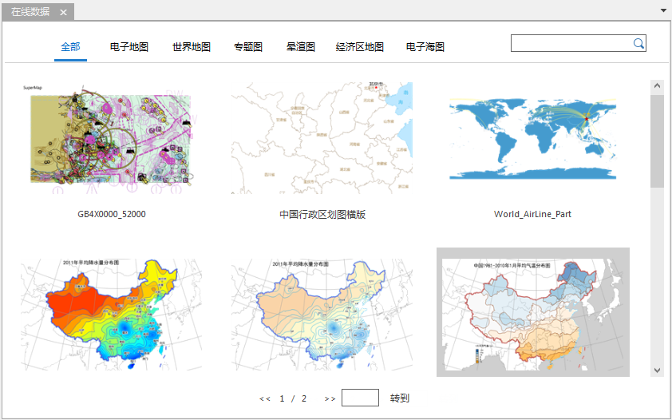
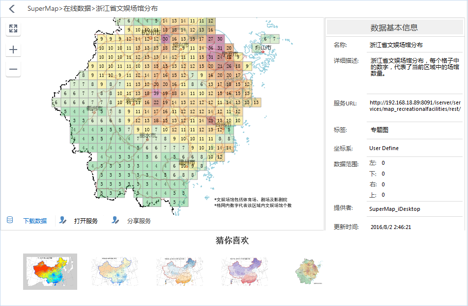

SuperMap 在线地图是指通过 SuperMap iDesktop 配制好地图后，将地图托管到 SuperMap Online 或 iPortal
上，用户通过桌面或浏览器都可以访问分享的地图。SuperMap 在线地图支持浏览、分享服务、下载等操作，同时支持将本地地图上传至 SuperMap
Online 或 iPortal，供其他用户浏览和下载。

在“工作空间管理器”的“云数据”面板中单击“在线地图”树结点，即可在右侧面板中查看服务地址中的在线地图，在线地图按种类分为电子地图、世界地图、专题图、晕渲图、经济区地图、电子海图，可根据地图类型进行查看。

  

  
### **查看地图**

  * **地图预览** ：单击地图列表中的某一地图，可在当前窗口中预览该地图，地图预览支持放大、缩小、全幅显示等操作。浏览在线地图的同时，地图右侧可查看该地图的名称、详细描述、服务URL、坐标系、数据范围、提供者、更新时间等信息，如下图所示：  
     
     

  * **打开服务** ：单击地图右下角的“打开服务”按钮，即可在当前工作空间中以Web数据源的形式打开该地图服务，同时会在地图窗口中打开该地图，用户可将该地图作为底图，在其基础上配图出图。
  * **分享服务** ：单击地图左下角的“分享服务”按钮，弹出的“地图服务”对话框中，显示了该地图的服务地址及地址的二维码，可将地址链接或二维码分享给好友。
  * **猜你喜欢** ：用户打开地图预览时，地图窗口下方会根据您所打开的地图名称和标签，显示你可能感兴趣的地图，单击即可直接浏览。

### **下载地图**

SuperMap Online 提供了丰富的地图资源，用户可根据自身的喜好和需要，下载地图数据到本地使用。下载地图前，需要先登录账号后。 **注意**
：若用户需下载 SuperMap Online 中的数据则需登录 SuperMap Online 的账号；若用户需下载 iPortal 中的数据，则需登录
iPortal 的账号。

登录账号后，在“在线地图”列表中单击查看感兴趣的地图，在地图预览窗口的左下角单击“下载数据”，选择地图数据的存放路径，单击“确定”按钮，即可开始下载，弹出的“任务管理器”对话框可以查看数据下载的进度。下载成功后，会自动在指定的目录下解压，在
中直接打开数据即可。

### **分享地图**

支持将本地地图分享至 SuperMap Online 或 iPortal
中，供其他用户查看、下载。分享后的地图可在浏览器、桌面端进行浏览、交互操作，有权限的用户还可下载地图。具体操作如下：

**功能入口**

在“工作空间管理器”的地图节点->选中待分享的地图->鼠标右键-> **分享地图...** ；

**参数描述**

在地图窗口右侧弹出 **分享地图** 面板的“ **地图** ”选项卡中，设置以下参数：

  * **选择地图** ：例表中显示了当前工作空间中的所有地图，勾选待分享的地图即可。
  * **地图图标** ：应用程序会根据地图内容，默认生成一个图标，用户可单击该图标，在本地选择一个图片文件作为地图的图标。图片支持的格式有：*.png、*.jpg.*jpeg、*.bmp。
  * **关键字** ：地图关键字可用于地图分组与搜索，在文本框中直接输入即可，多个关键字需以分号隔开。
  * **简介** ：可在该文本框中输入地图内容的描述信息，便于其他用户快速的了解地图内容。
  * **上传地址** ：设置地图托管的服务地址，下拉列表中显示了 SuperMap Online 和当前 iPortal 的地址，单击下拉按钮选择即可。
  * **公开对象** ：支持设置该地图分享的对象，若上传地址为 SuperMap Online，则可设置地图是否对任何人可见；若上传地址为 iPortal，则可设置地图是否对任何人或群组内可见，并支持指定可见群组。

分享地图的同时，需将其所在的工作空间一起上传，在“分享地图”的“ **工作空间** ”选项中，设置上传工作空间的相关参数即可，具体说明如下：

  * **选择数据** ：显示了当前打开工作空间的名称。
  * **名称** ：设置工作空间上传后的显示名称。
  * **图标** ：单击图标，在弹出的“打开”对话框中选择图片文件作为该工作空间的图标。图片支持的格式有：*.png、*.jpg.*jpeg、*.bmp。
  * **关键字** ：输入工作空间的关键字，便于数据搜索，多个关键字需以分号隔开。
  * **简介** ：可在该文本框中输入该工作空间的描述信息，便于其他用户快速了解工作空间中的主要内容。
  * **上传目录** ：单击右侧按钮，在弹出的“选择目录”对话框中，选择或新建工作空间上传后的存放目录。“选择目录”对话框支持目录的返回上一级、重命名、新建目录、删除等目录管理的操作。 

设置好以上参数之后，单击“分享地图”面板中的“分享”按钮，即可将地图机器所在的工作空间分享至指定的服务站平台中（SuperMap
Online或iPortal）。上传过程中可在弹出的“任务管理”对话框中查看数据的上传进度，并支持暂停或删除上传任务。

地图分享成功后，在“云数据”面板中单击“在线地图”，即可在地图列表中查看已分享的地图，同时可在“工作空间”数据列表中查看、下载已分享的工作空间。

### 相关内容：

 [配置服务](ConfigureAddress)

 [在线数据](OnlineData)

 [在线颜色方案](OnlineColorSchemes)

 [在线符号库](OnlineSymbol)

 [我的数据](OnlineMyData)

