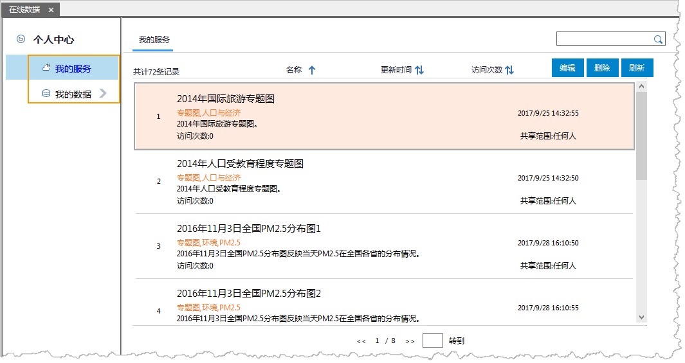

### 使用说明

在 中登录 SuperMap Online 和 iPortal 帐号，在“个人中心”中支持对 SuperMap Online 和 iPortal
帐号里“[我的服务](OnlineMyData#1)和“[我的数据](OnlineMyData#2)”资源进行管理。

在工作空间管理器在线数据面板中，选择Super Online或 iPortal 资源目录。单击“ **个人中心**
”，在“个人中心”文件目录中包含“我的服务”和“我的数据”，点击某个数据节点，在数据列表展示该类型下的数据信息。默认显示“我的服务“内容，如下图所示：

  

  
###  我的服务

“ **我的服务** ”中的数据即为用户通过个人账户分享发布的地图服务。支持对已发布的地图服务进行查看、编辑、删除等操作。

  * “ **查看** ”： 我的地图服务可以按照服务名称、更新时间、访问系数进行排序显示。
  * “ **搜索** ”：在搜索的文本框中，可输入数据文件的全部或部分字符，即可在当前选中的目录树中搜索包含这些字符的数据文件。
  * “ **编辑** ”：在服务列表中选择单个服务项，单击数据右上角的“编辑”按钮，弹出“编辑我的服务”对话框，可对该地图服务的服务名称、分类、标签、详细描述以及查看权限进行编辑修改。功能与数据项右上角“编辑”功能一致。
  * “ **删除** ”：在服务列表中选择单个服务项，单击数据右上角的”删除“按钮，将所选地图服务从我的服务中删除。功能与数据项右上角“删除”功能一致。
  * “ **刷新** ”：单击”刷新“按钮，对当前数据列表进行刷新。 

###  我的数据

“ **我的数据** ”中的数据即为用户上传至个人账户的工作空间、数据源、符号库、颜色方案等数据。

  * 在线窗口顶部，数据按照类型分为：工作空间、数据源、符号库、颜色方案四种类型。点击不同的标签页面，该页面显示不同类别的数据分组。没有分类的数据均可在“全部”的标签页面内查看。
  * 在线数据窗口左侧，将我的数据按照文件名称进行分组。选中文件目录名称右键，可新建目录、对已有文件目录进行删除及重命名操作。
  * SuperMap Online和 iPortal 为用户提供的在线服务上传空间各为5GB容量。 
  * 可通过在线窗口右上角工具栏按钮对数据项进行上传、下载、删除、刷新操作。

  1. “ **上传** ”：支持上传本地和当前打开的工作空间、数据源、符号库及颜色方案等数据。单击“上传”按钮，弹出“上传数据”对话框，在“ **数据类型** ”处选择上传的数据类型。
  * **工作空间** ：数据类型选择“工作空间”，单击“确定”按钮，在线窗口右侧弹出“分享”面板，支持本地和当前打开的工作空间。
  * **数据源** ：数据类型选择“数据源”，单击“确定”按钮，在线窗口右侧弹出“分享”面板，支持本地和当前打开的数据源，在上传 UDB 数据时将数据自动发布为 REST 数据服务。
  * **符号库** ：当数据类型选择点符号库/线型符号库/填充符号库时，单击“确定”按钮，弹出相应类型的“符号管理器”对话框，选中待上传的符号或者符号分组，然后执行右键菜单中的“分享至Online”。
  * **颜色方案** ：当数据类型选择“颜色方案”时，单击“确定”按钮，弹出“颜色方案管理器”对话框，选中待上传的符号或者符号分组，然后执行右键菜单中的“分享至Online”。
  * **其他** ：当数据类型选择“其他”时，单击“确定”按钮，弹出“文件选择”对话框，支持上传任意格式数据文件。

确定上传数据的文件后，弹出“任务管理”对话框内显示数据的上传总进度、单个文件的上传进度；并通过暂停、取消、删除等按钮对上传文件进行操作控制。

  2. “ **下载** ”：在数据列表中选择单个数据项，单击”下载“按钮，可将在线数据下载到本地。 功能与数据项右上角下载功能一致。
  3. “ **删除** ”：在数据列表中选择单个数据项，单击”删除“按钮，将所选数据从我的数据中删除。功能与数据项右上角删除功能一致。
  4. “ **刷新** ”：单击”刷新“按钮，对当前数据列表进行刷新。 

### 相关内容：

 [配置服务](ConfigureAddress)

 [在线地图](OnlineMap)

 [在线数据](OnlineData)

 [在线颜色方案](OnlineColorSchemes)

 [在线符号库](OnlineSymbol)
