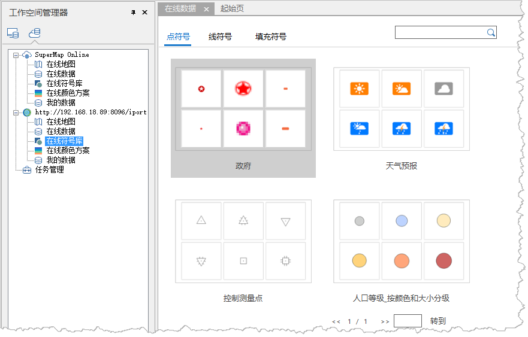
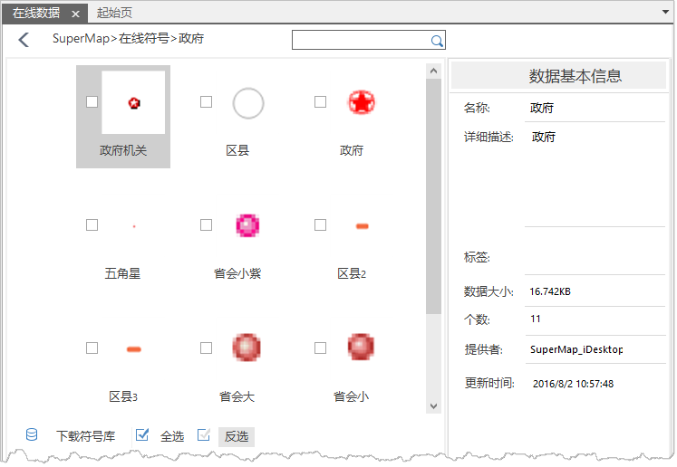
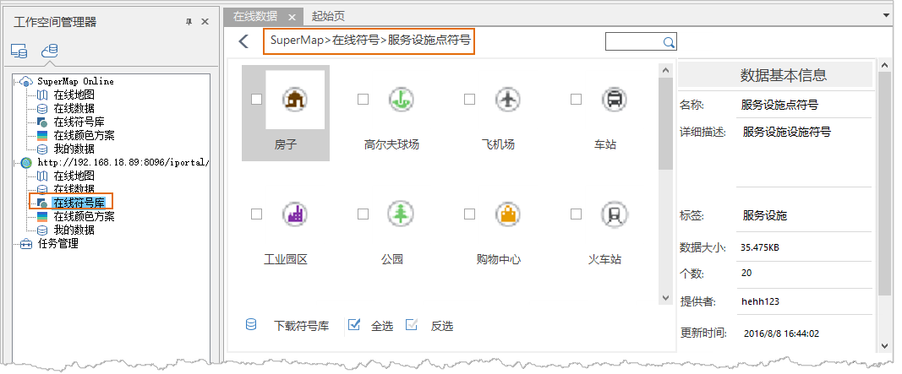

### 使用说明

在线服务同时支持访问 SuperMap Online 公有云和 iPortal
私有云数据中的在线符号库，支持对云服务中在线符号库的查看、下载，并可将本地符号库数据上传、共享。

#### 在线符号库查看/预览

1. 在工作空间管理器中，选择Super Online或 iPortal 资源目录。单击“ **在线符号库** ”，在线数据预览窗口中显示出在线符号库数据内容，如下图所示：  

  

2. “ **在线数据** ”窗口中排列三个标签页，分别是：点符号、线符号和填充符号。在不同的标签页面内显示不同类别的符号分组。点击某一具体分组，进入分组详细列表，并在窗口右侧弹出“数据基本信息”属性框，该属性框中显示了分组数据的基本信息。如下图所示：  

  

#### 在线符号库下载与应用

1. 支持在线符号的下载，在符号预览窗口中，在需要下载的符号前勾选对应符号的复选框，也可选择程序提供的“全选”和“反选”按钮，辅助符号的选择，选择好符号后，单击窗口左下角的“下载符号库”按钮，弹出“任务管理”对话框。
2. “任务管理”,首行显示下载总进度，其后的进度条会随着下载的进度变化而变化。可在下载过程中随时选择”全部暂停“或”全部取消“下载任务。下载任务依次排列在列表框中，可查看单个符号文件的下载进度，并通过进度条后的”暂停“”删除“按钮控制下载任务。
3. 若勾选”任务管理“对话框底部的”数据传输完成后自动关闭“复选框，当执行完所有下载任务，任务管理器会自动关闭。如不勾选，任务管理器中正在下载的任务列表将没有记录，在传输完成列表中依次显示下载成功的数据。
4. 下载完成的符号库，将保存在本地SuperMap符号库中，打开符号选择器，在根组目录下，增加了Online子目录，下载的在线符号将存放在在线符号库的子目录中，方便了用户使用在线符号资源。
5. 当用户在绘图过程中，若系统提供的点符号、线符号、填充符号不能满足绘制需求，可依照上述方法访问 SuperMap Online/ iPortal 在线资源，下载在线资源中的在线符号，然后在符号选择器中选择应用已下载的符号资源。

#### 本地符号库上传共享

支持将本地符号库上传至 SuperMap Online 或 iPortal 上进行分享，方便用户分享自定义的地图符号，丰富了用户的配图资源。

1. 打开SuperMap iDesktop 应用程序，展开工作空间管理器的”资源“节点；双击资源节点下的”点符号库“子节点，弹出”点符号选择器”.在”点符号选择器“中选中需要上传的的点符号，鼠标右键单击”分享至Online“按钮。弹出“上传符号库”对话框。
2. 在“上传符号库”，需对上传符号库数据资源输入如下信息：

* **名称** ：符号库上传后的名称。
* **关键字** ：输入多个标签关键字，用以检索和区分不同符号类型。
* **简介** ：对上传的符号库进行描述，方便浏览和下载。
* **上传地址** ：单击右侧下拉按钮选择上传至SuperMap Online 公有云或者 iPortal 私有云。
* **上传目录** ：单击  按钮，弹出“选择目录”对话框。可在该对话框中选择和设置文件目录，“  ”可以新建文件目录；“  ”可对已有文件进行删除操作；“  ”,对已有文件目录进行重命名。确定文件目录后，单击“确定”按钮，返回“上传符号库”对话框。
* **仅自己/任何人/群组内** ：设置上传后的数据查看权限，默认为“仅自己”可见；勾选“任何人”复选框，数据查看权限对任何人可见； 勾选“群组内”复选框，数据查看权限可设置固定群组可见。
3. 完成上述设置，单击“分享”按钮，弹出“任务管理”对话框，对话框内显示符号数据的上传总进度、单个符号文件的上传进度；并通过暂停、取消、删除等按钮对上传文件进行操作控制。
4. 分享成功后， 可在SuperMap Online 及 iPortal 中的在线符号库中浏览、下载，方便了其他用户使用在线符号资源。   
   

### 相关内容：

 [配置服务](ConfigureAddress.htm)

 [在线地图](OnlineMap.htm)

 [在线数据](OnlineData.htm)

 [在线颜色方案](OnlineColorSchemes.htm)

 [我的数据](OnlineMyData.htm)

