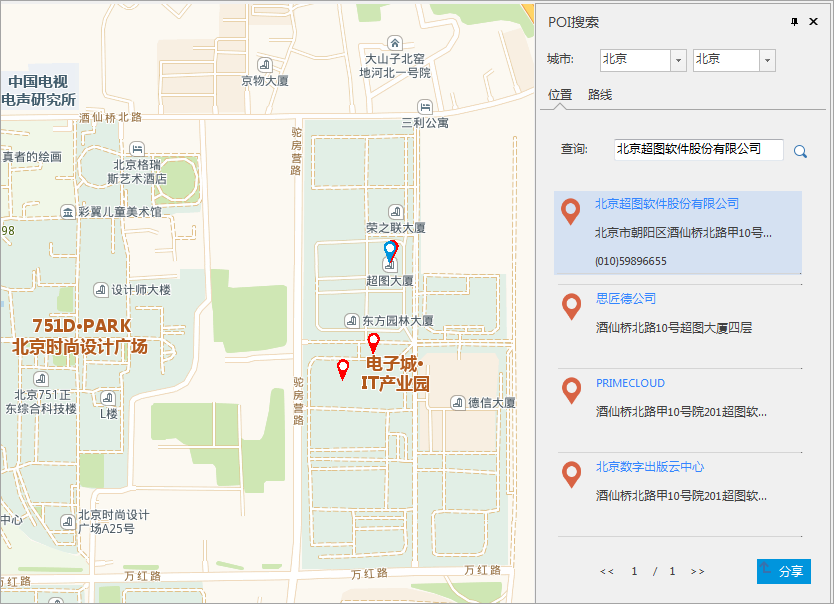

### 使用说明

支持 POI 检索，POI（Point of Interest）,即兴趣点，电子地图中用来表示名称、地址、经度、纬度、类别等信息点位。可基于
SuperMap Online 地图的 POI 服务，对地图进行位置搜索操作。能够便捷、快速的实现位置定位。

同时支持打开 POI

### 操作步骤

  1. 在地图窗口打开一幅在线地图服务。
  2. 在“ **在线** ”选项卡->“ **服务** ”组->“ **POI 搜索** ”。
  3. 在弹出“ **POI 搜索** ”面板中，输入查询信息： 
  * **城市** ：确定查询的省份及城市名称，可手动输入名称或点击文本框下拉按钮在下拉菜单中选择所要查询的城市名称。 
    * 单击第一个下拉框按钮，选择查询信息所属省份，此项为必选项。
    * 单击第二个下拉框按钮，选择查询信息所属的城市。默认显示的为所选省份的省会城市，可在下拉菜单中选择该省的其他城市，也可选择为空，此项为非必填选项。
    * **查询** ：用于输入查询的POI信息。支持输入关键字进行模糊查询。
  4. 完成上述 POI 信息输入，点击查询按钮，查询面板中显示出查询结果，查询结果以红色点位标注在地图窗口。若查询结果为多个，选择某个结果，在地图窗口该点会以蓝色点闪烁高亮显示。  
  
  
---  
  5. 用户可将搜索出的POI结果，以链接方式分享给其他用户，POI 搜索面板底部有“分享”按钮，单击该按钮，弹出“分享”对话框，其中“ **URL** ”即为当前搜索结果的搜索链接，点击复制按钮，可复制该点的地址链接。用户可通过[ **打开POI分享**](OpenPOI)功能查看其他用户分享的POI链接。

### 相关内容：

 [配置服务](ConfigureAddress)

 [在线地图](OnlineMap)

 [在线数据](OnlineData)

 [在线符号库](OnlineSymbol)

 [我的数据](OnlineMyData)

