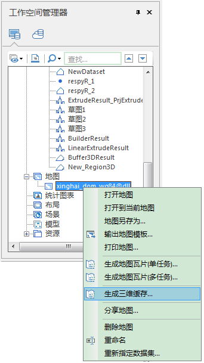
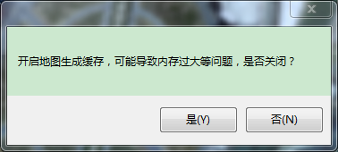

**使用说明**

地图生成三维缓存可以用来提高地图在场景中的显示效率。

**操作步骤**

  1. 在工作空间管理器内的某一地图右键菜单中选择“生成三维缓存...”。  
   
  
  2. 若存在开启的场景或者地图窗口，会弹出提示窗口，如下图所示：  
  

  3. 弹出的“地图生成三维缓存”对话框，用来添设置地图三维缓存的参数。
  4. 参数设置：
       * **缓存名称：** 在“缓存名称”右侧的文本框中输入缓存名称，即缓存根目录的名称。
       * **缓存路径：** 在“缓存路径”右侧的文本框中输入缓存的输出路径，可以为本地路径；用户还可以通过文本框后的“浏览 ”按钮来选择路径。
       * **存储类型** :系统提供了2种缓存类型，紧凑和原始。紧凑表示采用一定的压缩和加密机制，在建立缓存时对数据进行压缩和加密；原始表示不对数据进行压缩，保留模型数据的原始信息。
       * **密码：** 为三维地图缓存设置密码进行加密，保证数据安全，当加载该三维地图缓存时，需要输入密码。
       * **图片类型：** 设置缓存图片保存的类型。应用程序支持 PNG、JPG和WEBP等图片格式。
       * **块大小：** ：获取缓存预处理后生成的每个缓存分块文件的采样尺寸，单位为像素，即 pixes*pixes。应用程序提供了1024*1024，512*512，256*256三种尺寸共用户选择。用户可以选择合适的尺寸大小。 
       * **图片压缩率：** ：设置生成三维地图缓存图片的压缩率，单位为%。
       * **线程数** ：分配给地图生成三维缓存操作的线程数，默认为1。
       * **完全填充缓存图片、背景透明：** 2个选项可根据需求自行勾选。
  5. 设置“瓦片范围”：
       * **瓦片范围** ：在“瓦片范围”区域进行设置，有下面两种方式：
         * 勾选“默认范围”复选框，默认采用数据集的范围，左上右下四个文本框显示了系统默认范围；
         * 不勾选“默认范围”复选框，用户可自定义范围。有两种方式，一种是通过选择范围数据集，取选择的数据集的范围；另一种是直接在左上右下四个文本框中输入范围值。
  6. **开始层、结束层** ：自动获取三维缓存的层编号，结束层可修改。 
  7. 单击“确定”按钮，执行地图生成三维缓存操作，生成*.sci3d格式的缓存文件。

**注意事项**

  1. 缓存范围设置时.在不勾选“默认”复选框时，左下右上的文本框变为可编辑状态，可以直接输入需要的缓存范围。
  2. 地图生成三维缓存功能不支持坐标系为平面坐标系的地图。

  

 

