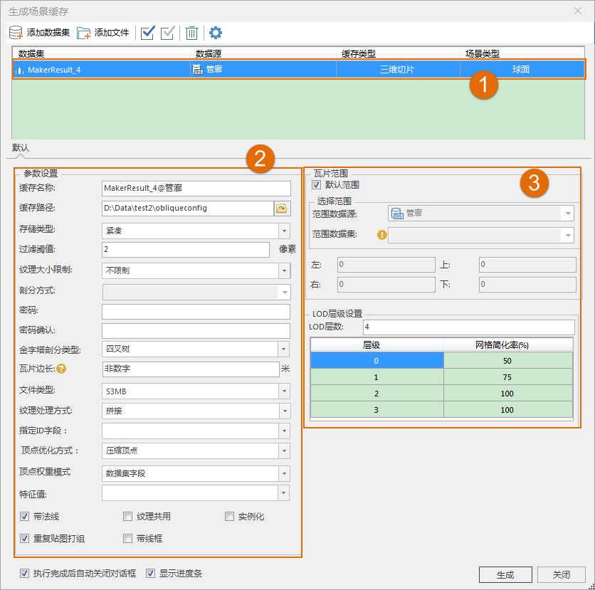
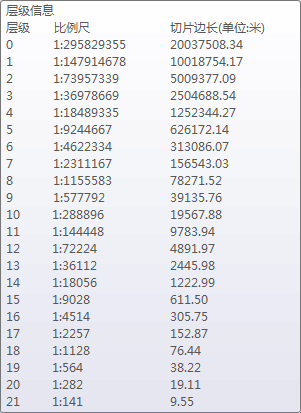

**使用说明**

三维切片缓存可以用来提高三维模型数据在场景中的显示效率。  支持使用模型数据集来生成 SCP格式的缓存文件。

**操作步骤**

  1. 在数据集右键菜单中选择“生成缓存...”。
  2. 弹出的“生成场景缓存”对话框，用来添加模型数据和设置三维切片缓存的参数。单击 ，弹出“选择”对话框，在对话框左侧列举了当前的工作空间中的所有数据源，右侧列举了该数据源中所有的数据集。用户可以利用对话框上方的工具条对所需要的数据集进行筛选和查找，选择完模型数据集成后，单击“确定”按钮。
  3. 返回“生成场景缓存”对话框，可以看到选择的属性数据集显示在列表中。  
  
 
  4. 数据列表区域（如数字1所示）：
       * **数据集：** 显示了用于生成三维切片缓存的数据集名称。
       * **数据源：** 显示了用于生成三维切片缓存的数据集所在的数据源的名称。
       * **缓存类型：** 显示了所要生成的三维切片缓存的类型，在此为“OSGB格式”。缓存类型为下拉按钮，下拉列表中列出了所选数据所支持的所有缓存类型，用户可从中进行选择。
       * **场景类型：** 场景类型分为两种：平面和球面。当数据集为平面坐标系时，场景类型只能设置为平面；当数据集为地理坐标系时，场景类型只能设置为球面；当数据集为投影坐标系时，场景类型可设置为平面或球面。
  5. 三维切片缓存的参数设置（如数字2所示）：
       * **缓存名称：** 在“缓存名称”右侧的文本框中输入缓存名称，即缓存根目录的名称。
       * **缓存路径：** 在“缓存路径”右侧的文本框中输入缓存的输出路径，可以为本地路径，也可以为网络路径；用户还可以通过文本框后的“浏览”按钮来选择路径。
       * **存储类型** :系统提供了2种缓存类型，紧凑和原始。紧凑表示采用一定的压缩和加密机制，在建立缓存时对数据进行压缩和加密；原始表示不对数据进行压缩，保留模型数据的原始信息。
       * **过滤阈值：** ：用于设置过滤粗糙层子对象的参数，默认为2，单位为像素。如若输入2，则表示小于2像素的子对象被过滤掉。
       * **纹理大小限制** ：用于设置纹理大小，可选不限制、1024像素*1024像素、2048像素*2048像素以及4096像素*4096像素等选项，默认为不限制。
       * **剖分方式** ：只针对影像缓存类型有效，非影像缓存类型该设置无效。
       * **密码：** 为三维切片缓存设置密码进行加密，保证数据安全，当加载该三维切片缓存时，需要输入密码。
       * **密码确认：** 对设置的密码进行确认。必须与上面的密码设置一致。如果两处输入密码不一致，在创建缓存的时候会提示：“生成三维切片缓存失败。密码不匹配，请重新输入！”的信息。
       * **金字塔剖分类型** ：用于设置缓存切片创建树型金字塔的剖分类型，应用程序提供了四叉树和八叉树两种方式。其中，四叉树适合城市级别的建筑剖分；八叉树适合单独一栋高楼做剖分，主要应用于 BIM 数据。
       * **瓦片边长** ：设置生成三维切片缓存的瓦片边长大小，单位为米。瓦片边长大小不同则对应的比例尺不同，将鼠标移至“瓦片边长”标签后的问号处，即可查看万片边长与比例尺、层级的对应关系，如下图所示。对模型数据只生成一层缓存，“瓦片边长”标识了缓存层相对于指定瓦片边长所对应的比例尺。  
    

       * **文件类型：** 文件类型分OSGB、S3M、S3MB三种数据格式，根据需求可自行选择。
       * **特征值：** 用于设置生成的缓存依据的特征值，通过下拉箭头进行选择。
       * **纹理处理方式：** 用于设置生成的缓存的纹理处理方式，提供了拼接、拼接且重映射和重映射三种方式。其中，拼接适用于三角网较密集的数据，对于这类数据采取拼接的方式会提高生成缓存的效率。
       * **指定字段ID** ：用于设置唯一标识ID的字段，通过下拉箭头进行选择。
       * **顶点优化方式：** ：只有当顶点权重模式为无时，可以设置顶点优化方式。提供压缩顶点和不压缩两种方式。
       * **顶点权重模式** ：提供无、数据集字段和三角形最短边三种方式。其中，无是指以高度作为权重，数据集字段是指以指定字段作为权重，三角形最短边是指以点所在的三角形最短边作为权重。
       * **特征值** ：只有选择数据集字段作为顶点权重模式时，该选项可用。单击右端下拉箭头指定字段。
       * **带法线、纹理共用、实例化、重复贴图打组以及带线框5个选项：** 默认勾选带法线和重复贴图打组，根据需求可自行勾选。
         * 带线框：用于生成模型缓存的轮廓。
  6. 设置“瓦片范围”和“LOD层级设置”（如数字3所示）：
       * **瓦片范围** ：在“瓦片范围”区域进行设置，有下面两种方式：
         * 勾选“默认范围”复选框，默认采用数据集的范围，左上右下四个文本框显示了系统默认范围；
         * 不勾选“默认范围”复选框，用户可自定义范围。有两种方式，一种是通过选择范围数据集，取选择的数据集的范围；另一种是直接在左上右下四个文本框中输入范围值。 
       * **LOD层级设置** ：用于设置三维切片缓存显示的细节层次。只有当图层的缓存类型为OSGB 格式的缓存时，才支持设置LOD层级参数。 
         * **LOD级数** ：用于设置OSGB格式的缓存的LOD层级数，在数值框中直接设置即可。
         * **层级** ：表示两层之间的相机高度切换距离差，例如：第2层的距离设置为200米，若相机高度为1000米时显示的是第3层缓存模型，则当相机高度为800米时则显示为第2层缓存模型。
         * **网格简化率** ：指的是对模型显示的细节按照百分比进行简化。有利于合理地分配模型渲染的资源，达到高效率的场景显示。
  7. 默认勾选“执行完成后自动关闭对话框”和“显示进度条”，单击“生成”按钮，执行三维切片缓存生成操作。其中 OlympicGreen.scv 为缓存配置文件，indexData.dat 为缓存索引文件。

**备注**

关于全球剖分规则的介绍可以参照[缓存目录其他层级结构构建基础](../../ApplicationTheme/CacheBuild/ImageCache4Base)中的简介。

**注意事项**

  1. 新建三维切片缓存时，建议不同的模型缓存创建在不同的目录下。因为生成三维切片缓存时，将会在指定的目录下生成三维切片缓存配置文件 *.scv、三维切片缓存索引文件以及缓存目录和缓存文件，如果两个三维切片缓存同时生成在一个目录下，则会出现两个三维切片缓存在相同的经纬度范围内的数据使用同一个缓存目录和缓存文件的情况，因此，为了避免异常情况的发生，建议不同的三维切片缓存生成在不同的目录下。
  2. 对缓存参数的介绍，只介绍与此类型缓存相关的参数。
  3. 缓存范围设置时的相关事项： 

在不勾选“默认”复选框时，左下右上的文本框变为可编辑状态，可以直接输入需要的缓存范围；

  

 

