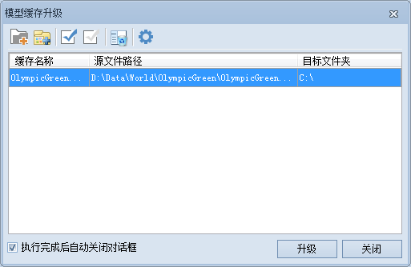

**使用说明**

SuperMap Deskpro.NET 6R 6.0 SP1 版本推出以后，三维模型缓存文件版本升级为 version 1.2。为了方便用户使用SuperMap Deskpro.NET 6.0 SP1产品之前的缓存文件，新产品增加了模型缓存升级功能。即将之前版本的三维模型缓存文件通过该功能自动升级成一组 version1.2
的缓存文件，version1.2版本的缓存文件更小，下载速度更快。SuperMap Deskpro.NET 6R 6.0 SP1 以上的版本生成的缓存文件已经是 version 1.2版本，不需要再升级。

**操作步骤**

  1. **激活复选框：** 单击“ **工具** ”选项卡“ **数据** ”组的 **模型缓存文件升级** 按钮。
   
  
  2. **添加升级文件：** 通过"单个添加"或"批量添加"两种方式进行选择 .scv 缓存文件。
  3. **选择升级文件：** 添加好一个或多个.scv 的缓存文件后可通过"全选"、"反选"、"移除"等设置调整选择列表中文件。
  4. **设置路径：** 通过"统一设置目标文件夹"按钮设置好输出的新版本缓存文件的保存地址。  
工具条按钮说明

       * 按钮：单击“添加”按钮，弹出“选择”对话框，通过该对话框可以选择需要合适的栅格数据集作为更新数据。对话框内显示的数据集与目标数据集的类型一致（栅格数据集或影像数据集），以保证是对同一类型的数据集进行更新。
       * 按钮：单击“移除”按钮，用来移除列表框中选中的一个或多个记录。
       * 按钮：单击“全选”按钮，用来选中列表框中的所有记录。
       * 按钮：单击“反选”按钮，用来反向选择列表框中的记录，即原来没有被选择的记录变为选中状态；原来选中的记录变为非选中状态。
       * 按钮：单击“移除”按钮，用来移除列表框中选中的一个或多个记录。
       * 按钮：选中一条或多条记录后，单击该按钮统一设置输出的新版本缓存文件的保存地址。

  5. **完成升级：** 确定好需要升级的缓存文件后单击“升级”按钮完成缓存文件升级，若放弃操作单击“关闭”。

  

 

