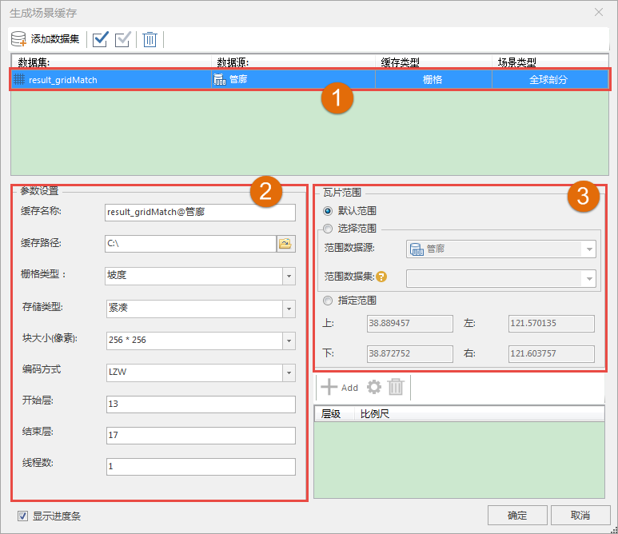

**使用说明**

可将栅格数据生成栅格缓存文件，优化数据的显示和浏览效果。镶嵌数据集生成场景缓存，缓存类型也为影像。

**操作步骤**

  1. 在数据集右键菜单中选择“生成缓存...”。
  2. 弹出的“生成场景缓存”对话框，用来添加栅格数据和设置生成栅格缓存的参数。
  3. 单击，弹出“选择”对话框，在对话框左侧列举了当前的工作空间中的所有数据源，右侧列举了该数据源中所有的数据集。用户可以利用对话框上方的工具条对所需要的数据集进行筛选和查找，选择完成后，单击“确定”按钮。  
  

  4. 数据列表区域（如数字1所示）：
       * **数据集** ：显示了用于生成栅格缓存的数据的名称。
       * **数据源** ：显示了用于生成栅格缓存的数据所在的数据源的名称。
       * **缓存类型** ：显示了所要生成的三维缓存的类型，在此为“栅格”。缓存类型下拉列表中列出了所选数据所支持的所有缓存类型，用户可从中进行选择。
       * **场景类型** ：场景类型分为两种：平面和球面。当数据集为平面坐标系时，场景类型只能设置为平面；当数据集为地理坐标系时，场景类型只能设置为球面；当数据集为投影坐标系时，场景类型可设置为平面或球面。
  5. 栅格缓存的参数设置（如数字2所示）。 
       * **缓存名称** ：在"缓存名称"右侧的文本框中输入缓存名称，即缓存根目录的名称； 
       * **缓存路径** ：在"缓存路径"右侧的文本框中输入缓存的输出路径，可以为本地路径，也可以为网络路径；用户还可以通过文本框后的"浏览"按钮来选择路径； 
       * **存储类型** ：系统提供了2种缓存类型，紧凑和原始。紧凑表示采用一定的压缩和加密机制，在建立缓存时对数据进行压缩和加密；原始表示不对数据进行压缩，保留影像数据的原始信息；
       * **块大小（像素）** ：获取缓存预处理后生成的每个缓存分块文件的采样尺寸，单位为像素，即 pixes*pixes。应用程序提供了2048*2048，1024*1024，512*512，256*256四种尺寸共用户选择。用户可以选择合适的尺寸大小。 
       * **编码方式** ：支持 LZW 编码方式。关于编码方式的介绍，请参见[数据集编码压缩方式](../../DataProcessing/DataManagement/EncodeType  )页面。
       * **开始层、结束层** ：自动获取影像缓存的层编号，可修改。
       * **线程数** ：默认为1。
  6. 设置“缓存范围”（如数字3所示）。在“缓存范围”区域进行设置，有下面两种方式： 
       * 勾选“默认”复选框，默认采用数据集的范围，左上右下四个文本框显示了系统默认范围；
       * 不勾选“默认”复选框，用户可自定义范围。有两种方式，一种是通过选择范围数据集，取选择的数据集的范围；另一种是直接在左上右下四个文本框中输入范围值。 
  7. “比例尺设置”处显示了当前数据的影像金字塔比例尺层级，在此处勾选层级比例尺，即可按照剖分规则，对每一分层的栅格数据进行分块，每一分块对应的区域范围的数据将存储为一个切片文件，从而得到栅格缓存数据。
  8. 默认勾选“显示进度条”，单击"生成”按钮，执行栅格缓存处理操作。每个栅格缓存单独存放在一个文件夹下，如示例中生成的缓存结果存放于" D:\DatasetDSM@DatasetDSM"文件夹，文件夹中包含了对应的栅格缓存文件。其中*.sct文件为缓存配置文件，标记了缓存的范围、层数等信息。 

**备注**

关于全球剖分规则的介绍可以参照[缓存目录其他层级结构构建基础](../../ApplicationTheme/CacheBuild/ImageCache4Base)中的简介。

**注意事项**

  1. 块大小（像素）仅为256*256，不可更改。
  2. 只有数据为地理坐标系时，支持设置线程参数为多线程。

  

 

