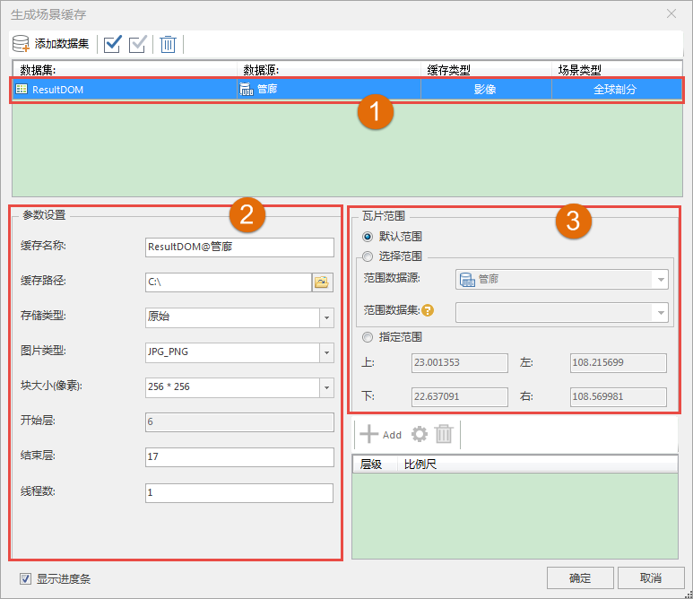

**使用说明**

影像缓存用来对影像数据生成三维缓存文件，优化影像数据的显示和浏览效果。镶嵌数据集生成场景缓存，缓存类型也为影像。

**操作步骤**

  1. 在数据集右键菜单中选择“生成缓存...”。
  2. 弹出的“生成场景缓存”对话框，用来添加影像数据和设置影像缓存的参数。Grid 影像和 Image 影像都可以通过添加数据集的方式添加。 
  3. 单击，弹出“选择”对话框，在对话框左侧列举了当前的工作空间中的所有数据源，右侧列举了该数据源中所有的数据集。用户可以利用对话框上方的工具条对所需要的数据集进行筛选和查找，选择完成后，单击“确定”按钮。
  4. 返回“生成场景缓存”对话框，可以看到选择的影像数据集和  显示在列表中。  
   
 
  5. 数据列表区域（如数字1所示）：
       * **数据集：** 显示了用于生成影像缓存的数据的名称。
       * **数据源：** 显示了用于生成影像缓存的数据所在的数据源的名称。当以文件形式添加的数据，则没有所在的数据源，显示为空。
       * **缓存类型：** 显示了所要生成的三维缓存的类型，在此为“影像”。缓存类型为下拉按钮，下拉列表中列出了所选数据所支持的所有缓存类型，用户可从中进行选择。对于 DEM 数据，既可以生成地形缓存，也可以生成影像缓存，这里在下拉列表中选择影像类型。
       * **场景类型：** 场景类型分为两种：平面和球面。当数据集为平面坐标系时，场景类型只能设置为平面；当数据集为地理坐标系时，场景类型只能设置为球面；当数据集为投影坐标系时，场景类型可设置为平面或球面。
  6. 影像缓存的参数设置（如数字2所示）。 
       * **缓存名称：** 在"缓存名称"右侧的文本框中输入缓存名称，即缓存根目录的名称； 
       * **缓存路径：** 在"缓存路径"右侧的文本框中输入缓存的输出路径，可以为本地路径，也可以为网络路径；用户还可以通过文本框后的"浏览"按钮来选择路径； 
       * **存储类型：** 系统提供了2种缓存类型，紧凑和原始。紧凑表示采用一定的压缩和加密机制，在建立缓存时对数据进行压缩和加密；原始表示不对数据进行压缩，保留影像数据的原始信息；
       * **图片类型：** 设置影像缓存图片保存的类型。应用程序支持 DXTZ、PNG、JPG、PNG-JPG 以及WEBP等五种图片格式。
       * **块大小（像素）：** 获取缓存预处理后生成的每个缓存分块文件的采样尺寸，单位为像素，即 pixes*pixes。应用程序提供了1024*1024，512*512，256*256等尺寸共用户选择。用户可以选择合适的尺寸大小。 
       * **开始层、结束层** ：自动获取影像缓存的层编号，可修改。
       * **线程数** ：设置分配给生成影像缓存的线程数，默认为1。
  7. 设置“缓存范围”（如数字3所示）。在“缓存范围”区域进行设置，有下面两种方式： 
       * 勾选“默认”复选框，默认采用数据集的范围，左上右下四个文本框显示了系统默认范围；
       * 不勾选“默认”复选框，用户可自定义范围。有两种方式，一种是通过选择范围数据集，取选择的数据集的范围；另一种是直接在左上右下四个文本框中输入范围值。 
  8. “比例尺设置”处显示了当前数据的影像金字塔比例尺层级，在此处勾选层级比例尺，即可按照剖分规则，对每一分层的影像数据进行分块，每一分块对应的区域范围的数据将存储为一个切片文件（缓存图片），从而得到影像缓存数据。
  9. 默认勾选“显示进度条”，单击"生成”按钮，执行影像缓存处理操作。每个影像缓存单独存放在一个文件夹下，如示例中生成的缓存结果存放于" D:\DatasetDSM@DatasetDSM"文件夹下，文件夹包含了对应的影像缓存文件。其中*.sci3d 文件为缓存配置文件，标记了缓存的范围、层数等信息。 

**备注**

  1. 关于全球剖分规则的介绍可以参照[缓存目录其他层级结构构建基础](../../ApplicationTheme/CacheBuild/ImageCache4Base  )中的简介。
  2. 只有数据为地理坐标系时，支持设置线程参数为多线程。

  

 

