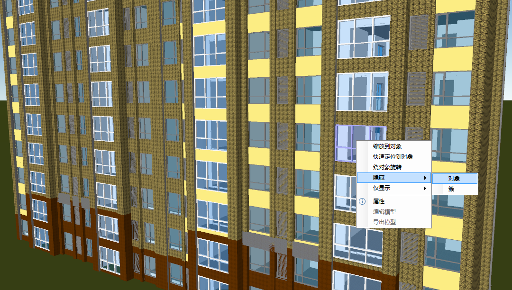
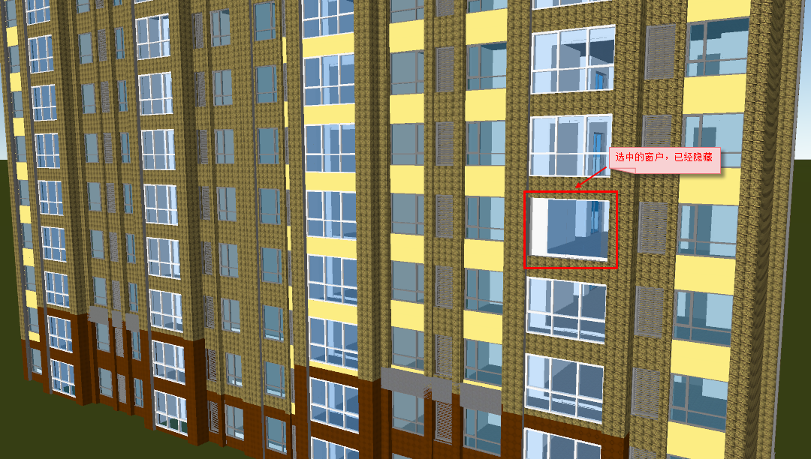
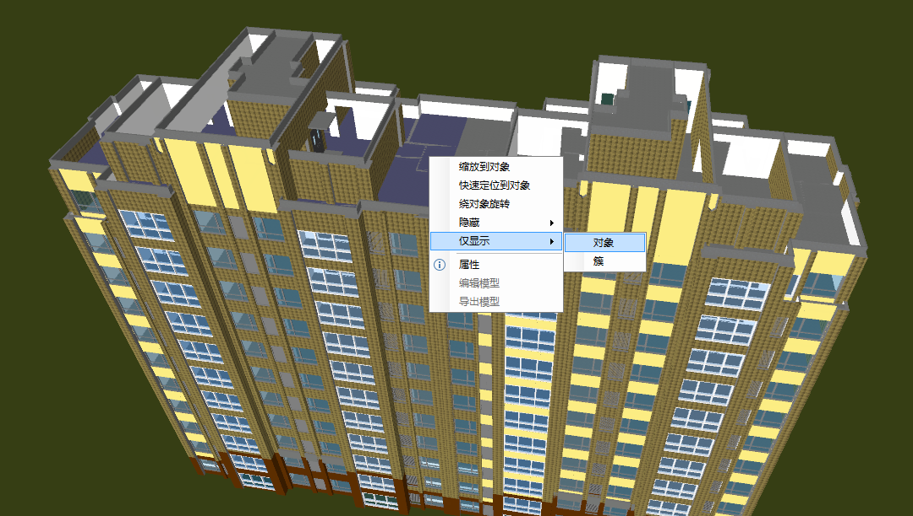
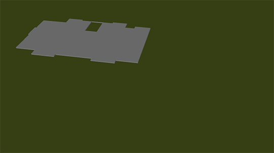
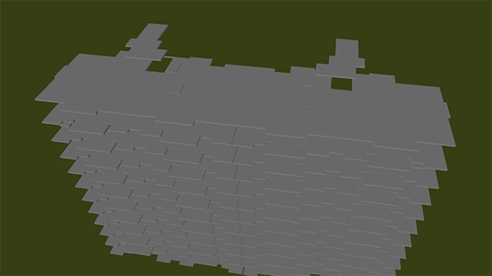
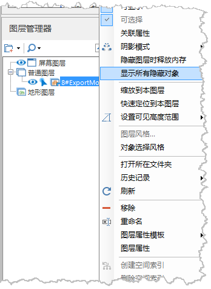

**使用说明**

对于加载显示的模型缓存，支持对模型对象、簇的隐藏与显示。

**操作步骤**

  1. 在球面场景中加载模型缓存，并快速定位到本图层。
  2. 选中对象，单击鼠标右键，弹出右键菜单，菜单中包含"隐藏"与"仅显示"选项，如下图所示：  
   
  
  3. 隐藏功能包括隐藏对象和隐藏簇：当选择"对象"时，只隐藏选中对象；当选择"簇"时，隐藏选中对象所在数据集内所有对象。  
  

  4. 仅显示功能包括仅显示对象和仅显示簇：当选择"对象"时，仅显示选中对象；当选择"簇"时，显示选中对象所在数据集内所有对象。  
    
    

  5. 在图层管理器中，选中模型缓存图层，单击鼠标右键，在弹出的右键菜单中选择"显示所有隐藏对象"，即能将先前操作隐藏的对象全部显示出来。  
    
  

  

 

