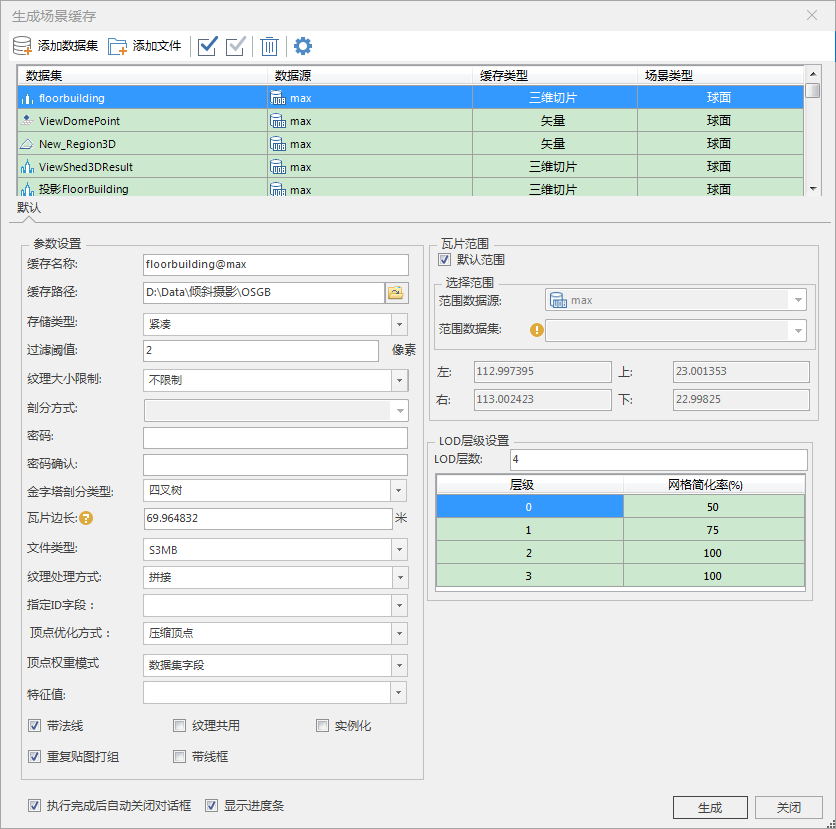
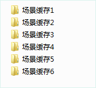

**使用说明**

“场景缓存”命令，用来对选择的数据集创建缓存文件。该功能不依赖于场景窗口，即在没有打开场景窗口的情况下，也可以直接使用此功能。

在生成场景缓存时，镶嵌数据集、影像数据集对应影像缓存，地形数据集对应地形缓存，矢量数据集对应矢量缓存，如果是缓存图层（比如模型缓存图层）或者 KML
图层，则保持不变。

场景缓存生成后，在结果路径下会形成一个新的工作空间和若干缓存文件夹。新的工作空间中不仅保存着各种新生成的缓存图层，还保存了各个缓存图层的风格信息。默认情况下，新生成的工作空间和用于生成缓存的场景名称相同，用户可以通过设置参数指定生成的工作空间及场景的名称。

**操作步骤**

  1. 打开需要生成缓存的数据集，鼠标右键单击数据集结点，在弹出菜单中选择“生成缓存...”项，弹出“生成场景缓存”对话框。
  2. 添加要生成场景缓存的数据。单击“添加数据集”按钮添加数据集（单击“添加文件”按钮添加文件），在弹出的“选择”对话框中，选择要生成缓存的数据文件，将选中的数据添加到“生成场景缓存”对话框数据列表区域。
       * **数据集：** 显示用于生成模型缓存的数据的名称。
       * **数据源：** 显示用于生成模型缓存的数据所在的数据源的名称。
       * **缓存类型：** 显示所要生成的场景缓存的类型。缓存类型为下拉按钮，下拉列表中列出了所选数据所支持的所有缓存类型，用户可从中进行选择。
       * **场景类型：** 显示所有生成的场景缓存所在的场景类型。场景类型为下拉按钮，下拉列表中列出了所选数据所支持的所有场景类型，用户可从中进行选择。  
  
  
  3. 数据集类型不同，生成场景缓存的的默认参数也不相同。
       * 生成矢量缓存时请参见[生成三维矢量缓存](VectorCache  )文档。
       * 生成地形缓存时请参见[生成三维地形缓存](TerrainCache  )、[生成TIN地形缓存](TINTerrainCache  )文档。
       * 生成影像缓存时请参见[生成三维影像缓存](ImageCache  )文档。
       * 生成模型缓存时请参见[生成三维切片缓存](CADModelCache  )文档。
  4. 默认勾选“执行完成后自动关闭对话框”和“显示进度条”。可以取消勾选。
  5. 设置完成后，单击“生成”按钮，执行场景缓存生成的操作。
  6. 生成的缓存文件存放在以场景名称命名的文件夹下，例如 C:\Cache\Scene 文件夹下，该文件夹下分别生成了以“场景名称+序号”命名的二级子文件夹，存放了不同类型的缓存文件，如场景缓存2.sct，场景缓存4.scv。  
  

**备注**

应用程序提供两种方式生成场景缓存，一种是通过“生成缓存...”命令生成场景缓存，另外一种是通过“生成场景缓存...”命令，对整个场景缓存中的所有数据生成缓存。两者在操作方式和生成结果上有所不同，在实际应用中请区别使用。

两者的区别表现在：

  1. “生成缓存...”命令位于工作空间管理器中的数据集结点的右键菜单中；“生成整个场景缓存”命令位于工作空间管理器中的场景结点的右键菜单中，要求当前工作空间必须存在场景。
  2. “生成缓存...”可以手动添加生成缓存的数据；整个场景缓存只能对某一场景窗口中的已有数据集生成缓存，不能添加不存在于场景中的其它数据集。
  3. “生成缓存...”可以修改数据集（主要是栅格数据）要生成的缓存类型，例如对于栅格数据，既可以生成地形缓存，也可以生成影像缓存，还可以是Tin地形；整个场景缓存中数据集要生成的缓存类型不允许修改。
  4. 场景缓存生成的结果查看的时候需要逐个打开每个图层对应的缓存文件；整个场景缓存生成了工作空间，会保存场景中各图层的风格。查看生成结果时，只需要打开整个场景缓存的工作空间，其风格就会显示出来。

**注意事项**

* 特别说明，目前不支持对路由数据生成场景缓存。在生成场景缓存的时候，应用程序会自动过滤不支持的数据集。
* 镶嵌数据集生成场景缓存（*.sci3d）时，需要先创建影像金字塔（supermap/arcgis软件均可），提高大批量影像数据的显示效率。
  

 

