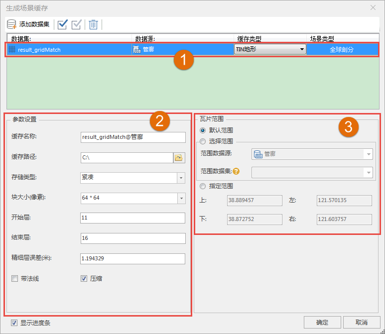

**使用说明**

TIN地形缓存用来对TIN地形数据生成缓存文件，优化TIN地形数据的显示和浏览效果。

**操作步骤**

  1. 在数据集右键菜单中选择“生成缓存...”。
  2. 弹出“生成场景缓存”对话框，用来添加数据和设置参数。默认选中的数据集已经被添加在列表中，如果需要添加其他栅格数据集，单击 ，弹出“选择”对话框，在对话框左侧列举了当前的工作空间中的所有数据源，右侧列举了该数据源中所有的数据集。用户可以利用对话框上方的工具条对所需要的数据集进行筛选和查找，选择完成后，单击“确定”按钮,返回“生成场景缓存”对话框。
  3. 在“生成场景缓存”对话框内可以看到选择的数据集显示在列表中。  
  
  
  4. 数据列表区域（如数字1所示）：
       * **数据集：** 显示了用于生成TIN地形缓存的数据集名称；
       * **数据源：** 显示了用于生成TIN地形缓存的数据集所在的数据源的名称；
       * **缓存类型：** 显示了所要生成的三维缓存的类型，在此为“TIN地形”。缓存类型为下拉按钮，下拉列表中列出了所选数据所支持的所有缓存类型，用户可从中进行选择；
       * **场景类型：** 场景类型分为两种：平面和球面。当数据集为平面坐标系时，场景类型只能设置为平面；当数据集为地理坐标系时，场景类型只能设置为球面；当数据集为投影坐标系时，场景类型可设置为平面或球面。
  5. TIN地形缓存参数的设置（如数字2所示）：
       * **缓存名称：** 在“缓存名称”右侧的文本框中输入缓存名称，即缓存根目录的名称。
       * **缓存路径：** 在“缓存路径”右侧的文本框中输入缓存的输出路径，可以为本地路径，也可以为网络路径；用户还可以通过文本框后的“浏览”按钮来选择路径。
       * **存储类型：** 系统提供了2种缓存类型，紧凑和原始。紧凑表示采用一定的压缩和加密机制，在建立缓存时对数据进行压缩和加密；原始表示不对数据进行压缩，保留影像数据的原始信息。
       * **块大小（像素）** ：提供32*32,64*64以及128*128，默认为64*64。
       * **开始层、结束层** ：自动获取层编号，开始层和结束层均可修改，支持的修改范围为自动获取的层编号之间。。
       * **精细层误差** ：直接在文本框内输入误差数值，单位为米。
       * **是否生成带法线** ：默认不勾选“带法线”复选框，用户可自行决定是否勾选。
       * **生成缓存时是否进行压缩** ：默认勾选“压缩”复选框，用户可自行决定是否勾选。
  6. 设置“瓦片范围”（如数字3所示）。在“瓦片范围”区域进行设置，有下面两种方式：
       * 勾选“默认”复选框，默认采用数据集的范围，左上右下四个文本框显示了系统默认范围；
       * 不勾选“默认”复选框，用户可自定义范围。有两种方式，一种是通过选择范围数据集，取选择的数据集的范围；另一种是直接在左上右下四个文本框中输入范围值。 
  7. 默认勾选“显示进度条”，单击“生成”按钮，执行TIN地形缓存生成操作。每个TIN地形缓存单独存放在一个文件夹下，其中 DatasetDSM@DatasetDSM.sct 为缓存配置文件。

**注意事项**

  1. 缓存范围设置时，在不勾选“默认”复选框时，左下右上的文本框变为可编辑状态，可以直接输入需要的缓存范围。

  

 

