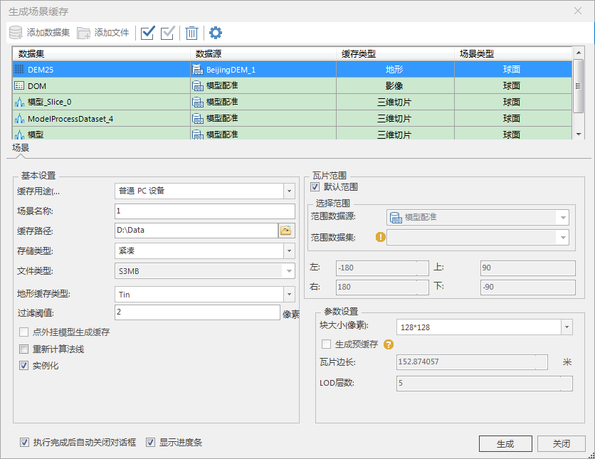
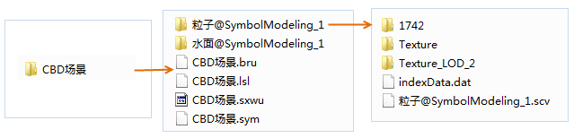
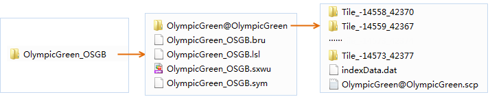

**使用说明**

“生成整个场景缓存”功能，用来对某一已保存场景中的数据集，创建不同类型的缓存文件。该功能不依赖于场景窗口，即在没有打开场景窗口的情况下，也可以直接使用此功能。

场景缓存是基于整个场景生成缓存，通过一次操作，即可将已经加载到场景中的不同类型的数据图层生成对应类型的缓存。在生成场景缓存时，影像图层对应影像缓存图层，地形图层对应地形缓存图层，矢量图层对应三维切片缓存图层，如果是缓存图层（比如模型缓存图层）或者
KML 图层，则保持不变，不生成缓存。

场景缓存生成后，在结果路径下会形成一个新的工作空间和若干缓存文件夹。新的工作空间中不仅保存着各种新生成的缓存图层，还保存了各个缓存图层的风格信息。默认情况下，新生成的工作空间和用于生成缓存的场景名称相同，用户可以通过设置相应参数指定生成的工作空间及场景的名称。

**操作步骤**

  1. 右键单击工作空间管理器中的场景结点，在弹出的右键菜单中选择“生成场景缓存…”命令。
  2. 弹出“生成场景缓存”对话框，场景中的各图层显示在数据列表中，如下图所示：  
  
 
  3. 数据列表区域：
       * **数据：** 显示了用于生成模型缓存的数据的名称。
       * **数据源：** 显示了用于生成模型缓存的数据所在的数据源的名称。
       * **缓存类型：** 显示了所要生成的三维缓存的类型，应用程序会根据场景中的图层类型，自动匹配缓存类型，如矢量图层缓存类型默认为三维切片缓存，地形图层的缓存类型为地形缓存，CAD模型数据集的缓存类型默认为矢量模型缓存，等等。缓存类型为下拉按钮，下拉列表中列出了所选数据所支持的所有缓存类型，用户可从中进行选择。
  4. 生成场景缓存的的基本设置，包括以下内容：
       * **缓存用途** ：设置生成的场景缓存的用途，主要用于普通 PC 设备和 iOS 系列设备、Android 系列设备三种。对于不同用途的缓存，应用程序将采用不同的纹理压缩方式，以减少纹理图像所使用的显存数量。 

          - **普通PC设备** ：适用于 PC 机（个人计算机）上通用的压缩纹理格式。
          - **iOS系列设备** ：适用于苹果 iOS 设备上通用的压缩纹理格式。以此种方式进行纹理压缩时，同时会生成一个离线地图包，方便 iOS 设备用户使用.
          - **Android 系列设备** ：适用于 Android 设备上通用的压缩纹理格式。以此种方式进行纹理压缩时，同时会生成一个离线地图包，方便
          Android 设备用户使用.
          - **不压缩** :不进行纹理压缩。

       * **场景名称：** 当前场景窗口中的场景名称。
       * **缓存路径：** 在“缓存路径”右侧的文本框中输入缓存的输出路径，可以为本地路径，也可以为网络路径；用户还可以通过文本框后的“浏览”按钮来选择路径。
       * **存储类型** ：系统提供了2种缓存类型，紧凑和原始。紧凑表示采用一定的压缩和加密机制，在建立缓存时对数据进行压缩和加密；原始表示不对数据进行压缩，保留模型数据的原始信息。
       * **文件类型** ：提供了4种文件类型，OSGB、S3M、S3MB。其中仅有OSGB格式支持纹理压缩。
       * **地形缓存类型** ：针对缓存类型为地形的数据进行设置，提供了2种类型，TIN和DEM。
       * **过滤阈值** ：用于设置过滤粗糙层子对象的参数，默认为0，单位为像素。如若输入2，则表示小于2像素的子对象被过滤掉。
       * **点外挂模型生成缓存** ：针对存在点外挂的情况，当点外挂为模型文件（如*.osgb、*.s3m等）时是否生成缓存，默认不勾选。
       * **是否重新计算法线、实例化** ：提供复选框选项，勾选即执行操作，默认勾选“实例化”。
  5. **瓦片范围** ：在“瓦片范围”区域进行设置，有下面两种方式： 
       * 勾选“默认范围”复选框，默认采用数据集的范围，左上右下四个文本框显示了系统默认范围；
       * 不勾选“默认范围”复选框，用户可自定义范围。有两种方式，一种是通过选择范围数据集，取选择的数据集的范围；另一种是直接在左上右下四个文本框中输入范围值。 
  6. 参数设置，包含内容如下：
       * **块大小（像素）：** 获取缓存预处理后生成的每个缓存分块文件的大小，单位为像素，即 pixes*pixes。应用程序提供了2048*2048，1024*1024，512*512，256*256，128*128，64*64，32*32，16*16，八种尺寸共用户选择，用户可以选择合适的尺寸大小。块大小对影像和地形数据有效，对矢量数据不可用。 
       * **生成预缓存：** 在数据列表处选中矢量图层时，可勾选“生成预缓存”复选框，对指定图层生成预缓存，以实现客户端数据更新。   
生成的预缓存数据与缓存数据的区别在于：
          - **预缓存**：生成的预缓存文件中的工作空间，以数据源和数据集的形式保留数据信息，便于通过iServer的数据服务，实现矢量数据的增加、删除、修改，以及属性数据的修改。
          - **非预缓存** ：生成的缓存文件中的工作空间，以场景缓存形式保存场景中的数据信息，没有保存源数据的数据集。

      * **瓦片边长** ：设置生成缓存的瓦片边长大小，单位为米。
      * **LOD层数** ： LOD 即 Levels of Detail，是指设置缓存显示的细节层次。只有当图层的缓存类型为三维切片缓存时，才支持设置LOD层级参数。
  7. 设置完成后，单击“生成”按钮，执行场景缓存生成的操作。
  8. 生成的缓存文件存放在以场景名称命名的文件夹下，例如 E:\Data\Cache 文件夹下，该文件夹下生成了以场景命名的子文件夹，存放了不同类型的缓存文件。 **CBD场景** 文件夹下保存缓存文件。其中“CBD场景.sxwu ”为保存的工作空间，在工作空间中保存了场景中各图层的风格信息。 **粒子@SymbolModeling_1** 缓存文件夹下，保存了粒子图层数据的缓存文件，即粒子@SymbolModeling_1.scv，若该文件为预缓存配置文件，则可供客户端使用。  
      
若缓存类型为三维切片缓存，则整个场景缓存的生成结果如下图所示，OlympicGreen@OlympicGreen文件夹中存放了OSGB数据的子文件夹，而子文件夹中保存着
*.osgb 数据。  
  

**备注**

应用程序提供两种方式生成场景缓存，一种是通过“生成缓存...”命令生成场景缓存，另外一种是通过“生成场景缓存...”命令，对整个场景缓存中的所有数据生成缓存。两者在操作方式和生成结果上有所不同，在实际应用中请区别使用。

两者的区别表现在：

  1. “生成缓存...”命令位于工作空间管理器中的数据集结点的右键菜单中；“生成场景缓存...”命令位于工作空间管理器中的场景结点的右键菜单中，要求当前工作空间必须存在场景。
  2. “生成缓存...”可以手动添加生成缓存的数据；整个场景缓存只能对某一场景窗口中的已有数据集生成缓存，不能添加不存在于场景中的其它数据集。
  3. “生成缓存...”可以修改数据集（主要是栅格数据）要生成的缓存类型，例如对于栅格数据，既可以生成地形缓存，也可以生成影像缓存，还可以是Tin地形；整个场景缓存中数据集要生成的缓存类型不允许修改。
  4. 场景缓存生成的结果查看的时候需要逐个打开每个图层对应的缓存文件；整个场景缓存生成了工作空间，会保存场景中各图层的风格。查看生成结果时，只需要打开整个场景缓存的工作空间，其风格就会显示出来。

**注意事项**

  1. 特别说明，目前不支持对路由数据生成场景缓存。在生成场景缓存的时候，应用程序会自动过滤不支持的数据集。
  2. 若当前场景中存在矢量数据或模型数据，则该数据生成的缓存瓦片大小为图层属性处设置的瓦片大小。
  3. 生成预缓存功能只适用于场景中的矢量数据。
  4. 设置了图层风格的二维点、线、面数据集在“高度模式”为“贴地”时生成整个场景缓存，不能保存其图层风格，需要将“高度模式”设置为“绝对高度”或者“相对地面”。
  5. 网络数据集设置了Gif纹理的管线风格，不支持生成三维切片缓存。
  6. 设置了管线风格的二维线数据集，也不支持生成三维切片缓存。

  

 

