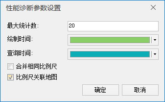

###  使用说明

地图性能诊断可对当前地图窗口的整体性能进行诊断，并给出不同视图、比例尺下地图的绘制耗时和查询耗时，以及各个图层的耗时情况，具体耗时情况以柱状图表示。其中，绘制时间是指在地图上显示数据所需要的时间；查询时间是指从数据源引擎中读取数据所需要的时间。

用户在进行地图缩放、漫游、刷新等操作过程中，若出现地图刷新慢或者卡顿情况，建议使用地图性能诊断工具进行诊断，可根据诊断结果总耗时和各个图层的耗时情况，对耗时较多的图层进行相应的优化，从而提高地图性能。

###  性能诊断

  1. 打开需进行性能诊断的地图后，可在“ **地图** ”选项卡的“ **制图** ”组中，单击“ **性能诊断** ”按钮，弹出“地图性能诊断”对话框。查看当前地图刷新一次所需要的时间，单位为毫秒。
  2. 该功能支持两种诊断模式，分别为实时诊断和手动诊断，开启实时诊断之后，可实时监测当前视图窗口中地图刷新一次所耗费的时间；若未开启实时性能诊断，可通过漫游或缩放调整地图地图窗口的显示内容或比例尺，单击对话框中的“诊断”按钮，诊断当前窗口的地图耗时情况。 

每次监测的数据都会记录在对话框中，数据记录的方式为如下图所示，记录地图刷新时的比例尺，在左侧树目录或者下方“全部信息统计”柱状图中，单击选中某个比例尺，右侧将显示出该比例尺地图刷新一次的耗时情况。耗时情况的数据以柱状体形式展现，其中上部分显示了当前比例尺下每一个图层的耗时情况，下部分显示各个比例尺地图的总的刷新耗时。

**注意** ：地图性能诊断对话框中只能同时显示同一个地图的诊断情况，切换地图窗口进行诊断时，需要清空上一幅地图的诊断结果。

   
 
  3. 诊断结果分为三个模块进行显示，分别为比例尺树目录、详细信息统计、全部信息统计，具体说明如下： 
       * 比例尺树目录：显示了当前地图进行过诊断操作的比例尺，在此处选中某个比例尺，右侧的“详细统计信息”会显示该比例尺下各图层的耗时情况。
       * 详细信息统计：用柱状图显示了指定比例尺下，各图层的绘制耗时和查询耗时信息，将鼠标放至某柱状图上，即可查看对应图层的图层标题、绘制时间和查询时间。同时，双击某柱状图，即可在图层管理器中自动定位到该图层。
       * 全部信息统计：显示了所有地图诊断的信息，将鼠标放至柱状图上，即可查看当前地图的名称、比例尺、中心点及图层个数，单击某比例尺对应的柱状图，或单击比例尺结点，即可在“详细信息统计”处查看该比例尺下各个图层的耗时情况。
  4. 通过工具栏可调整诊断信息的显示模式、颜色等，工具条说明如下：
       * **显示模式** ：单击“显示模式”组合框下拉按钮，选择诊断信息的显示模式，显示模式有：分类显示、合并显示、仅显示绘制时间和仅显示查询时间4种。
       * **移除** ：单击  下拉按钮，选择“移除”项即可移除列表中选中某个比例尺记录；选择“移除全部”项即可移除所有查询记录。
       * **设置** ：单击  按钮，弹出“性能诊断参数设置”对话框，用来设置诊断结果显示的相关参数，如耗时柱状图颜色、最大统计、合并相同比例尺等。  
      
性能诊断参数设置  
         * **最大统计** ：用于设置可诊断地图性能的最大统计数，默认为20个。当比例尺个数达到最大统计数后，继续诊断会删除最早的比例尺诊断结果，保留新增比例尺诊断结果。
         * **绘制时间** ：用来设置绘制时间的柱状图的显示颜色。
         * **查询时间** ：用来设置查询时间的柱状图的显示颜色
         * **合并相同比例尺** ：勾选该复选框后，将只显示相同比例尺耗时最大的一个地图诊断信息。
         * **比例尺关联地图** ：勾选该复选框后，在比例尺列表中单击某个比例尺记录，或者在“全部信息统计”处单击某个统计记录的柱状图，即可关联地图窗口显示该统计记录对应的地图显示范围。

用户可根据地图的绘制耗时和查询耗时，可对耗时较多的图层进行优化，相关操作可参见一下页面：

  

 

