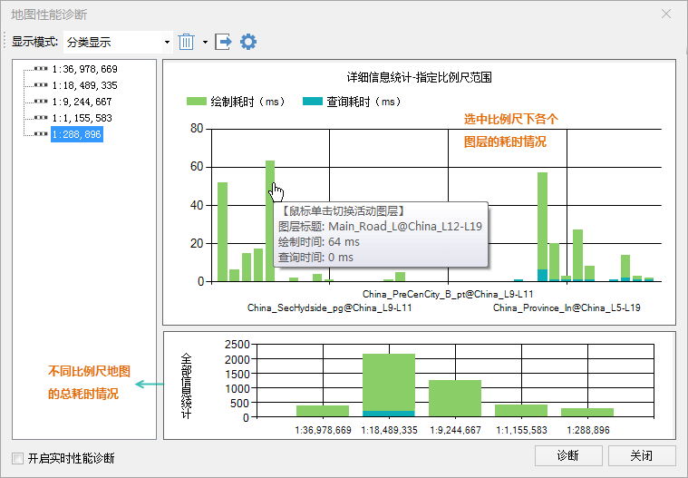

###  使用说明

地图性能优化主要是通过各种工具，提高地图的浏览、查询效率，增强地图的美观性和可读性。SuperMap
提供了监测地图显示和查询的性能工具，通过该工具可检测出当前地图的耗时情况，帮助用户更直观的监测地图性能的详细情况。

###  地图性能诊断

打开需进行性能诊断的地图，单击“ **地图** ”选项卡的“ **性能诊断制图** ”组中，单击“ **性能诊断**
”按钮，打开“地图性能诊断”对话框，可以查看刷新一次当前地图所需要的时间，单位为毫秒。该功能支持两种诊断模式，分别为实时诊断和手动诊断，开启实时诊断之后，可实时监测当前视图窗口中地图刷新一次所耗费的时间；若未开启实时性能诊断，可通过漫游或缩放调整地图地图窗口的显示内容或比例尺，单击对话框中的“诊断”按钮，诊断当前窗口的地图耗时情况。

每次监测的数据都会记录在对话框中，数据记录的方式为如下图所示，记录地图刷新时的比例尺，在左侧树目录或者下方“全部信息统计”柱状图中，单击选中某个比例尺，右侧将显示出该比例尺地图刷新一次的耗时情况。耗时情况的数据以柱状体形式展现，其中上部分显示了当前比例尺下每一个图层的耗时情况，下部分显示各个比例尺地图的总的刷新耗时。

  
 
  
###  优化地图性能

提高地图的显示和查询效率，需要先了解影响地图性能的因素，影响二维地图性能的因素主要有：空间数据是否优化、地图数据正确性和复杂度、地图属性设置、缓存使用和网速等等。影响地图查询耗时的主要因素有：空间索引和字段索引，而影响地图绘制耗时的因素较多，下文将对这些影响因素进行详细的介绍。

  * **空间索引**  
随着 GIS数据量的逐渐增大，使得空间数据的访问速度降低，而空间索引就是用来提高数据空间查询效率的数据结构。为地图中显示的数据集创建空间索引，可以提升地图的浏览和查询效率，推荐使用R树索引和图库索引(**注** ：文件型数据源仅支持R树索引)。

如下图所示，某地区的电子地图数据，对其建立空间索引前和空间索引后的地图浏览效率是有差别的，建立空间索引前，地图刷新一次耗时约 1800ms，其中查询耗时为
500ms；建立所有数据集的空间索引（R树索引）后，地图刷新一次耗时约 1200ms，查询耗时约
100ms。由此可见，对数据集创建空间索引之后，地图的浏览效率有明显提升，尤其是查询效率。

  

  

  * **字段索引**

字段索引提供了对特定键值的数据快速访问的能力字段索引一般采用二叉树或者二叉树的衍生数据结构。若数据集中某一字段需要用于SQL查询、分析、专题图制作等功能，可为该字段创建字段索引。创建字段索引后可提升地图绘制的效率。

例如：对 **ThreeRoad_Ln** 线数据要用于制作标签专题图，在未对该数据中字段创建索引时，诊断的地图耗时约为
310ms，对用于制作标签专题图中的 **NAME** 字段创建字段索引之后，地图刷新的总耗时约为
240ms，地图的绘制和查询耗时都有所减少。由此说明，创建数据集的字段索引可提升地图的绘制和查询效率。

  

  
 
  * **数据集类型**

地图尽量使用简单数据集，少使用 CAD
数据集。因为简单数据集不需要存储对象风格，且比复合数据集的数据量小。例如，对某地区的三级道路地图数据进行测试，道路数据分别使用简单线数据集存储和CAD复合数据集存储，测试两种情况下地图刷新一次的效率，结果如下图所示，在相同条件下，简单线数据集的刷新耗时约为
500 毫秒，CAD数据集的刷新耗时约为 950
毫秒。由此可见，同样内容和数据量的数据，简单类型数据集比复合类型数据集的绘制和查询时间都少，因此地图中尽量使用简单类型数据。

  

  * **数据集编码**

对数据库型数据源，尽可能设置数据集编码，数据集编码能减少数据量大小，对数据库型数据源而言，可以减少数据传输总量。
数据集编码方式可以通过新建数据集、复制数据集、导入数据集和导出影像数据集等功能进行修改。不同类型数据集的编码方式不同，如下表所示：

数据集类型 | 编码方式  
---|---  
矢量数据集 | 单字节、双字节、三字节、四字节  
DEM/Grid 数据集 | SGL、LZW  
影像数据集 | LZ、DCT、PNG  
  * **影像金字塔**

为影像建立金字塔，可以提高地图的浏览速度。当向地图中添加影像数据集时，系统将自动询问是否创建影像金字塔，选择“是”即可对影像数据集创建影像金字塔，然后在添加到地图中显示。例如，一幅影像数据创建影像金字塔之前，刷新一次的耗时约为
2000 毫秒，创建影像金字塔后，在相同比例尺和视图下，影像地图刷新一次耗时约为30毫秒，大幅度提升了地图的显示性能。

  

  * **图层比例尺**

地图在不同比例尺下所体现的内容的详细程度是不同的，所以地图中的每一个图层并不是在所有比例尺下都需要显示出来，因此有必要控制图层的最小显示比例尺和最大显示比例尺，从而保证保持某一比例尺内显示的内容最少。这样可以有效提升地图的浏览、操作效率。
如下图所示，四川省电子地图的三个比例尺的显示内容，随着比例尺的放大，小比例尺下显示的图层内容在大比例尺下显示就显得毫无意义。相反，大比例尺下的显示的图层内容在小比例尺下也无需显示。因此，就需要根据具体的地图需求，合理安排不同比例尺级别下的显示内容。在图层属性对话框中，“最小可见比例尺”和“最大可见比例尺”可以设置该图层的显隐条件。当地图的比例尺小于所设置的“最小可见比例尺”或者大于所设置的“最大可见比例尺”，图层都是不可见的。

  * **图层属性**

    - 设置对象显示顺序  
    对文件型数据源中单值、分段专题图而言，如果专题图子项为符号填充，且专题表达式由一个字段构成，请在图层属性中将此字段设置为该专题图层的【对象显示顺序字段】，如图
    8 46所示。这种方式可以在一定程度上提升绘制效率，在海量地图数据下，提升较为明显和重要。

    - 对象最小显示尺寸  
    在地图比例尺较小的情况下，对于图层中的一些小对象在当前比例尺下几乎不可见，并且显示处理意义不大，所以，可以通过“图层属性”设置对话框中的“对象最小显示尺寸”，设置一个显示条件，小于给定值的对象不可见，可在一定程度上提升地图刷新效率。

    - 标签专题图图层设置  
    地图中的标签专题图层对地图性能影响最大，针对标签专题图层的一些属性设置，需要谨慎对待，例如配图过程中建议不勾选流动显示，在数据量较大的情况下建议关闭自动避让，因为自动避让是实时计算的。

    - 十字路口优化  
    一般在道路制图中，遇到道路交叉的路段，默认情况下是按照路段矢量化的先后顺序来决定其在地图上的绘制顺序，从而产生道路叠放的结果。此时，会给人一种叠放的两条道路在实际中是上下层的立交关系，而实际上，发生叠置的道路在交叉处是十字路口或者丁字楼口，对于一些道路数据图层。  
     
开启十字路口优化也将降低地图的性能，在允许的情况下可以选择另一种制图手段来实现十字路口优化的效果，十字路口优化功能开启后，图层的绘制性能会有所下降，这里提供一个可替代方案。上面已经说明出现道路交叉路口线型效果不合理，是由于使用的线型符号由两个不同风格线条叠加形成，如图
6 13所示。
我们可以将同一个道路数据添加两次到地窗口中，制作两个图层，两个道路图层都采用普通单一线条的线型符号，并设置位于上层道路的颜色为道路的填充颜色，这里设置为白色，设置一个合适的线宽；下层道路的颜色为边线的颜色，这里设置为灰色，设置的线宽要大于上个道路图层的线宽，从而模拟由两条不同风格和宽度的线条叠加而成的线型符号。这种方式道路交叉口的渲染与十字路口优化后的效果相同，但是性能却略高于开启十字路口优化功能的图层。  
  

  * **地图属性**

地图的一些属性设置对性能影响较大，所以在实际应用中要考虑是否使用替代方案来达到下面地图属性设置的效果：动态投影、线型反走样、文本反走样、压盖设置。SuperMap
软件在图层级别中也提供了反走样和压盖设置，不需要开启整个地图的反走样和压盖设置，仅对个别图层设置反走样或压盖即可。开启动态投影也会对地图性能有所影响，建议将待添加到同一幅地图中的数据先统一转换为一致的投影，以避免因为开启动态投影影响地图的刷新效率。

  * **数据错误**  
数据错误包括数据范围错误和数据不合理两种情况，下文分别对这两种情况进行说明：

    * **数据范围错误**  
数据范围错误主要原因之一就是有坐标异常的数据，如何检查数据范围错误，或者数据范围错误的表象是什么，方法如下：  
在新建地图窗口中添加单个数据集并进行全幅显示可检查数据范围的正确性，如果地图主要区域缩成一小团，就有可能存在坐标异常的数据；  
检查数据集中坐标，点数据集中是SMX和SMY，线面数据集中是SmSdriW、SmSdriN、SmSdriE、SmSdriS四个字段，通过字段列的升降序可检查是否有异常数据。

    * **数据合理性**  
下面几种数据情况会影响到地图的显示效率：

      1. 地图中，记录数达到百万条以上的数据图层非常多。
      2. 有大量的图层，但每个图层中的对象数目太少。
      3. 存在大量的长度小于10米的道路、河流或面积小于100平米的公园。  
针对上面的问题，这里给出一些推荐的解决办法：

      1. 问题一：尽可能将数据分开，可以按数据类型进行划分，也可以按地理位置进行划分。
      2. 问题二：合并同类型的数据集。
      3. 问题三：确定最小长度或面积的标准，如线对象的长度不能小于10米、面对象的面积不能小于100平米等，若存在不符合标准的几何对象，可进行如下操作： 
           * 鉴于数据质量参差不齐，请先对线、面数据集进行融合，并对面数据集进行碎小多边形合并；
           * 图层关联浏览属性数据，并对SmLength或SmArea字段进行升序排列，检查是否存在应该存在但长度或面积过小的对象；
           * 修改融合容限，及碎小多边形容限，直至不存在长度或面积过小的对象；
           * 使用数据集右键菜单中浏览属性数据，对SmLength或SmArea字段进行升序排列，删除长度或面积过小的对象。
  * **降低数据复杂度**

数据复杂性的表现之一为：节点过多、子对象过多，若存在数据节点过多的问题，线数据集可直接进行重采样，面数据集推荐先拓扑转线再对线进行重采样，再重新拓扑构面。在子对象过多的问题上，推荐对几何对象进行分解，在分解前需要排查图层中对象，避免分解岛洞多边形。

**重采样**

例如，某条单行线道路，其线对象走势区域直线，当显示该线对象的节点时，发现此线对象存在众多节点，而实际上很多节点都是多余的，所以有必要删除这些冗余节点，这里通过对线数据进行重采样的方式来去除冗余节点。

   
  
经过重采样后，示例中的该段单行线道路节点减少，只保留了必要的节点。再次用地图性能诊断功能对比示例中的整个道路数据在地图中某个比例尺下刷新一次的耗时，线数据重采样前，刷新一次耗时约为34秒，重采样后去除了冗余节点，刷新一次仅用大约11秒时间，性能提升两倍。其中，主要减少了地图绘制的时间，查询时间几乎变。

  

**避让或抽稀点**

数据较大且带有标注的点数据，在比例尺较小的地图中显示时会比较密集，通常我们可以通过标签专题图的压盖和避让设置来实现目标效果。首先打开该点数据对应的标签专题图的属性面板，在“属性”面板中勾选“自动避让”，在“高级”选项卡中设置“文本避让的缓存范围”为合适的距离数据，于此同时，必须勾选“地图属性”设置对话框中“压盖设置”列表中的“点随标签显隐”，设置完成后，即可实现地图标签合理显示的效果。

此外，若是单个图层中的点对象显示紧密，还可以通过点抽稀的方式实现，根据指定的抽稀半径，即可将点数据抽稀，使得地图达到符合所预期的点稀疏程度的效果。

  
  
  * **地图缓存**

在浏览器和服务器端使用地图时，一般会使用地图缓存进行浏览，在发布服务时，建议发布缓存数据（将缓存sci保存为一个工作空间）而非原始工作空间，发布缓存会直接读取缓存图片，而发布工作空间需要读取图片的位置算，二者在性能上有较大的差异。
