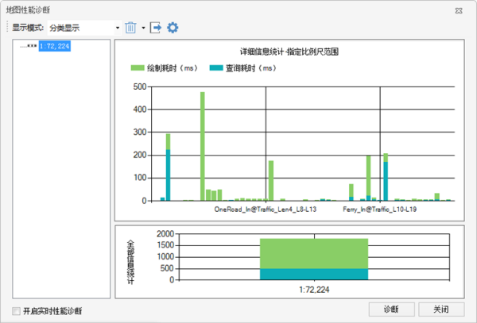
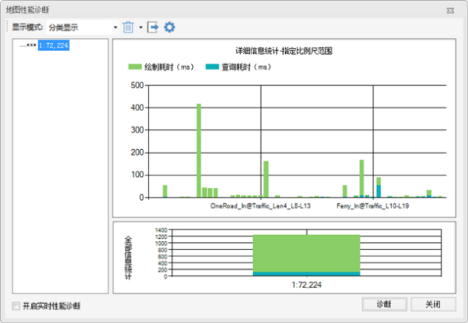
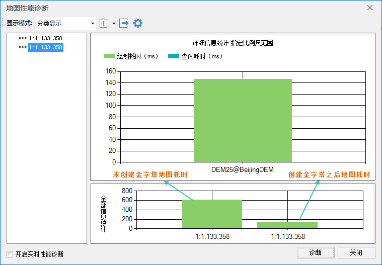

提高地图的查询效率，需要先了解影响地图性能的因素，数据的查询耗时较长，大都跟数据集的数据结构有关，提高数据集的读取效率可以从以下几点着手，即数据编码、金字塔、空间索引、缓存。矢量数据与影像数据的结构有所不同，因此，下文将分别介绍矢量和影像数据查询耗时的优化方案。

### 矢量数据集

* **[空间索引](../../DataProcessing/DataManagement/ManageSpatialIndex )**  
随着 GIS数据量的逐渐增大，使得空间数据的访问速度降低，而空间索引就是用来提高数据空间查询效率的数据结构。为地图中显示的数据集创建空间索引，可以提升地图的浏览和查询效率，推荐使用R树索引和图库索引(**注** ：文件型数据源仅支持R树索引)。

* **[R树索引](../../DataProcessing/DataManagement/SpatialIndexRTree  )**  
优点：通用情况下查询性能最高。但对于一些特殊组织的数据，用图库索引＋本地缓存，速度是最快的。  
缺点：并发支持差，因此一般只用于独占的文件型数据源，而不常用于需要经常并发编辑的数据库型数据源；维护代价大，索引建立时间长。  
备注：对于静态数据，R树优势明显。

* **[四叉树索引](../../DataProcessing/DataManagement/SpatialIndexQTree  )**  
优点：并发支持较好，建索引速度也较快。  
缺点：查询性能低于R树。  
建议使用动态索引替代四叉树。

* **[动态索引](../../DataProcessing/DataManagement/SpatialIndexMultiLevelGrid  )**  
优点：并发支持好，建索引速度快，支持大数据量。可定制每一级格网的大小，不受数据集范围的限制。适合于数据库型数据源，在大数据量且只读情况下，性能比图库索引稍低。

* **[图库索引](../../DataProcessing/DataManagement/SpatialIndexTile  )**  
针对某些应用，图库索引是最快的一种，最适合规则分幅的数据，如按标准图幅编号的1：25万或1：10万的国家基本比例尺地形图。对于普通数据，如果采用图库索引，也会带来性能的提升。
图库索引是针对数据库数据源的。根据范围或者某一字段对矢量数据集创建图库索引。用表示对象所属区域的字段来创建图库索引，或者按范围创建时，每一块里的记录数尽量平均，比如每块范围内有2000～20000个对象，范围不要太大或太小，这样的效果都很好。一般推荐范围：30×30即900个格子，这样的推荐值适合10万条记录的数据集。如果实际数据与此不同，则需要修改范围的长和宽。

如下图所示，某地区的电子地图数据，对其建立空间索引前和空间索引后的地图浏览效率是有差别的，建立空间索引前，地图刷新一次耗时约 1800ms，其中查询耗时为
500ms；建立所有数据集的空间索引（R树索引）后，地图刷新一次耗时约 1200ms，查询耗时约
100ms。由此可见，对数据集创建空间索引之后，地图的浏览效率有明显提升，尤其是查询效率。

    

 * [**数据编码**](../../DataProcessing/DataManagement/EncodeType  )  
数据编码是一个压缩的概念，类似于 ZIP、RAR等，数据集编码能减少数据量大小，数据量的减少可以大大提高磁盘读写和网络传输的效率，显著提高性能。数据集编码方式可以通过新建数据集、复制数据集、导入数据集和导出影像数据集等功能进行修改。矢量数据集有多种编码方式，如单字节、双字节、三字节、四字节。需注意的是点、属性表以及CAD 数据集不可进行压缩编码。

  * [**地图缓存**](../Cache/2DCache  )

在浏览器和服务器端（B/S）使用地图时，一般会使用地图缓存进行浏览，在发布服务时，建议发布缓存数据（将缓存sci保存为一个工作空间）而非原始工作空间，发布缓存会直接读取缓存图片，而发布工作空间需要读取图片的位置，二者在性能上有较大的差异。

### 栅格数据集

* [**影像金字塔**](../../DataProcessing/DataManagement/DTr_CreatePyromid)

为影像建立金字塔，可以提高地图的浏览速度。当向地图中添加影像数据集时，系统将自动询问是否创建影像金字塔，选择“是”即可对影像数据集创建影像金字塔，然后再添加到地图中显示。例如，一幅影像数据创建影像金字塔之前，刷新一次的耗时约为
2000 毫秒，创建影像金字塔后，在相同比例尺和视图下，影像地图刷新一次耗时约为30毫秒，大幅度提升了地图的显示性能。

   

* [**栅格编码**](../../DataProcessing/DataManagement/EncodeType  )

对栅格和影像数据集，在 SuperMap 中可采用
DCT、SGL、LZW、PNG或未编码来存储。其中未编码是最简单最直观又非常重要的一种栅格结构编码方法，就是将栅格数据看作一个数据矩阵，逐行（或逐列）逐个记录像元值。这种存储方式未采用任何压缩方法，因而当栅格像素较多时，需要相当大的存储空间，而且随着空间分辨率的提高，存储空间成几何级数递增。由于影像空间域存在很强的相关性，经常相邻的像元具有相同的属性值，使用一定的压缩编码，可以大大节省栅格数据的存储空间。

<table>
<caption>表1：数据集存储时的压缩编码方式</caption>
<thead>
<tr>
<td width="86"><strong>编码方式</strong></td>
<td width="772"><strong>描述</strong></td>
</tr>
</thead>
<tr>
<td>未编码</td>
<td>不使用编码方式。 </td>
</tr>
<tr>
<td>SGL</td>
<td>
SGL（SuperMap Grid LZW），SuperMap 自定义的一种压缩存储格式，其实质是改进的 LZW 

目前 SuperMap 中的对 Grid 数据集和 DEM 数据集压缩存储采用的就是 SGL 的压缩编码方式，这是一种无损压缩，适用于栅格数据集。
</td>
</tr>
<tr>
<td>DCT</td>
<td>
DCT（Discrete Cosine Transform），离散余弦编码，是一种广泛应用于图像压缩中的变换编码方法。其原理是通过变换降低图像原始空间域表示中存在的非常强的相关性，使信号更紧凑地表达。该方法有很高的压缩率和性能，但编码是有失真的。

这种变换方法在信息的压缩能力、重构图像质量、适应范围和算法复杂性等方面之间提供了一种很好的平衡，成为目前应用最广泛的图像压缩技术。

由于影像数据集一般不用来进行精确的分析，所以 DCT 编码方式是影像数据集存储的压缩编码方式，适用于影像数据集。
 </td>
</tr>
<tr>
<td>LZW</td>
<td>
LZW 是一种广泛采用的字典压缩方法，其最早是用在文字数据的压缩方面。

LZW 的编码的原理是用代号来取代一段字符串，后续的相同的字符串就使用相同代号，所以该编码方式不仅可以对重复数据起到压缩作用，还可以对不重复数据进行压缩操作。

适用于索引色影像的压缩方式，这是一种无损压缩编码方式，适用于栅格和影像数据集。
</td>
</tr>
<tr>
<td>PNG</td>
<td>PNG 压缩编码方式，支持多种位深的图像，是一种无损压缩方式，适用于影像数据集。</td>
</tr>
</table>