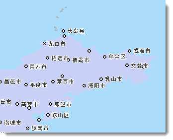
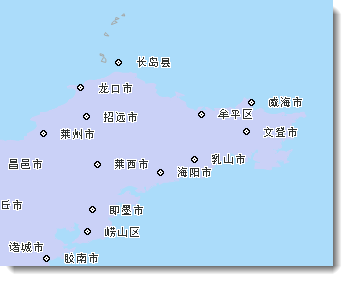
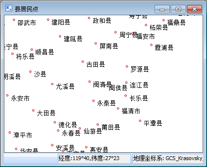
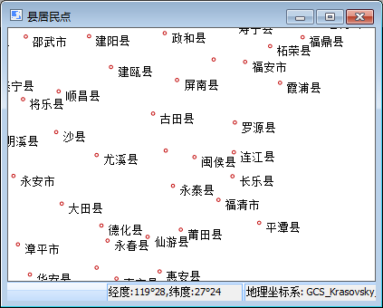
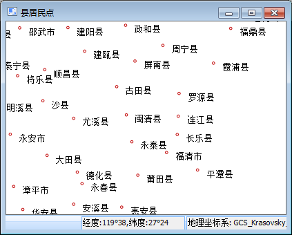

当地图中放置多个标注要素时，就会出现文本、标签、专题图元素等显示过于密集的区域，这些要素之间会发生相互叠置的现象，从而减低地图的可读性。压盖设置功能帮助用户对地图中的文本、标签、专题图元素等对象的显示进行控制，有利于更好地处理地图中各种类型对象的压盖显示问题，最终获得比较满意的地图显示效果。

如下图所示，在“ **地图** ”选项卡的“ **属性** ”组中，单击“ **地图属性**
”按钮，弹出的右停靠窗口中点击"压盖设置"按钮，如下所示的菜单。可以使用此菜单中的项，分别对压盖情况进行设置。

  

  
###  **显示压盖对象**

该复选框用于控制是否显示产生压盖现象的对象，若勾选该复选框，发生压盖现象的所有对象都会显示，同时压盖设置下拉按钮灰显不可用。若未勾选该复选框，可在压盖设置中进行详细设置。

###  **压盖设置**

**压盖选项**

可以对不同类型的压盖对象之间的显示进行控制。发生压盖的对象既可以位于同一个图层，也可以来自于不同图层。注意：当两个对象发生叠置时，在设置了显示压盖对象的情况下，我们会优先显示位于下方的被压盖的对象，位于上方的对象将不会显示。

  * **点随标签显隐**  
如果点图层中的点比较密集，对其制作标签专题图，则标签专题图的自动避让功能会将压盖重叠的标签自动避让掉，这样就形成个别点没有标签的错觉；如果不使用自动避让又会出现标签之间压盖的情况产生。点随标签显隐功能控制点图层和基于该图层制作的标签专题图的标签的过滤显示问题。选中"点随标签显隐"复选框，如果点对应的标签被隐藏掉的话，则该点也不会显示。  
    
 
  * **显示被点压盖的点**  
当地图中同一图层中的点对象或者不同点图层的点对象被其它点对象压盖时，可以控制是否显示相互压盖的点对象。选中此项表示将同时显示显示发生压盖的点对象，否则仅显示位于下方的点对象，位于上方的点对象不会显示。

  * **显示点和文本相互压盖的对象**  
文本包含标签专题图的文本注记和文本图层（CAD图层）的文本。当地图中的点图层和标签专题图或文本图层（CAD图层）发生压盖现象时，可以控制显示相互压盖的对象与文本（包括标签）的显示情况。选中此项表示显示发生叠置的点和文本对象；否则仅显示位于下方的点或者文本对象，叠置于其上的对象将不会显示。注意：此项不能控制文本对象之间的压盖和点对象之间的压盖。  
如下图所示，左图为原始地图，默认选中“显示点和文本相互压盖的对象”压盖选项；右图是不显示发生压盖的点与文本对象的效果。由于标签图层（文本）位于点图层之上，所以一旦点与文本对象发生叠置时，选择“显示点和文本相互压盖的对象”复选框时，文本对象将被过滤掉，仅保留点对象。  
    

  * **显示被文本压盖的文本**  
文本包含标签专题图的文本注记和文本图层（CAD图层）的文本。当标签专题图图层或文本图层（CAD图层）中的文本或者标签之间发生叠置时，可以使用“显示被文本压盖的文本”项对其压盖情况进行控制。选中“显示被文本压盖的文本”复选框，对发生叠置的文本对象不作处理，即全部显示叠置的文本对象；否则，对叠置的对象进行显示控制，即位于下方的对象保留，而叠置于其上的对象将被不会显示。注：在标签专题图图层中会先判断是否执行“自动避让”功能。  
如下图所示，左图为原始地图，选中了“显示被文本压盖的文本”选项，全部显示叠置的文本对象；右图未选中“显示被文本压盖的文本”选项，仅显示位于下方的文本对象，而与其发生叠置的文本对象不会显示。

    

  * **显示被压盖的等级符号**  
统计符号专题图中的等级符号之间很有可能发生压盖，这些叠置的对象可以来自一个或者多个图层。通过“显示被压盖的等级符号”选项设置参数，可以对发生压盖的等级专题图元素显示情况进行控制。选中该复选框，不会进行显示控制，显示所有发生叠置的等级符号；否则会对叠置的对象进行过滤，即仅显示下方的对象，不会显示位于其上的对象。

  * **显示被压盖的统计符号**  
如果地图中的统计符号专题图（如饼图和柱状图）图层的统计符号之间可能会发生压盖，这些统计符号可以存在于一个图层或者多个图层。通过压盖设置菜单中的“显示被压盖的统计符号”选项，可以对相互叠置的统计符号的显示情况进行控制。选中该复选框，则不会对统计符号的显示进行控制，显示所有叠置的统计符号；否则仅显示位于下方的统计符号对象，不显示位于其上的统计符号对象。

**压盖范围设置**  

“压盖范围”用来设置两个对象之间的压盖间距，通过指定宽度和高度来确定此范围。例如设置压盖范围的宽和高分别为60和40，则实际的压盖范围计算方法是以文本对象的外接矩形为边界，向左向右60个单位，向上向下40个单位。单位为0.1mm。压盖范围对以上5种压盖情况均适用。  

压盖间距（压盖范围的宽或高）为正数时表示两个对象之间的距离，超出该距离时显示，小于等于该距离时不显示；为负数时表示两个对象的压盖距离，小于该距离的绝对值时显示，大于等于该距离的绝对值时不显示。  

如下图所示，左图没有设置压盖范围，应用程序根据前面设置的过滤选项对文本的显示进行控制，右图所示设置压盖范围（宽为20 mm，高为20
mm）的显示效果，应用程序对落入每个文本此范围内的其他对象进行过滤处理。  
  
  

 

