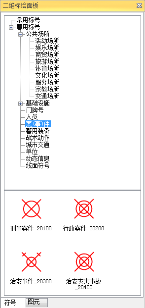
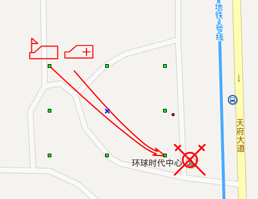

二维标绘可用于结合电子地图实现军事作战方案、应急处置方案、公安围捕方案等指挥调度方案的二维图形标绘。通过使用二维图形标绘面板提供的各类具有特殊意义的图形、标号，可以在二维地图上直观、准确地展现事件的处置方案，提高应急事件处置过程中会商和沟通的效率。

二维标绘提供了遵照相关行业标准制作的标号库，能够完整地支持军事、公安和武警、应急等行业图形应用需求，警用图形标号库如下图所示。

  

图形标号能够在地图中被选中，进行移动、缩放等操作，实现图形交互式编辑。下图中为线面标号在地图中的编辑操作界面示意。

  

  
在SuperMap桌面产品中，新建或者打开一个地图窗口，就会显示“二维标绘”选项卡，对此选项卡中的功能介绍如下：

[### 标绘面板](Introduce2DPlottingPanel)

用来显示常用标号、警用标号以及图元的符号面板，在CAD图层可编辑的情况下，可直接选中某一标号或图元进行绘制。

[### 属性面板](PropertyPanel_2D)

用来显示选中标号或图元的属性信息，支持直接对其属性进行修改。
