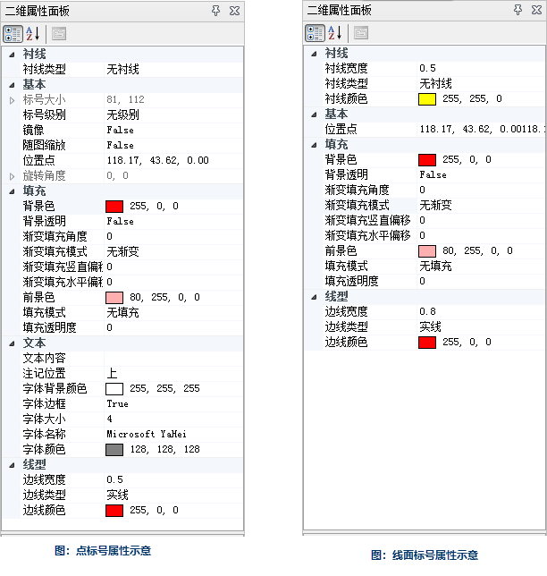

### 使用说明

二维属性面板提供了点标号、线面标号以及图元的属性修改，例如标号大小、镜像、填充、文本内容、线型、衬线等属性。具体操作步骤如下：

  1. 在“ **二维标绘** ”选项卡“ **标绘面板** ”组中，单击“ **属性面板** ”，弹出“二维属性面板”对话框。
  2. 选中一个点标号或者线面标号，可以在属性面板中查看、修改标号相应的属性。点标号、线面标号的属性参数，如下图所示。  
  
 

绘制在地图窗口的二维标号，除了可以选中修改其属性外，也可以直接在地图窗口中拖动鼠标进行编辑，具体请查看：[二三维标号的编辑](../EditPlotting)。

###  相关主题

 [二维标绘面板](Introduce2DPlottingPanel)

 [态势推演管理器](../AnimationManager)

